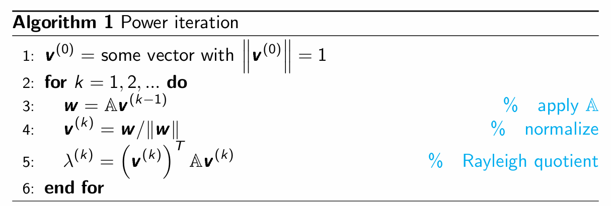
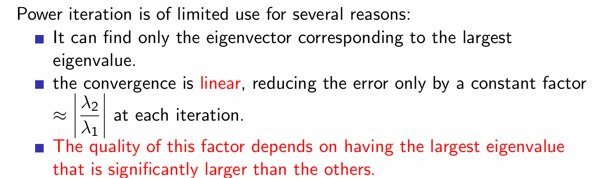
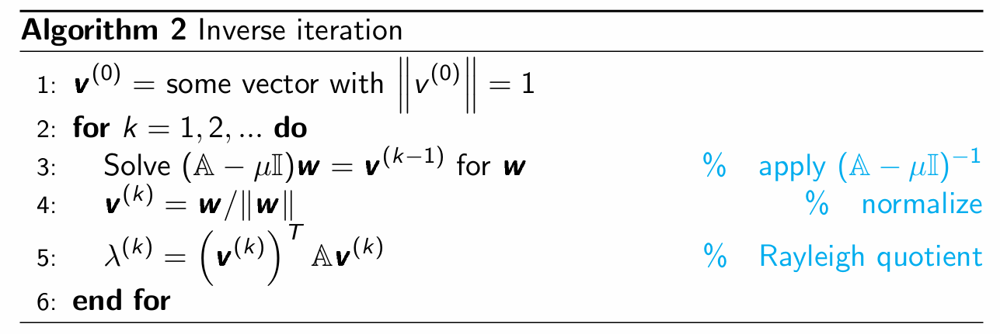
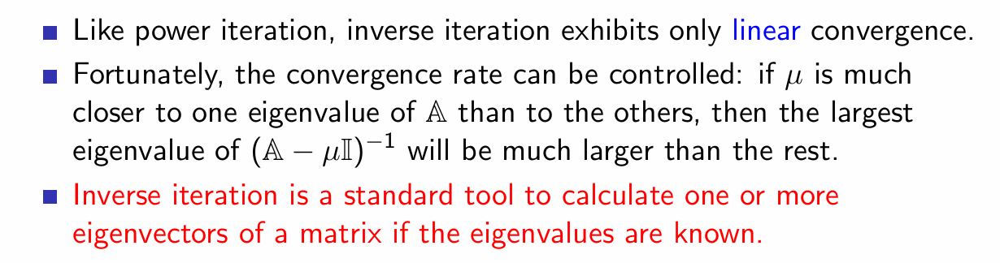
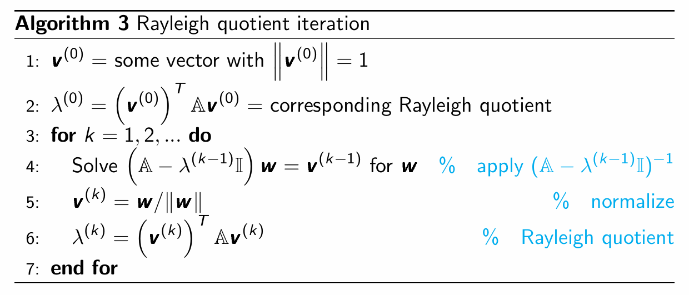
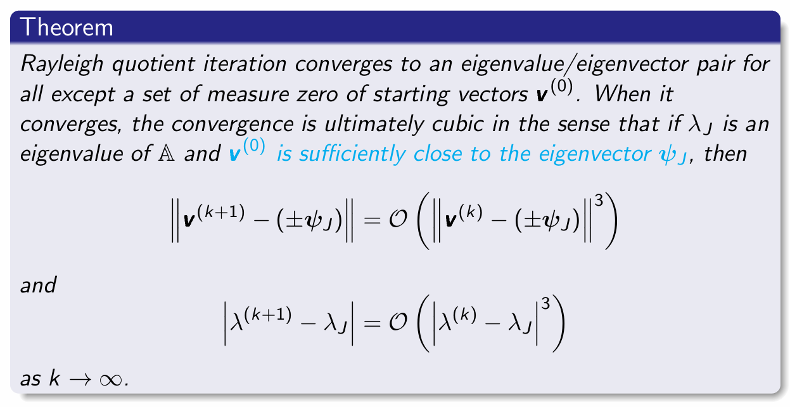

# Chapter 3-1 Compute Eigenvalues and Eigenvectors

# 1 Rayleigh quotient
## 1.1 实对称矩阵的核心性质
### 对称矩阵的内积定义
记 $\langle\cdot,\cdot\rangle$ 为 $\mathbb{R}^n$ 上的标准内积，**实 $n\times n$ 矩阵 $\mathbb{M}$ 为对称矩阵**，当且仅当：
$$
\langle \mathbb{M}\boldsymbol{x}, \boldsymbol{y} \rangle = \langle \boldsymbol{x}, \mathbb{M}\boldsymbol{y} \rangle \quad \forall \boldsymbol{x},\boldsymbol{y} \in \mathbb{R}^n
$$

### 特征值与特征向量基础定义
将对称矩阵 $\mathbb{M}$ 的特征值按升序排列：$\lambda_1 \leq \lambda_2 \leq \dots \leq \lambda_n$，对应的特征向量为 $\{\psi_1,\psi_2,\dots,\psi_n\}$，满足特征值核心等式：
$$
\mathbb{M}\psi_i = \lambda_i \psi_i
$$

### 对称矩阵的关键结论
对于实对称矩阵 $\mathbb{M}$，有两个核心性质：
1. 所有特征值 $\lambda_1 \leq \lambda_2 \leq \dots \leq \lambda_n$ 均为**实数**
2. 对应的特征向量组 $\{\psi_1,\psi_2,\dots,\psi_n\}$ 构成 $\mathbb{R}^n$ 的一组**正交基**

### 特征向量正交性的严格证明
设 $\psi_i$ 和 $\psi_j$ 是对称矩阵 $\mathbb{M}$ 对应**互异特征值** $\lambda_i \neq \lambda_j$ 的特征向量，推导如下：
$$
\begin{align*}
\lambda_i \langle \psi_i, \psi_j \rangle &= \langle \lambda_i \psi_i, \psi_j \rangle \\
&= \langle \mathbb{M}\psi_i, \psi_j \rangle \\
&= \langle \psi_i, \mathbb{M}\psi_j \rangle \quad (\text{对称矩阵的内积定义}) \\
&= \langle \psi_i, \lambda_j \psi_j \rangle \\
&= \lambda_j \langle \psi_i, \psi_j \rangle
\end{align*}
$$
由于 $\lambda_i \neq \lambda_j$，因此必须满足 $\langle \psi_i, \psi_j \rangle = 0$，即不同特征值对应的特征向量两两正交，因此特征向量组构成 $\mathbb{R}^n$ 的正交基。

## 1.2 瑞利商（Rayleigh Quotient）
### 核心定义
对于实对称矩阵 $\mathbb{M}$，非零实向量 $\boldsymbol{x} (\boldsymbol{x} \neq \boldsymbol{0})$ 关于 $\mathbb{M}$ 的**瑞利商**定义为：
$$
R(\mathbb{M}, \boldsymbol{x}) := \frac{\boldsymbol{x}^T \mathbb{M} \boldsymbol{x}}{\boldsymbol{x}^T \boldsymbol{x}} = \frac{\langle \mathbb{M}\boldsymbol{x}, \boldsymbol{x} \rangle}{\langle \boldsymbol{x}, \boldsymbol{x} \rangle}
$$

### 关键性质
1. **尺度不变性**：对任意非零标量 $c$，有 $R(\mathbb{M}, c\boldsymbol{x}) = R(\mathbb{M}, \boldsymbol{x})$。
   即瑞利商与向量的长度无关，仅由向量的方向决定。
2. **特征向量映射性质**：若 $\psi$ 是 $\mathbb{M}$ 对应特征值 $\lambda$ 的特征向量，则其瑞利商等于该特征值：
$$
\frac{\langle \mathbb{M}\psi, \psi \rangle}{\langle \psi, \psi \rangle} = \frac{\langle \lambda \psi, \psi \rangle}{\langle \psi, \psi \rangle} = \frac{\lambda \langle \psi, \psi \rangle}{\langle \psi, \psi \rangle} = \lambda
$$

### 计算示例
给定对称矩阵：
$$
\mathbb{A} = \begin{bmatrix} 3 & 4 \\ 4 & 3 \end{bmatrix}
$$
其精确特征值为 $\lambda_1 = -1$，$\lambda_2 = 7$，对应的特征向量分别为：
$$
\boldsymbol{v}_1 = \begin{bmatrix} -1 \\ 1 \end{bmatrix}, \quad \boldsymbol{v}_2 = \begin{bmatrix} 1 \\ 1 \end{bmatrix}
$$

- 对 $\boldsymbol{v}_1$ 计算瑞利商：
$$
R(\mathbb{A}, \boldsymbol{v}_1) = \frac{\boldsymbol{v}_1^T \mathbb{A} \boldsymbol{v}_1}{\boldsymbol{v}_1^T \boldsymbol{v}_1} = \frac{\begin{bmatrix} -1 & 1 \end{bmatrix}\begin{bmatrix} 3 & 4 \\ 4 & 3 \end{bmatrix}\begin{bmatrix} -1 \\ 1 \end{bmatrix}}{2} = \frac{-2}{2} = -1
$$

- 对 $\boldsymbol{v}_2$ 计算瑞利商：
$$
R(\mathbb{A}, \boldsymbol{v}_2) = \frac{\boldsymbol{v}_2^T \mathbb{A} \boldsymbol{v}_2}{\boldsymbol{v}_2^T \boldsymbol{v}_2} = \frac{\begin{bmatrix} 1 & 1 \end{bmatrix}\begin{bmatrix} 3 & 4 \\ 4 & 3 \end{bmatrix}\begin{bmatrix} 1 \\ 1 \end{bmatrix}}{2} = \frac{14}{2} = 7
$$
计算结果与矩阵的特征值完全一致，验证了上述性质。

## 1.3 瑞利商与特征值的关系定理
### 核心定理
设 $\mathbb{M} \in \mathbb{R}^{n\times n}$ 为对称矩阵，定义瑞利商的最大化问题：
$$
\boldsymbol{x} := \arg\max_{\substack{\boldsymbol{x}\in\mathbb{R}^n \\ \boldsymbol{x}\neq \boldsymbol{0}}} R(\mathbb{M}, \boldsymbol{x})
$$
则有两个核心结论：
1. 最优解 $\boldsymbol{x}$ 满足特征值方程：$\mathbb{M}\boldsymbol{x} = R(\mathbb{M}, \boldsymbol{x}) \boldsymbol{x}$
2. 最优解对应的瑞利商 $R(\mathbb{M}, \boldsymbol{x}) = \sigma_n$，是矩阵 $\mathbb{M}$ 的**最大特征值**

### 最优解存在性说明
上述最大化问题的最优解 $\boldsymbol{x}$ 必然存在，核心依据：
1. 由瑞利商的尺度不变性，只需考虑**单位范数**的向量 $\boldsymbol{x}$；$\mathbb{R}^n$ 中的单位球面是**紧集**（欧几里得空间中，紧集等价于有界闭集）
2. 瑞利商在除原点外的区域是**连续函数**
3. 根据极值定理，连续函数在紧集上一定能取到最大值，因此最优解必然存在。

### 最小特征值与中间特征值的瑞利商刻画
与最大化结论对称，可得到最小特征值与中间特征值的完整刻画：
1. 矩阵的最小特征值 $\lambda_1$，是瑞利商能取到的**最小值**。
2. 第 $i$ 个特征值 $\lambda_i$（升序排列），可通过正交约束下的瑞利商最小化得到：
$$
\lambda_i = \min_{\boldsymbol{x} \perp \psi_1,\dots,\psi_{i-1}} \frac{\langle \mathbb{M}\boldsymbol{x}, \boldsymbol{x} \rangle}{\langle \boldsymbol{x}, \boldsymbol{x} \rangle}
$$
3. 对应的第 $i$ 个特征向量，是上述最小化问题的最优解：
$$
\psi_i = \arg\min_{\boldsymbol{x} \perp \psi_1,\dots,\psi_{i-1}} \frac{\langle \mathbb{M}\boldsymbol{x}, \boldsymbol{x} \rangle}{\langle \boldsymbol{x}, \boldsymbol{x} \rangle}
$$

### 核心结论
瑞利商的取值范围，**恰好等于矩阵所有特征值的取值范围**。

## 1.4 瑞利商值域的验证示例
给定3阶对角对称矩阵：
$$
\mathbb{A} = \begin{bmatrix} 1 & 0 & 0 \\ 0 & 2 & 0 \\ 0 & 0 & 3 \end{bmatrix}
$$
其精确特征值为 $\lambda_1=1,\lambda_2=2,\lambda_3=3$，对应的标准正交特征向量为：
$$
\boldsymbol{v}_1 = \begin{bmatrix} 1 \\ 0 \\ 0 \end{bmatrix}, \quad \boldsymbol{v}_2 = \begin{bmatrix} 0 \\ 1 \\ 0 \end{bmatrix}, \quad \boldsymbol{v}_3 = \begin{bmatrix} 0 \\ 0 \\ 1 \end{bmatrix}
$$

不失一般性（WLOG），取任意单位向量 $\boldsymbol{x} = \begin{bmatrix} a \\ b \\ c \end{bmatrix}$，满足 $a^2 + b^2 + c^2 = 1$，计算其瑞利商：
$$
\frac{\langle \mathbb{A}\boldsymbol{x}, \boldsymbol{x} \rangle}{\langle \boldsymbol{x}, \boldsymbol{x} \rangle} = \langle \mathbb{A}\boldsymbol{x}, \boldsymbol{x} \rangle = a^2 + 2b^2 + 3c^2
$$

1. **上界验证**：$a^2 + 2b^2 + 3c^2 \leq 3$，当且仅当 $\boldsymbol{x}=\boldsymbol{v}_3$ 时取等号，对应最大特征值 $\lambda_3=3$。
2. **下界验证**：$a^2 + 2b^2 + 3c^2 \geq 1$，当且仅当 $\boldsymbol{x}=\boldsymbol{v}_1$ 时取等号，对应最小特征值 $\lambda_1=1$。
3. **中间值验证**：当 $\boldsymbol{x}=\boldsymbol{v}_2$ 时，瑞利商为 $0^2 + 2\times1^2 + 3\times0^2 = 2$，恰好等于中间特征值 $\lambda_2=2$。

该示例完整验证了瑞利商的值域与矩阵特征值范围完全一致。

## 1.5 复数域的瑞利商与Hermitian矩阵
实对称矩阵的概念可推广到复数域，对应为**Hermitian矩阵**，瑞利商的定义也同步扩展。

### 1. Hermitian矩阵定义
Hermitian矩阵（自伴随矩阵）是一类复方阵，满足**自身等于其共轭转置**，即：
$$
\mathbb{M}^* = \mathbb{M}
$$
其中 $\mathbb{M}^*$ 表示矩阵的共轭转置（先取元素的复共轭，再转置）。等价地，矩阵第 $i$ 行第 $j$ 列的元素，等于第 $j$ 行第 $i$ 列元素的复共轭。

> 重要性质：Hermitian矩阵的对角元素必须为实数（对角元素需等于自身的复共轭）。

#### Hermitian矩阵示例
如下矩阵为典型的Hermitian矩阵：
$$
\mathbb{M} = \begin{bmatrix} 0 & a-ib & c-id \\ a+ib & 1 & m-in \\ c+id & m+in & 2 \end{bmatrix}
$$
其对角元素均为实数，非对角元素满足共轭对称的要求。

### 2. 复数域的瑞利商定义
对于Hermitian矩阵 $\mathbb{M}$，非零复向量 $\boldsymbol{x}$ 的瑞利商定义为：
$$
R(\mathbb{M}, \boldsymbol{x}) = \frac{\boldsymbol{x}^* \mathbb{M} \boldsymbol{x}}{\boldsymbol{x}^* \boldsymbol{x}} = \frac{\langle \mathbb{M}\boldsymbol{x}, \boldsymbol{x} \rangle}{\langle \boldsymbol{x}, \boldsymbol{x} \rangle}
$$
其中 $\boldsymbol{x}^*$ 为向量 $\boldsymbol{x}$ 的共轭转置，$\langle\cdot,\cdot\rangle$ 为复数域的标准内积。

> 复数域瑞利商保留了实域的核心性质：尺度不变性、特征向量的瑞利商等于对应特征值，且其值域等于Hermitian矩阵的特征值范围。

---

# 2 Numerical schemes for finding eigenvalues and eigenvectors

## 2.1 特征值数值求解的基础说明
### 特征多项式法的数值弊端
入门线性代数中，通常通过求解特征多项式 $\det(\mathbb{A}-\lambda\mathbb{I})=0$ 的根得到特征值，但**该方法在数值计算中完全不适用**，核心原因：
特征多项式的根对多项式系数的变化极其敏感，即使原矩阵的特征值是良态的，多项式系数的微小数值误差也会导致特征值求解结果出现巨大偏差。

### 特征值的数值计算符号约定
对于对称矩阵 $\mathbb{A} \in \mathbb{R}^{n\times n}$，在数值计算场景中，通常将特征值按**绝对值降序**排列：
$$
|\lambda_1| \geq |\lambda_2| \geq \dots \geq |\lambda_n|
$$
对应的特征向量记为 $\{\psi_1,\psi_2,\dots,\psi_n\}$，满足核心定义式：
$$
\mathbb{A}\psi_i = \lambda_i \psi_i
$$

## 2.2 幂迭代法（Power Iteration）
### 核心思想
针对实对称矩阵 $\mathbb{A} \in \mathbb{R}^{n\times n}$，幂迭代法通过迭代生成向量序列 $\boldsymbol{v}^{(i)}$，使其收敛到**按模最大的特征值（主特征值）** 对应的特征向量（主特征向量）$\psi_1$。

### 算法流程

### 计算复杂度
幂迭代每一轮迭代的计算复杂度为 **$O(n^2)$**，其中 $n$ 为矩阵的维度：
- 核心的矩阵-向量乘法 $\mathbb{A}\boldsymbol{v}^{(k-1)}$ 是复杂度主导项，为 $O(n^2)$；
- 向量归一化、瑞利商计算的复杂度均为 $O(n)$，可忽略不计。

### 收敛性分析
将初始向量 $\boldsymbol{v}^{(0)}$ 展开为矩阵 $\mathbb{A}$ 的标准正交特征向量的线性组合：
$$
\boldsymbol{v}^{(0)} = a_1\psi_1 + a_2\psi_2 + \dots + a_n\psi_n
$$
迭代 $k$ 次后，$\boldsymbol{v}^{(k)}$ 是 $\mathbb{A}^k \boldsymbol{v}^{(0)}$ 的归一化结果，即存在常数 $c_k$ 使得：
$$
\begin{align*}
\boldsymbol{v}^{(k)} &= c_k \mathbb{A}^k \boldsymbol{v}^{(0)} \\
&= c_k \left( a_1\lambda_1^k \psi_1 + a_2\lambda_2^k \psi_2 + \dots + a_n\lambda_n^k \psi_n \right) \\
&= c_k \lambda_1^k \left( a_1 \psi_1 + a_2 \left( \frac{\lambda_2}{\lambda_1} \right)^k \psi_2 + \dots + a_n \left( \frac{\lambda_n}{\lambda_1} \right)^k \psi_n \right)
\end{align*}
$$
当 $|\lambda_1| > |\lambda_i| \ (i\geq2)$ 时，$(\lambda_i/\lambda_1)^k$ 会随着 $k$ 增大趋近于0，迭代向量最终仅保留主特征向量 $\psi_1$ 的分量，实现收敛。

**定理**：设实对称矩阵 $\mathbb{A}$ 的特征值满足 $|\lambda_1| > |\lambda_2| \geq \dots \geq |\lambda_n|$（主特征值严格占优），且初始向量满足 $\psi_1^T \boldsymbol{v}^{(0)} \neq 0$（初始向量包含主特征向量的非零分量），则幂迭代的迭代序列满足：
$$
\left\| \boldsymbol{v}^{(k)} - (\pm\psi_1) \right\| = O\left( \left| \frac{\lambda_2}{\lambda_1} \right|^k \right), \quad \left| \lambda^{(k)} - \lambda_1 \right| = O\left( \left| \frac{\lambda_2}{\lambda_1} \right|^{2k} \right)
$$
当 $k \to \infty$ 时，序列收敛到主特征向量和主特征值。

### 幂迭代的局限性
幂迭代的应用场景有明显限制，核心不足包括：
1. 仅能求解**按模最大的特征值**对应的特征向量，无法直接求解其他特征值与特征向量；
2. 收敛类型为**线性收敛**，每一轮迭代仅能将误差按固定比例 $\approx |\lambda_2/\lambda_1|$ 缩小；
3. 收敛速度高度依赖主特征值与次大特征值的差距：若 $|\lambda_1|$ 与 $|\lambda_2|$ 差距很小，收敛会极其缓慢。

### 数值示例
给定实对称矩阵：
$$
\mathbb{A} = \begin{bmatrix} 2 & 1 & 1 \\ 1 & 3 & 1 \\ 1 & 1 & 4 \end{bmatrix}
$$
其精确特征值为 $\lambda_1 \approx 5.2143$，$\lambda_2 \approx 2.4608$，$\lambda_3 \approx 1.3249$，主特征向量为 $\boldsymbol{v}_1 \approx \begin{bmatrix} -0.3971 \\ -0.5207 \\ -0.7558 \end{bmatrix}$。

取初始向量 $\boldsymbol{v}^{(0)} = \frac{1}{\sqrt{3}} \begin{bmatrix} 1 \\ 1 \\ 1 \end{bmatrix}$，迭代结果如下：
- 第1次迭代：$\boldsymbol{v}^{(1)} \approx \begin{bmatrix} 0.4558 \\ 0.5698 \\ 0.6838 \end{bmatrix}$，$\lambda^{(1)} \approx 5.1818$
- 第2次迭代：$\boldsymbol{v}^{(2)} \approx \begin{bmatrix} 0.4171 \\ 0.5488 \\ 0.7244 \end{bmatrix}$，$\lambda^{(2)} \approx 5.20819$
- 第10次迭代：$\boldsymbol{v}^{(10)} \approx \begin{bmatrix} 0.3971 \\ 0.5207 \\ 0.7557 \end{bmatrix}$，$\lambda^{(10)} \approx 5.214319709$
- 迭代15次后，结果精度达到10位有效数字，验证了算法的收敛性。

## 2.3 反幂法 (Inverse Iteration)

### 数学原理
对于任意不属于矩阵 $\mathbb{A}$ 的特征值的实数 $\mu \in \mathbb{R}$：
* 矩阵 $(\mathbb{A} - \mu\mathbb{I})^{-1}$ 的特征向量与矩阵 $\mathbb{A}$ 的特征向量**完全相同**。
* 对应的特征值为 $\{(\lambda_j - \mu)^{-1}\}$，其中 $\{\lambda_j\}$ 是矩阵 $A$ 的特征值。

**推论**：这个性质启发了反幂法。如果我们想找到距离 $\mu$ 最近的特征值 $\lambda_J$，我们可以通过对 $(\mathbb{A} - \mu\mathbb{I})^{-1}$ 应用幂法 (Power Iteration) 来实现，因为此时对应的特征值 $(\lambda_J - \mu)^{-1}$ 将是绝对值最大的特征值（主特征值）。

### 算法步骤 (Algorithm 2: Inverse Iteration)

1. **初始化**：选取初始向量 $\mathbf{v}^{(0)}$，满足 $\|\mathbf{v}^{(0)}\| = 1$。
2. **迭代过程** (对于 $k = 1, 2, \dots$)：
   * **求解线性方程组**：解 $(\mathbb{A} - \mu\mathbb{I})\mathbf{w} = \mathbf{v}^{(k-1)}$ 得到 $\mathbf{w}$。 
     *(注意：这等价于计算 $\mathbf{w} = (\mathbb{A} - \mu\mathbb{I})^{-1}\mathbf{v}^{(k-1)}$)*
   * **归一化**：$\mathbf{v}^{(k)} = \mathbf{w}/\|\mathbf{w}\|$
   * **计算瑞利商 (Rayleigh quotient)** 获取特征值近似：$\lambda^{(k)} = \left(\mathbf{v}^{(k)}\right)^T \mathbb{A}\mathbf{v}^{(k)}$

#### 反幂法的计算复杂度是多少？
* **预处理阶段**：通常我们会对 $(\mathbb{A} - \mu\mathbb{I})$ 进行 LU 分解或 QR 分解，这一步的复杂度是 $\mathcal{O}(n^3)$。由于 $\mu$ 是常数，这一步**只需要做一次**。
* **迭代阶段**：在每次迭代中，利用已经分解好的矩阵进行前向/后向替换求解方程组，复杂度为 $\mathcal{O}(n^2)$。计算瑞利商涉及矩阵乘向量，复杂度也是 $\mathcal{O}(n^2)$。
* **总复杂度**：$\mathcal{O}(n^3) + k \cdot \mathcal{O}(n^2)$，其中 $k$ 为迭代次数，$n$ 为矩阵维度。

### 收敛性分析 (Analysis of Inverse Iteration)

**定理**：假设 $\lambda_J$ 是距离 $\mu$ 最近的特征值，$\lambda_K$ 是第二近的特征值。即满足 $|\mu - \lambda_J| < |\mu - \lambda_K| \le |\mu - \lambda_j|$ (对于所有的 $j \ne J, K$)。如果初始投影不为 0 ($\psi_J' \mathbf{v}^{(0)} \ne 0$)，则算法的误差满足：

* **特征向量误差**：$\|\mathbf{v}^{(k)} - (\pm\psi_J)\| = \mathcal{O}\left(\left| \frac{\mu - \lambda_J}{\mu - \lambda_K} \right|^k\right)$
* **特征值误差**：$|\lambda^{(k)} - \lambda_J| = \mathcal{O}\left(\left| \frac{\mu - \lambda_J}{\mu - \lambda_K} \right|^{2k}\right)$

**核心结论**：
1. **线性收敛**：与标准幂法一样，反幂法表现出**线性收敛 (linear convergence)**。
2. **收敛速度可控**：如果选择的偏移量 $\mu$ 非常接近目标特征值 $\lambda_J$ 而远离其他特征值，收敛比 $\left| \frac{\mu - \lambda_J}{\mu - \lambda_K} \right|$ 会非常小，从而大幅加快收敛速度。
3. **主要应用场景**：如果已经提前（通过其他方法）知道或近似知道了特征值，反幂法是**计算对应特征向量的标准工具**。

### 实例演示 (Example)

**已知条件**：
矩阵 $\mathbb{A} = \begin{bmatrix} 2 & 1 & 1 \\ 1 & 3 & 1 \\ 1 & 1 & 4 \end{bmatrix}$
准确特征值分别为 $\lambda_1 \approx 5.2143$, $\lambda_2 \approx 2.4608$, $\lambda_3 \approx 1.3249$。

**反幂法求解**：
* 目标：寻找最大的特征值 $\lambda_1$ 及其特征向量。
* 参数设置：初始猜测向量 $\mathbf{v}^{(0)} = [1/\sqrt{3}, 1/\sqrt{3}, 1/\sqrt{3}]^T$，偏移量猜测 $\mu = 5$ (因为 5 比较接近 5.2143)。
* 迭代结果：通过迭代，$\lambda^{(k)}$ 迅速逼近 $5.21431974\dots$，$\mathbf{v}^{(k)}$ 也收敛于对应的真实特征向量 $[-0.3971, -0.5207, -0.7558]^T$。

## 2.4 瑞利商迭代与算法复杂度

### 瑞利商迭代的核心思想 (Main Idea)
瑞利商迭代是一种用于计算特征值和特征向量的算法。它扩展了反幂法的思想，通过在每次迭代中**动态更新**瑞利商作为新的特征值估计，从而获得越来越精确的特征值近似。

### 瑞利商迭代算法步骤

1. **初始化**：选取初始向量 $\mathbf{v}^{(0)}$，满足 $\|\mathbf{v}^{(0)}\| = 1$。
2. **初始特征值估计**：计算对应的瑞利商 $\lambda^{(0)} = \left(\mathbf{v}^{(0)}\right)^T \mathbb{A}\mathbf{v}^{(0)}$。
3. **迭代过程** (对于 $k = 1, 2, \dots$)：
   * **求解线性系统**：解方程 $(\mathbb{A} - \lambda^{(k-1)}\mathbb{I})\mathbf{w} = \mathbf{v}^{(k-1)}$ 得到 $\mathbf{w}$。
     *(相当于应用 $(\mathbb{A} - \lambda^{(k-1)}\mathbb{I})^{-1}$)*
   * **归一化**：$\mathbf{v}^{(k)} = \mathbf{w}/\|\mathbf{w}\|$
   * **更新瑞利商**：$\lambda^{(k)} = \left(\mathbf{v}^{(k)}\right)^T \mathbb{A}\mathbf{v}^{(k)}$

### 收敛性分析 (Convergence)
瑞利商迭代的收敛速度极其惊人，每次迭代几乎能将精度的有效位数变为原来的三倍（**三次收敛**）。

**定理**：
除了极少数（测度为零）的特殊初始向量外，瑞利商迭代都会收敛到一个特征值/特征向量对。当它收敛，且 $\mathbf{v}^{(0)}$ 足够接近目标特征向量 $\psi_J$ 时，其最终收敛速度是**三次的 (cubic)**。满足以下关系（当 $k \to \infty$）：
* 特征向量误差：$\|\mathbf{v}^{(k+1)} - (\pm\psi_J)\| = \mathcal{O}\left(\|\mathbf{v}^{(k)} - (\pm\psi_J)\|^3\right)$
* 特征值误差：$|\lambda^{(k+1)} - \lambda_J| = \mathcal{O}\left(|\lambda^{(k)} - \lambda_J|^3\right)$

### 实例演示 (Example)
对于矩阵 $\mathbb{A} = \begin{bmatrix} 2 & 1 & 1 \\ 1 & 3 & 1 \\ 1 & 1 & 4 \end{bmatrix}$：
* 设定初始猜测 $\mathbf{v}^{(0)} = [1/\sqrt{3}, 1/\sqrt{3}, 1/\sqrt{3}]^T$ 及 $\lambda^{(0)} = 5$。
* 仅经过**两次迭代**，$\lambda^{(2)}$ 就达到了 $\approx 5.214319743184\dots$，已经精确到 10 位有效数字。
* 如果机器精度足够，再进行三次迭代可将精度提升至约 270 位。

## 运行成本与复杂度对比 (Running Cost)
假设 $\mathbb{A} \in \mathbb{R}^{m \times m}$ 是一个稠密矩阵：

1. **幂法 (Power iteration)**：每步仅涉及矩阵向量乘法，需要 $\mathcal{O}(m^2)$ 次浮点运算 (flops)。
2. **反幂法 (Inverse iteration)**：每步需要求解线性系统。表面上看需要 $\mathcal{O}(m^3)$ 次运算，但由于偏移量 $\mu$ 是固定的，可以通过提前对矩阵进行 LU 或 QR 分解进行预处理，将每步迭代的复杂度降至 $\mathcal{O}(m^2)$。
3. **瑞利商迭代 (Rayleigh quotient iteration)**：**解答了算法 3 的复杂度问题**。因为在每一步迭代中，需要求逆的矩阵 $(\mathbb{A} - \lambda^{(k-1)}\mathbb{I})$ 都在随着 $\lambda^{(k-1)}$ 变化，因此无法像反幂法那样通过一次预处理一劳永逸。在不采用特殊优化的情况下，每步迭代的复杂度难以突破 $\mathcal{O}(m^3)$ 次浮点运算。

# 3 瑞利商最大化与拉格朗日乘子法

## 3.1 核心动机与瑞利商的尺度不变性 (Recall & Invariance)
在特征值计算中，**瑞利商 (Rayleigh quotient)** 的最大值由对应最大特征值的特征向量取得。我们可以通过拉格朗日乘子法来证明这一结论。

**尺度不变性 (Scale Invariance)**：
瑞利商对于向量的缩放是不变的。对于任意标量 $c \in \mathbb{R}$：
$$R(\mathbb{M}, c\mathbf{x}) = \frac{\langle \mathbb{M}(c\mathbf{x}), c\mathbf{x} \rangle}{\langle c\mathbf{x}, c\mathbf{x} \rangle} = \frac{c^2 \langle \mathbb{M}\mathbf{x}, \mathbf{x} \rangle}{c^2 \langle \mathbf{x}, \mathbf{x} \rangle} = R(\mathbb{M}, \mathbf{x})$$
正是由于这种尺度不变性，我们在研究使其最大化/最小化的条件时，只需考虑单位向量这一特例，即加上等式约束：$\|\mathbf{x}\|^2 = \mathbf{x}^T\mathbf{x} = 1$。

## 3.2 拉格朗日乘子法基础 (Method of Lagrange Multipliers)
拉格朗日乘子法是一种在**等式约束**条件下寻找函数局部极值（极大值或极小值）的策略。
对于目标函数 $f(x)$ 和等式约束 $g(x) = 0$，构造拉格朗日函数：
$$\mathcal{L}(x, \lambda) = f(x) + \lambda g(x)$$
通过求解该函数关于 $x$ 和乘子 $\lambda$ 的驻点（即所有偏导数等于 0 的点），即可找到极值候选点。

## 3.3 优化瑞利商的具体推导 (Maximize the Rayleigh quotient)
我们将上述方法应用于寻找瑞利商的临界点。

* **目标函数**：$R(\mathbb{M}, \mathbf{x}) = \mathbf{x}^T\mathbb{M}\mathbf{x}$
* **约束条件**：$\|\mathbf{x}\|^2 = \mathbf{x}^T\mathbf{x} = 1$ (即 $\mathbf{x}^T\mathbf{x} - 1 = 0$)
* **构建拉格朗日函数**：
    $$\mathcal{L}(\mathbf{x}, \lambda) = \mathbf{x}^T\mathbb{M}\mathbf{x} - \lambda(\mathbf{x}^T\mathbf{x} - 1)$$
    *(其中 $\lambda$ 为拉格朗日乘子)*

**求解驻点**：
令 $\mathcal{L}(\mathbf{x}, \lambda)$ 对 $\mathbf{x}$ 的梯度为 0：
$$\nabla_{\mathbf{x}}\mathcal{L}(\mathbf{x}, \lambda) = 0$$
$$\Rightarrow 2\mathbf{x}^T\mathbb{M} - 2\lambda\mathbf{x}^T = 0$$
$$\Rightarrow 2\mathbb{M}\mathbf{x} - 2\lambda\mathbf{x} = 0$$
$$\Rightarrow \mathbb{M}\mathbf{x} = \lambda\mathbf{x}$$
**结论 1**：瑞利商的驻点正好满足特征值方程！这意味着驻点必定是矩阵 $\mathbb{M}$ 的特征向量。

**计算驻点处的函数值**：
在这些驻点上，瑞利商的值为：
$$R(\mathbb{M}, \mathbf{x}) = \frac{\langle \mathbb{M}\mathbf{x}, \mathbf{x} \rangle}{\langle \mathbf{x}, \mathbf{x} \rangle} = \frac{\langle \lambda\mathbf{x}, \mathbf{x} \rangle}{\langle \mathbf{x}, \mathbf{x} \rangle} = \lambda$$
**结论 2**：在驻点处，瑞利商的值恰好等于对应的特征值 $\lambda$。

## 3.4 总结与重要应用 (Summary)
1.  矩阵 $\mathbb{M}$ 的**特征向量** $\mathbf{x}_1, \dots, \mathbf{x}_n$ 正是瑞利商的**临界点 (critical points)**。
2.  它们对应的**特征值** $\lambda_1, \dots, \lambda_n$ 则是拉格朗日函数 $\mathcal{L}$ 的**驻值 (stationary values)**。
3.  **🌟 在 AI 中的应用拓展**：将特征值问题转化为带约束的优化问题，这一数学性质是机器学习中**主成分分析 (PCA)** 和**典型相关分析 (Canonical Correlation)** 等降维/表征学习算法的底层理论基础。