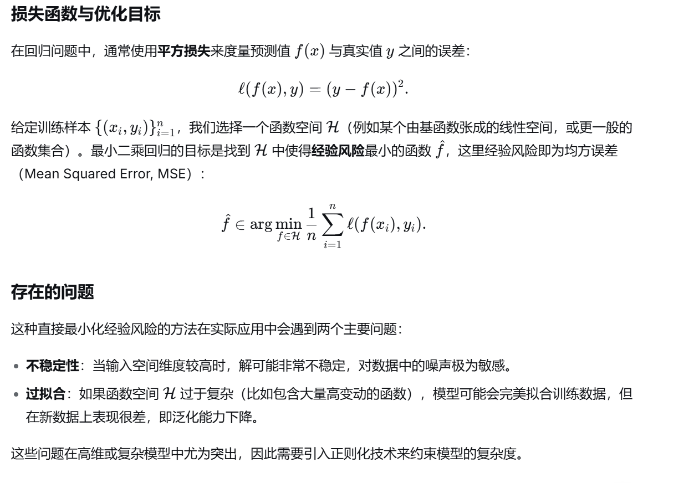
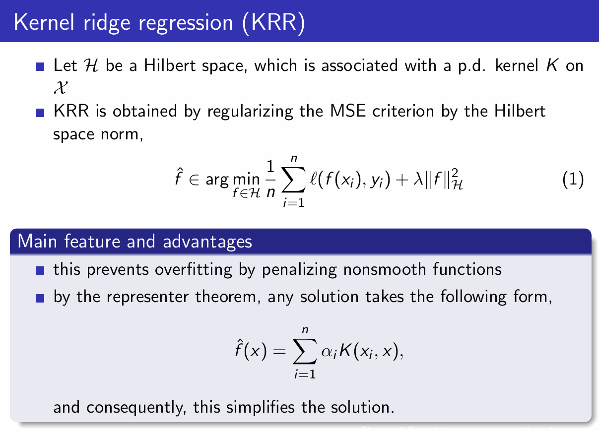
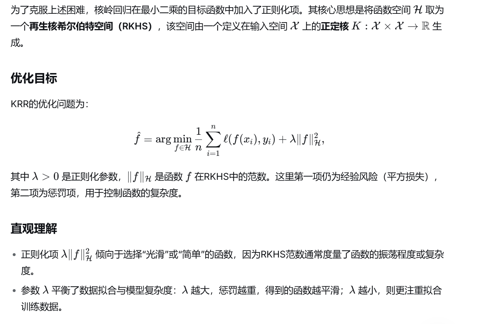
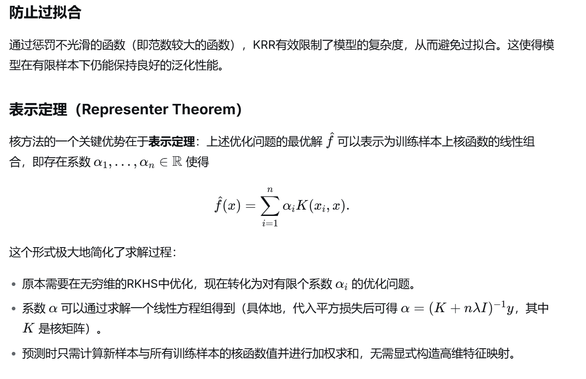
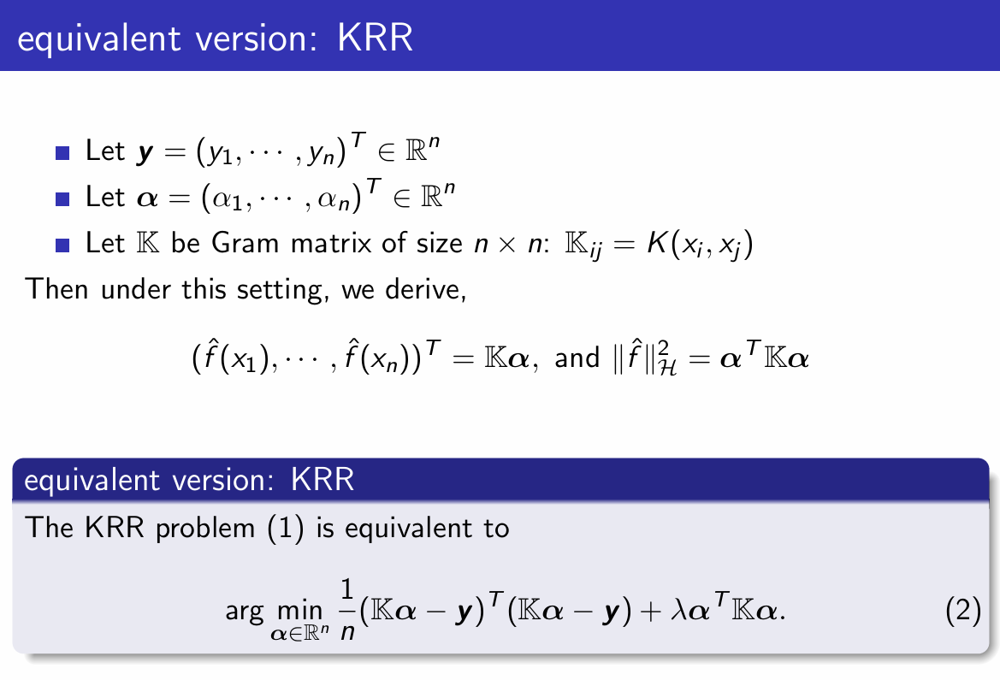
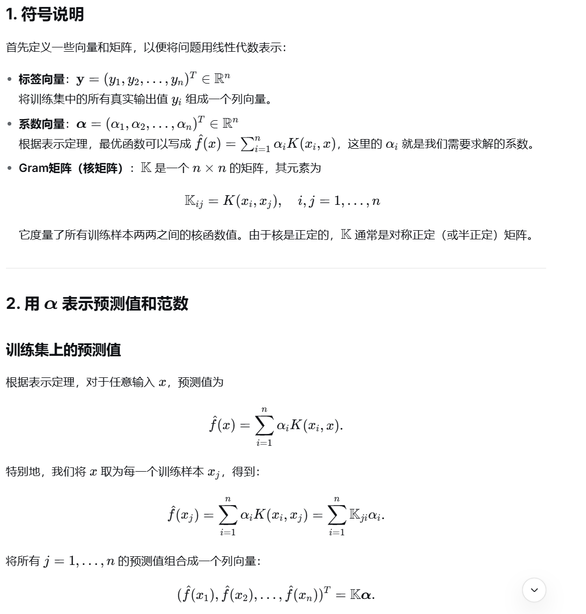
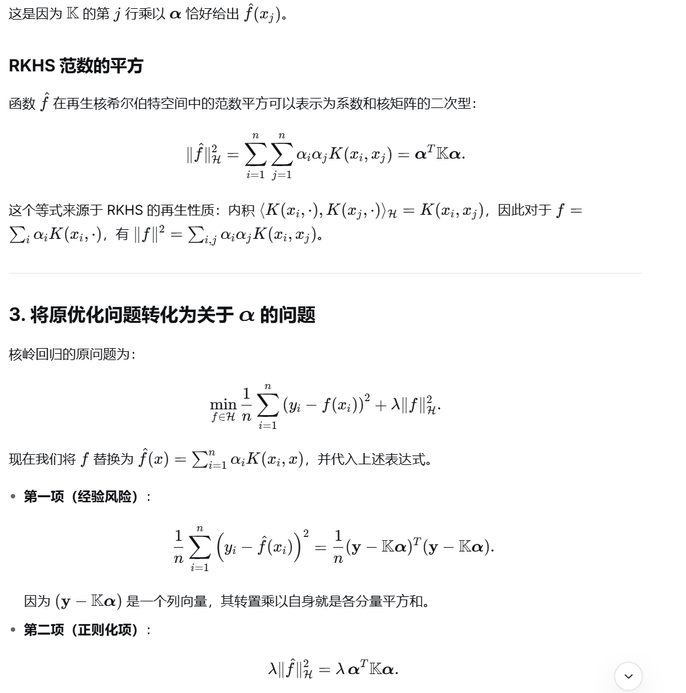
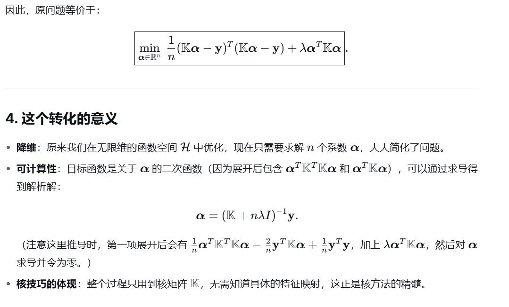
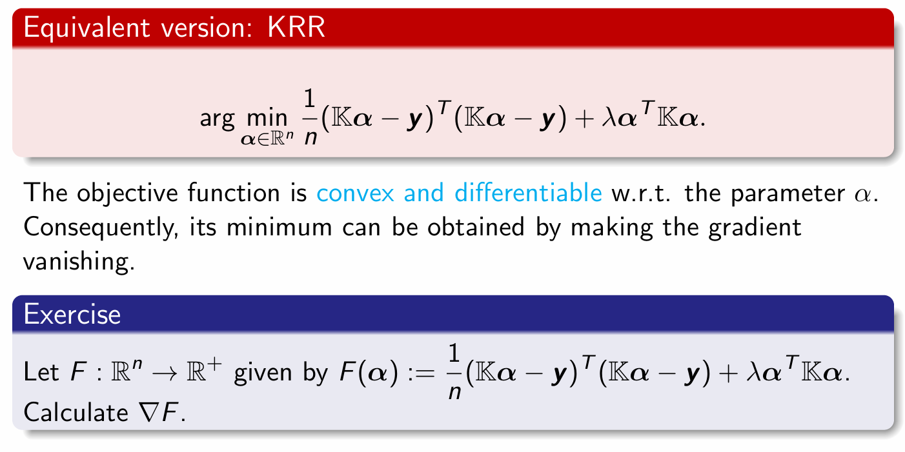

# Chapter 1 Convolution operators and kernel operators
**最头疼的一集**

# 1 Convolutional Neural Network
## 1.1 维卷积与互相关（Cross-correlation）
**核心关系**
- 卷积的**交换律**源于对核的翻转操作，这一性质主要用于理论证明，对神经网络实现并非必需。
- 互相关是卷积的简化实现，**不执行核的翻转**，因此是PyTorch等框架中更常用的底层实现方式。

**互相关数学定义**
设输入 $I \in \mathbb{R}^{m_1 \times n_1}$，核 $K \in \mathbb{R}^{m_2 \times n_2}$，输出特征图 $S \in \mathbb{R}^{(m_1 - m_2 + 1) \times (n_1 - n_2 + 1)}$，则：
$$
S(i,j) := (I * K)(i,j) = \sum_{k_1=1}^{m_2} \sum_{k_2=1}^{n_2} I(i + k_1, j + k_2) K(k_1, k_2)
$$

## 1.2 机器学习中卷积的基本概念
- **输入（Input）**：多维数组（张量）形式的原始数据，例如图像的像素矩阵。
- **核（Kernel）**：由学习算法优化的参数张量，通过滑动计算提取输入的局部特征。

## 1.3 卷积在机器学习中的三大核心优势
### 稀疏交互（Sparse Interaction）
- **卷积模型**：单个输入单元仅影响局部输出单元（如宽度为3的核仅影响3个输出），连接局部且稀疏，计算冗余度低。
- **全连接模型**：单个输入单元影响所有输出单元，连接稠密，计算与参数冗余度高。
- 核心价值：高效捕捉局部特征，降低计算量与过拟合风险。

### 参数共享（Parameter Sharing）
- **卷积模型**：卷积核的参数在整个输入空间共享使用（如核的中心元素在所有位置复用），大幅减少参数量。
- **全连接模型**：权重矩阵的参数仅使用一次，无共享机制，参数量随输入尺寸指数增长。
- 核心价值：以少量参数学习全局通用特征，提升计算效率与平移鲁棒性。

### 等变表示（Equivariant Representations）
- 输入的平移会导致输出的对应平移，能够保留输入的空间结构信息，适合处理图像等具有空间相关性的数据。

### 可视化对比总结
| 特性 | 卷积模型 | 全连接模型 |
|------|----------|------------|
| 连接方式 | 局部、稀疏 | 全局、稠密 |
| 参数使用 | 全局共享 | 单次使用 |
| 空间结构保留 | 支持（等变表示） | 不支持 |
| 计算效率 | 高 | 低 |
| 参数量 | 少 | 多 |

## 2.1 卷积层
### 基本构成
- **输入图像**：通常为多维张量，示例中为 $5 \times 5 \times 1$（高×宽×通道数）。
- **卷积核（Kernel/Filter）**：示例中为 $3 \times 3 \times 1$ 的参数矩阵，是卷积层的核心参数，负责提取局部特征。

### 滑动计算过程
- **步长（Stride）**：示例中步长为1（无跳步），卷积核在输入图像上共滑动9次，每次与覆盖的图像区域做矩阵乘法。
- **滑动路径**：卷积核先沿宽度方向右移，遍历完整行后，再向下跳步至行首，重复滑动直到遍历整个图像。

### 卷积的目标与特征提取
**核心目标**
- 从输入图像中提取**高层特征**（如边缘），多层卷积可实现从**底层特征**（颜色、梯度方向）到高层语义特征的递进式学习，让网络具备完整的图像理解能力。

**输出尺寸与填充策略**
| 填充类型 | 效果 | 输出尺寸示例 |
|----------|------|--------------|
| **Valid Padding（无填充）** | 仅对图像有效区域进行卷积，输出尺寸小于输入 | $5 \times 5$ 输入 → $3 \times 3$ 输出 |
| **Same Padding（补零填充）** | 对输入图像边缘补零，保持输出尺寸与输入一致 | $5 \times 5$ 输入 → $5 \times 5$ 输出（需先扩充为 $7 \times 7$） |

## 1.3 池化层
### 核心作用
- **降维与效率优化**：压缩卷积特征图的空间尺寸，减少后续计算量与参数量。
- **特征不变性**：提取具有**旋转与位置不变性**的主导特征，增强模型对局部平移的鲁棒性。

### 常见池化类型
- **最大池化（Max Pooling）**：取卷积核覆盖区域的最大值，保留最显著的局部特征。
- **平均池化（Average Pooling）**：取卷积核覆盖区域的平均值，平滑局部特征，减少噪声干扰。

---

# 2 核方法（Kernel Method）
## 2.1 核方法概述
#### 动机（Motivation）
- 开发通用算法，用于处理和**分析各种类型的数据**（如向量、字符串、图、图像等），无需对数据类型做任何假设。
- 通过对**成对比较函数**施加约束（如正定核），获得一个通用的**学习框架**（在希尔伯特空间中进行优化）。

#### 方法（Approach）
- 基于**成对比较**（pairwise comparisons）开发方法。
- 将**正定核**作为约束条件，构建一个适用于各类数据学习的统一框架，并在希尔伯特空间中进行优化。

### 2.1.1 核心理论支撑
核方法基于两个重要理论成果，构成了一系列强大数据分析算法的基础：

- 核技巧（Kernel Trick）
  - 基于**正定核可以表示为内积**的特性。
  - 允许在高维特征空间中通过核函数隐式计算内积，而无需显式计算高维特征映射。

- 表示定理（Representer Theorem）
  - 基于希尔伯特空间范数定义的**正则化泛函的某些性质**。

### 2.1.2 核方法的工作原理
1. **核映射（Kernel Map）**：
   - 将数据嵌入到一个**高维特征空间**，该空间的内积由对应的**正定核**定义。
   
2. **高效计算**：
   - 核技巧使得学习算法能够**高效实现**，无需显式处理高维特征表示。

3. **表达能力增强**：
   - 核方法能够**增强简单预测器（如线性预测器）的表达能力**，使其能够处理非线性问题。

#### 核方法的优势
- **通用性**：适用于多种数据类型和结构。
- **计算高效**：通过核技巧避免高维计算。
- **理论保障**：有坚实的数学基础（如希尔伯特空间理论、表示定理）。
- **灵活性**：可通过选择不同的核函数适应不同问题。

## 2.2 核方法的基本范例（Basic Paradigm of Kernel Method）

### 2.2.1 基本流程：
给定一个域集 \(\mathcal{X}\)，目标是使用训练数据学习函数 \(h : \mathcal{X} \to \mathbb{R}\)：

1. **选择映射**：  
   选择一个映射 \(\psi : \mathcal{X} \to \mathcal{H}\)，将数据映射到特征空间 \(\mathcal{H}\)（通常是 \(\mathbb{R}^n\)，也可以是任意希尔伯特空间，包括无限维空间）。

2. **构建映射后的训练集**：  
   对于标记训练数据 \(S = \{(x_i, y_i)\}_{i=1}^m\)，创建映射后的序列：
   \[
   \hat{S} = \{(\psi(x_i), y_i)\}_{i=1}^m
   \]

3. **在特征空间中训练线性预测器**：  
   在 \(\hat{S}\) 上训练一个线性预测器 \(\hat{h} : \mathcal{H} \to \mathbb{R}\)。

4. **预测新数据点**：  
   对测试点 \(x\) 的预测为 \(\hat{h}(\psi(x))\)。

**关键**：该学习范式的成功取决于为给定任务选择合适的映射 \(\psi\)。

### 2.2.2 动机示例：使用半空间分类

**问题**：如何在二维空间 \(\mathcal{X} = \mathbb{R}^2\) 中用半空间分离非线性可分的训练集？

**解决方案**：
- 将原始实例空间 \(\mathbb{R}^2\) 映射到更高维空间（例如 \(\mathbb{R}^4\)）。
- 在高维空间中学习一个半空间（线性分类器）。
- 这使得半空间类别更具表达能力，能够处理原始空间中非线性可分的问题。

### 2.2.3 通俗比喻总结
我们用一个生活中的例子来理解这个流程：
**原始问题：** 你想区分 “圆形的水果” 和 “非圆形的水果”，但在 “颜色 - 重量” 的二维描述里，它们混在一起，无法用一条直线分开。
**核方法流程：**
- 升维映射：你增加了 “形状” 这个新特征，把描述从二维（颜色 - 重量）扩展到三维（颜色 - 重量 - 形状）。
- 生成新数据：把所有水果都用三维特征重新描述。
- 训练线性模型：在三维空间里，你可以用一个平面轻松把 “圆形” 和 “非圆形” 分开。
- 预测新水果：对一个新水果，你先提取它的三维特征，再用那个平面判断它是否是圆形水果。

## 2.3 正定核（Positive Definite Kernels）

### 2.3.1 定义
设 \(\chi\) 为一个集合，一个正定核是一个函数：
\[
K: \chi \times \chi \to \mathbb{R}
\]
满足以下条件：

1. **对称性**：
   \[
   \forall (x, x') \in \chi^2,\quad K(x, x') = K(x', x)
   \]

2. **正定性**：
   对所有 \(N \in \mathbb{N}\)、任意点 \((x^1, \dots, x^N) \in \chi^N\) 和任意系数 \((a_1, \dots, a_N) \in \mathbb{R}^N\)，有：
   \[
   \sum_{i=1}^N \sum_{j=1}^N a_i a_j K(x^i, x^j) \geq 0
   \]

### 2.3.2 正定核的相似性矩阵（Similarity Matrices）

#### 等价条件
一个核 \(K\) 是正定的 **当且仅当**：  
对于任意 \(N \in \mathbb{N}\) 和任意点集 \((x^1, \dots, x^N) \in \chi^N\)，其相似性矩阵：
\[
[K]_{ij} := K(x^i, x^j)
\]
是一个 **半正定矩阵**。

#### 核方法的输入
- 核方法算法以这样的相似性矩阵作为输入。
- 矩阵的每个元素 \(K(x^i, x^j)\) 表示数据点 \(x^i\) 和 \(x^j\) 在高维特征空间中的内积。

---

# 3 基于核的监督学习

## 3.1 基于核的监督学习
该算法将监督学习问题统一为以下三个步骤：

## 3.2 一般函数空间上的最小二乘回归

## 3.3 核岭回归（Kernel Ridge Regression, KRR）

