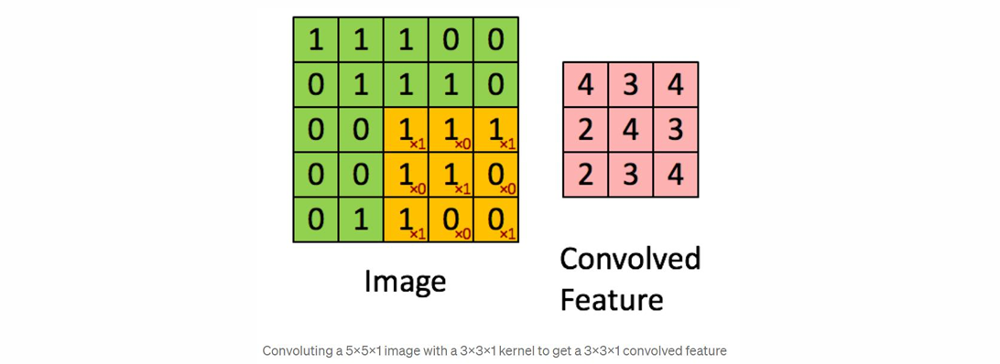
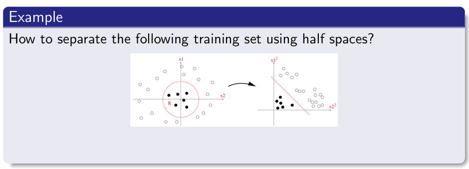
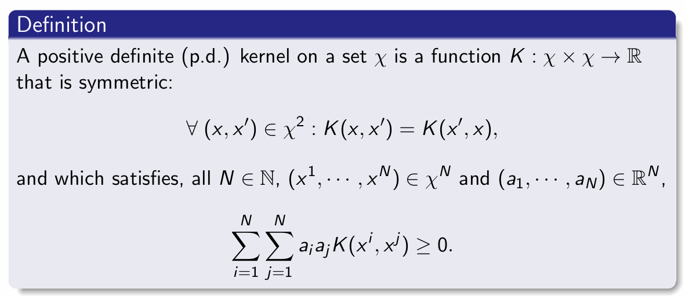
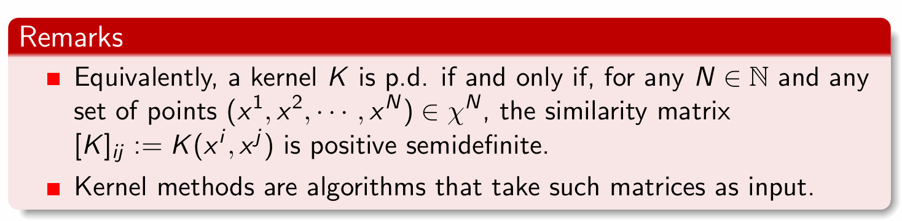
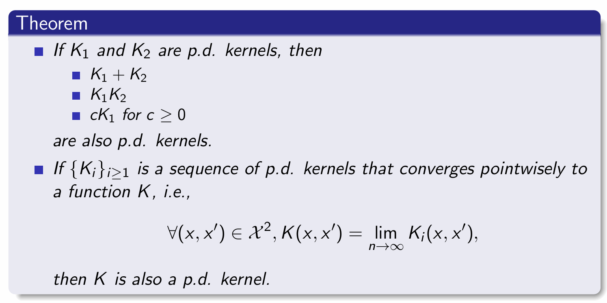
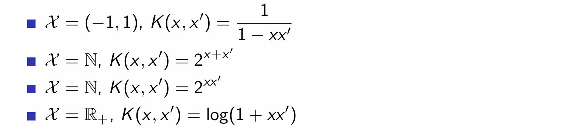
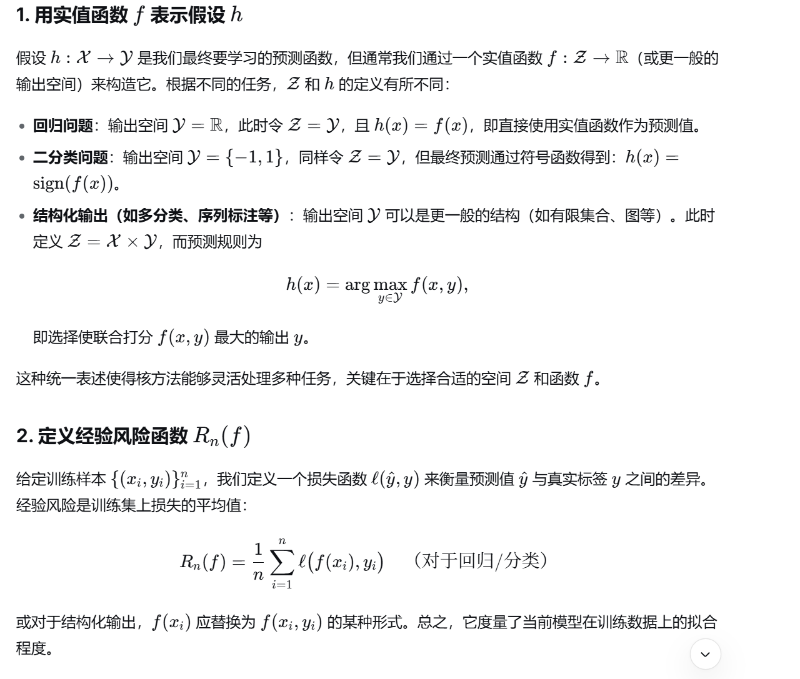
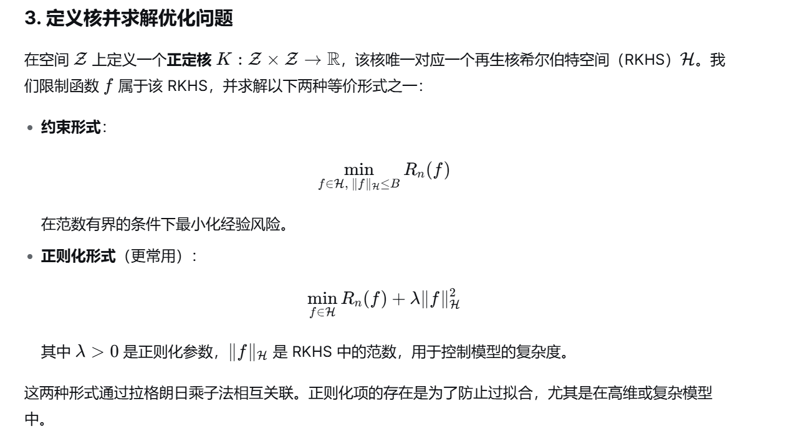
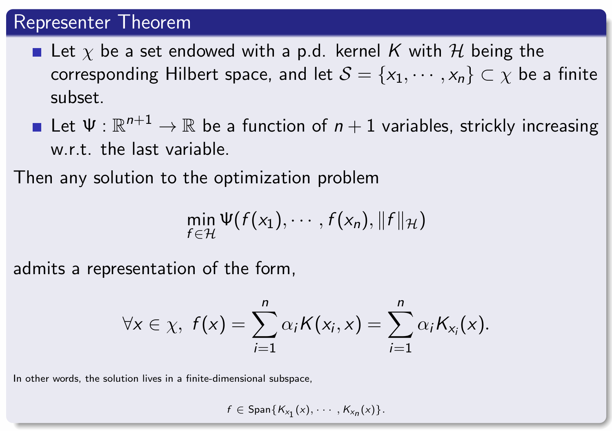
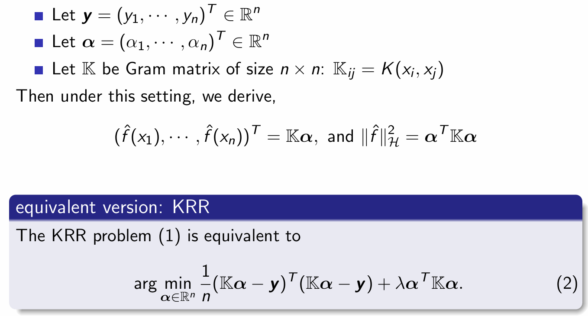

# Chapter 1 Convolution operators and kernel operators

# 1 Convolutional Neural Network
## 1.1 维卷积与互相关（Cross-correlation）
**核心关系**
- 卷积的**交换律**源于对核的翻转操作，这一性质主要用于理论证明，对神经网络实现并非必需。
- 互相关是卷积的简化实现，**不执行核的翻转**，因此是PyTorch等框架中更常用的底层实现方式。

**互相关数学定义**
设输入 $I \in \mathbb{R}^{m_1 \times n_1}$，核 $K \in \mathbb{R}^{m_2 \times n_2}$，输出特征图 $S \in \mathbb{R}^{(m_1 - m_2 + 1) \times (n_1 - n_2 + 1)}$，则：
$$
S(i,j) := (I * K)(i,j) = \sum_{k_1=1}^{m_2} \sum_{k_2=1}^{n_2} I(i + k_1, j + k_2) K(k_1, k_2)
$$

## 1.2 机器学习中卷积的基本概念
- **输入（Input）**：多维数组（张量）形式的原始数据，例如图像的像素矩阵。
- **核（Kernel）**：由学习算法优化的参数张量，通过滑动计算提取输入的局部特征。

## 1.3 卷积在机器学习中的三大核心优势
### 稀疏交互（Sparse Interaction）
- **卷积模型**：单个输入单元仅影响局部输出单元（如宽度为3的核仅影响3个输出），连接局部且稀疏，计算冗余度低。
- **全连接模型**：单个输入单元影响所有输出单元，连接稠密，计算与参数冗余度高。
- 核心价值：高效捕捉局部特征，降低计算量与过拟合风险。

### 参数共享（Parameter Sharing）
- **卷积模型**：卷积核的参数在整个输入空间共享使用（如核的中心元素在所有位置复用），大幅减少参数量。
- **全连接模型**：权重矩阵的参数仅使用一次，无共享机制，参数量随输入尺寸指数增长。
- 核心价值：以少量参数学习全局通用特征，提升计算效率与平移鲁棒性。

### 等变表示（Equivariant Representations）
- 输入的平移会导致输出的对应平移，能够保留输入的空间结构信息，适合处理图像等具有空间相关性的数据。

### 可视化对比总结
| 特性 | 卷积模型 | 全连接模型 |
|------|----------|------------|
| 连接方式 | 局部、稀疏 | 全局、稠密 |
| 参数使用 | 全局共享 | 单次使用 |
| 空间结构保留 | 支持（等变表示） | 不支持 |
| 计算效率 | 高 | 低 |
| 参数量 | 少 | 多 |

## 2.1 卷积层
### 基本构成
- **输入图像**：通常为多维张量，示例中为 $5 \times 5 \times 1$（高×宽×通道数）。
- **卷积核（Kernel/Filter）**：示例中为 $3 \times 3 \times 1$ 的参数矩阵，是卷积层的核心参数，负责提取局部特征。

### 滑动计算过程
- **步长（Stride）**：示例中步长为1（无跳步），卷积核在输入图像上共滑动9次，每次与覆盖的图像区域做矩阵乘法。
- **滑动路径**：卷积核先沿宽度方向右移，遍历完整行后，再向下跳步至行首，重复滑动直到遍历整个图像。

### 卷积的目标与特征提取
**核心目标**
- 从输入图像中提取**高层特征**（如边缘），多层卷积可实现从**底层特征**（颜色、梯度方向）到高层语义特征的递进式学习，让网络具备完整的图像理解能力。

**输出尺寸与填充策略**
| 填充类型 | 效果 | 输出尺寸示例 |
|----------|------|--------------|
| **Valid Padding（无填充）** | 仅对图像有效区域进行卷积，输出尺寸小于输入 | $5 \times 5$ 输入 → $3 \times 3$ 输出 |
| **Same Padding（补零填充）** | 对输入图像边缘补零，保持输出尺寸与输入一致 | $5 \times 5$ 输入 → $5 \times 5$ 输出（需先扩充为 $7 \times 7$） |

## 1.3 池化层
### 核心作用
- **降维与效率优化**：压缩卷积特征图的空间尺寸，减少后续计算量与参数量。
- **特征不变性**：提取具有**旋转与位置不变性**的主导特征，增强模型对局部平移的鲁棒性。

### 常见池化类型
- **最大池化（Max Pooling）**：取卷积核覆盖区域的最大值，保留最显著的局部特征。
- **平均池化（Average Pooling）**：取卷积核覆盖区域的平均值，平滑局部特征，减少噪声干扰。

---

# 2 核方法（Kernel Method）
## 2.1 核方法概述
#### 动机（Motivation）
- 开发通用算法，用于处理和**分析各种类型的数据**（如向量、字符串、图、图像等），无需对数据类型做任何假设。
- 通过对**成对比较函数**施加约束（如正定核），获得一个通用的**学习框架**（在希尔伯特空间中进行优化）。

#### 方法（Approach）
- 基于**成对比较**（pairwise comparisons）开发方法。
- 将**正定核**作为约束条件，构建一个适用于各类数据学习的统一框架，并在希尔伯特空间中进行优化。

### 2.1.1 核心理论支撑
核方法基于两个重要理论成果，构成了一系列强大数据分析算法的基础：

- 核技巧（Kernel Trick）
  - 基于**正定核可以表示为内积**的特性。
  - 允许在高维特征空间中通过核函数隐式计算内积，而无需显式计算高维特征映射。

- 表示定理（Representer Theorem）
  - 基于希尔伯特空间范数定义的**正则化泛函的某些性质**。

### 2.1.2 核方法的工作原理
1. **核映射（Kernel Map）**：
   - 将数据嵌入到一个**高维特征空间**，该空间的内积由对应的**正定核**定义。
   
2. **高效计算**：
   - 核技巧使得学习算法能够**高效实现**，无需显式处理高维特征表示。

3. **表达能力增强**：
   - 核方法能够**增强简单预测器（如线性预测器）的表达能力**，使其能够处理非线性问题。

#### 核方法的优势
- **通用性**：适用于多种数据类型和结构。
- **计算高效**：通过核技巧避免高维计算。
- **理论保障**：有坚实的数学基础（如希尔伯特空间理论、表示定理）。
- **灵活性**：可通过选择不同的核函数适应不同问题。

## 2.2 核方法的基本范例（Basic Paradigm of Kernel Method）

### 2.2.1 基本流程：
给定一个域集 \(\mathcal{X}\)，目标是使用训练数据学习函数 \(h : \mathcal{X} \to \mathbb{R}\)：

1. **选择映射**：  
   选择一个映射 \(\psi : \mathcal{X} \to \mathcal{H}\)，将数据映射到特征空间 \(\mathcal{H}\)（通常是 \(\mathbb{R}^n\)，也可以是任意希尔伯特空间，包括无限维空间）。

2. **构建映射后的训练集**：  
   对于标记训练数据 \(S = \{(x_i, y_i)\}_{i=1}^m\)，创建映射后的序列：
   \[
   \hat{S} = \{(\psi(x_i), y_i)\}_{i=1}^m
   \]

3. **在特征空间中训练线性预测器**：  
   在 \(\hat{S}\) 上训练一个线性预测器 \(\hat{h} : \mathcal{H} \to \mathbb{R}\)。

4. **预测新数据点**：  
   对测试点 \(x\) 的预测为 \(\hat{h}(\psi(x))\)。

**关键**：该学习范式的成功取决于为给定任务选择合适的映射 \(\psi\)。

### 2.2.2 动机示例：使用半空间分类

**问题**：如何在二维空间 \(\mathcal{X} = \mathbb{R}^2\) 中用半空间分离非线性可分的训练集？

**解决方案**：
- 将原始实例空间 \(\mathbb{R}^2\) 映射到更高维空间（例如 \(\mathbb{R}^4\)）。
- 在高维空间中学习一个半空间（线性分类器）。
- 这使得半空间类别更具表达能力，能够处理原始空间中非线性可分的问题。

### 2.2.3 通俗比喻总结
我们用一个生活中的例子来理解这个流程：
**原始问题：** 你想区分 “圆形的水果” 和 “非圆形的水果”，但在 “颜色 - 重量” 的二维描述里，它们混在一起，无法用一条直线分开。
**核方法流程：**
- 升维映射：你增加了 “形状” 这个新特征，把描述从二维（颜色 - 重量）扩展到三维（颜色 - 重量 - 形状）。
- 生成新数据：把所有水果都用三维特征重新描述。
- 训练线性模型：在三维空间里，你可以用一个平面轻松把 “圆形” 和 “非圆形” 分开。
- 预测新水果：对一个新水果，你先提取它的三维特征，再用那个平面判断它是否是圆形水果。

## 2.3 正定核（Positive Definite Kernels）

### 2.3.1 定义
设 \(\chi\) 为一个集合，一个正定核是一个函数：
\[
K: \chi \times \chi \to \mathbb{R}
\]
满足以下条件：

1. **对称性**：
   \[
   \forall (x, x') \in \chi^2,\quad K(x, x') = K(x', x)
   \]

2. **正定性**：
   对所有 \(N \in \mathbb{N}\)、任意点 \((x^1, \dots, x^N) \in \chi^N\) 和任意系数 \((a_1, \dots, a_N) \in \mathbb{R}^N\)，有：
   \[
   \sum_{i=1}^N \sum_{j=1}^N a_i a_j K(x^i, x^j) \geq 0
   \]

### 2.3.2 正定核的相似性矩阵（Similarity Matrices）

#### 等价条件
一个核 \(K\) 是正定的 **当且仅当**：  
对于任意 \(N \in \mathbb{N}\) 和任意点集 \((x^1, \dots, x^N) \in \chi^N\)，其相似性矩阵：
\[
[K]_{ij} := K(x^i, x^j)
\]
是一个 **半正定矩阵**。

#### 核方法的输入
- 核方法算法以这样的相似性矩阵作为输入。
- 矩阵的每个元素 \(K(x^i, x^j)\) 表示数据点 \(x^i\) 和 \(x^j\) 在高维特征空间中的内积。

### 2.3.3 正定核的常见示例 (Examples)

#### 最简单的正定核
* **针对实数 (For real numbers)**:
    设 $\chi = \mathbb{R}$。定义函数为两个实数相乘：
    $$\forall(x, x') \in \chi^2 : K(x, x') = xx'$$
    这是一个正定核。
* **针对向量 (For vectors)**:
    设 $\chi = \mathbb{R}^d$。定义函数为两个向量的内积：
    $$\forall(x, x') \in \chi^2 : K(x, x') = \langle x, x' \rangle_\chi$$
    这是一个正定核，通常被称为**线性核 (Linear kernel)**。

#### 引入特征映射的核 (A more ambitious p.d. kernel)
如果 $\chi$ 是任意集合，且存在一个特征映射 $\phi: \chi \rightarrow \mathbb{R}^d$ 将其映射到向量空间。那么定义在该映射内积上的函数也是正定核：
$$\forall(x, x') \in \chi^2 : K(x, x') = \langle \phi(x), \phi(x') \rangle_{\mathbb{R}^d}$$

#### 多项式核示例 (Polynomial kernel)
* **设定**: $\chi := \mathbb{R}^2$
* **特征映射 $\phi$**: $\phi: \chi \rightarrow \mathbb{R}^3$ 定义为：
    $$\phi(x_1, x_2) = (x_1^2, \sqrt{2}x_1x_2, x_2^2)$$
* **核函数推导**:
    $$K(x, x') = \langle \phi(x), \phi(x') \rangle_{\mathbb{R}^3} = \langle x, x' \rangle_{\mathbb{R}^2}^2$$
    这个函数 $K$ 也是一个正定核。它展示了如何在低维空间 $\mathbb{R}^2$ 中计算内积的平方，等效于在高维空间 $\mathbb{R}^3$ 中进行特征映射后的内积计算（这就是核技巧/Kernel Trick 的核心思想）。

### 2.3.4 正定核的组合性质 (Combining kernels)

在已知一些基础正定核的情况下，可以通过特定的数学操作组合出新的正定核。课件给出了以下重要定理：

#### 基础组合定理
如果 $K_1$ 和 $K_2$ 都是正定核 (p.d. kernels)，那么以下组合也是正定核：
*   **相加**: $K_1 + K_2$
*   **相乘**: $K_1K_2$
*   **非负标量乘法**: $cK_1$ （其中 $c \ge 0$）

#### 极限收敛定理
如果存在一个正定核序列 $\{K_i\}_{i \ge 1}$，且该序列**逐点收敛 (converges pointwisely)** 到一个函数 $K$，即：
$$\forall(x, x') \in \mathcal{X}^2, \quad K(x, x') = \lim_{n \rightarrow \infty} K_i(x, x')$$
那么，这个极限函数 $K$ 也是一个正定核。

### 2.3.5 指数核定理 (Exponential Kernel Theorem)

#### 定理内容
如果 $K$ 是一个正定核，那么它的指数形式 $e^K$ 也是一个正定核。

#### 证明逻辑 (Proof)
这个定理的证明完美地运用了上一节的“组合性质”。利用泰勒展开（麦克劳林级数），可以将 $e^{K(x, x')}$ 展开为：
$$e^{K(x, x')} = \lim_{n \rightarrow \infty} \sum_{i=0}^n \frac{K(x, x')^i}{i!}$$

**推导过程解析：**
1.  **幂次正定**：因为 $K$ 是正定核，根据“相乘”性质，它的任意次幂 $K(x, x')^i$ 也是正定核。
2.  **标量乘法正定**：$\frac{1}{i!}$ 是一个大于 $0$ 的常数，根据“非负标量乘法”性质，$\frac{K(x, x')^i}{i!}$ 是正定核。
3.  **相加正定**：根据“相加”性质，前 $n$ 项的和 $\sum_{i=0}^n \frac{K(x, x')^i}{i!}$ 是正定核。
4.  **极限正定**：最后，根据“极限收敛定理”，当 $n \rightarrow \infty$ 时的极限 $e^{K(x, x')}$ 依然是正定核。

#### 练习解析 (Exercise)

**题目**：证明对于任意 $d \in \mathbb{N}$，函数 $\langle x, x' \rangle_{\mathbb{R}^p}^d$ 在定义域 $\chi = \mathbb{R}^p$ 上是正定核。

**证明解析**：
1. 我们已知两个向量的内积 $\langle x, x' \rangle_{\mathbb{R}^p}$ 是一个基础的正定核（即线性核）。
2. 根据正定核的“组合定理”中的**相乘性质 (If $K_1, K_2$ are p.d., then $K_1K_2$ is p.d.)**，一个正定核自身与自身相乘依然是正定核。
3. 将内积核自身连乘 $d$ 次，即得到 $\langle x, x' \rangle_{\mathbb{R}^p}^d$。
4. 因此，通过数学归纳法或直接应用乘积性质，即可证明对于任意自然数 $d$，该多项式核依然是正定核。

## 2.4 隋唐测验 (Quiz) 解析：以下哪些是正定核 (p.d. kernels)？

针对课件中给出的四个核函数，我们通过正定核的构造性质来进行逐一分析和判断：

### 1. $\mathcal{X} = (-1, 1), \quad K(x, x') = \frac{1}{1 - xx'}$
*   **判断结论：是正定核 (Yes)**
*   **解析过程**：
    因为 $x, x' \in (-1, 1)$，所以绝对值 $|xx'| < 1$。我们可以利用几何级数（泰勒展开）将其展开：
    $$K(x, x') = \frac{1}{1 - xx'} = \sum_{n=0}^{\infty} (xx')^n = 1 + xx' + (xx')^2 + (xx')^3 + \cdots$$
    由于展开式可以写成 $\sum_{n=0}^{\infty} x^n (x')^n$，这相当于定义了一个无穷维的特征映射 $\phi(x) = (1, x, x^2, x^3, \cdots)$，而 $K(x, x')$ 正好是 $\langle \phi(x), \phi(x') \rangle$ 的内积。因此，它是正定核。

### 2. $\mathcal{X} = \mathbb{N}, \quad K(x, x') = 2^{x+x'}$
*   **判断结论：是正定核 (Yes)**
*   **解析过程**：
    利用指数的性质，可以将其分解为两个独立部分的乘积：
    $$K(x, x') = 2^{x} \cdot 2^{x'}$$
    我们可以定义一个一维的特征映射 $\phi(x) = 2^x$。那么 $K(x, x') = \phi(x)\phi(x')$，这完全符合一维向量内积的定义。因此，它是正定核。

### 3. $\mathcal{X} = \mathbb{N}, \quad K(x, x') = 2^{xx'}$
*   **判断结论：是正定核 (Yes)**
*   **解析过程**：
    利用对数恒等式，我们可以将其改写为以 $e$ 为底的指数函数：
    $$K(x, x') = e^{(\ln 2) xx'}$$
    我们已知 $xx'$ 是一个最基础的正定核（线性核）。因为 $\ln 2 > 0$，所以 $(\ln 2)xx'$ 也是正定核。
    根据正定核的性质：**正定核的指数函数依然是正定核**（因为 $e^z = 1 + z + \frac{z^2}{2!} + \cdots$，各项系数均为正，且正定核的幂和加和依然正定）。因此，$2^{xx'}$ 也是正定核。

### 4. $\mathcal{X} = \mathbb{R}_+, \quad K(x, x') = \log(1 + xx')$
*   **判断结论：不是正定核 (No)**
*   **解析过程**：
    要证明它不是正定核，我们只需要找出一个反例，即构造一个不满足半正定性质的相似度矩阵（Gram 矩阵）。
    我们从定义域 $\mathbb{R}_+$ 中选取两个点：$x_1 = 1, x_2 = 10$。
    计算对应的 $2 \times 2$ Gram 矩阵 $K$：
    $$K = \begin{bmatrix} \log(1+1\times1) & \log(1+1\times10) \\ \log(1+10\times1) & \log(1+10\times10) \end{bmatrix} = \begin{bmatrix} \log(2) & \log(11) \\ \log(11) & \log(101) \end{bmatrix}$$
    计算该矩阵的行列式：
    $$\det(K) = \log(2) \cdot \log(101) - (\log(11))^2 \approx (0.693 \times 4.615) - (2.397)^2 \approx 3.198 - 5.745 < 0$$
    因为矩阵的行列式小于 0，说明该矩阵存在负的特征值，**不是半正定矩阵**。因此，该函数不满足正定核的条件。
    *(直觉提示：如果对其进行泰勒展开 $\log(1+z) = z - z^2/2 + z^3/3 - \cdots$，出现的负系数也暗示了它可能无法保持正定性。)*

## 2.5 常见核函数与泰勒展开性质总结

在核方法理论中，假设内积 $z = \langle x, x' \rangle = x^T x'$，若一个标量函数 $f(z)$ 的泰勒级数（麦克劳林级数）展开式为 $f(z) = \sum_{n=0}^{\infty} a_n z^n$，且**所有系数 $a_n \ge 0$**，则由该函数构造的 $K(x, x') = f(x^T x')$ 必然是正定核（Positive Definite Kernel, p.d. kernel）。

以下是常见核函数的性质汇总表：

| 核函数名称 (Kernel) | 函数表达式 $K(x, x')$ | 对应单变量函数 $f(z)$ (设 $z = x^T x'$) | 泰勒展开 / 级数形式 | 展开系数特征 | 是否为正定核 (p.d.) |
| :--- | :--- | :--- | :--- | :--- | :--- |
| **线性核 (Linear)** | $x^T x'$ | $f(z) = z$ | $f(z) = z$ | $a_1 = 1$, 其余为 $0$ ($a_n \ge 0$) | **是** |
| **多项式核 (Polynomial)** | $(\gamma x^T x' + c)^d$   $(\gamma>0, c \ge 0, d \in \mathbb{N}^+)$ | $f(z) = (\gamma z + c)^d$ | $f(z) = \sum_{k=0}^{d} \binom{d}{k} (\gamma z)^k c^{d-k}$ | 二项式展开，所有系数 $\ge 0$ | **是** |
| **指数核 (Exponential)** | $e^{\gamma x^T x'}$   $(\gamma > 0)$ | $f(z) = e^{\gamma z}$ | $f(z) = \sum_{n=0}^{\infty} \frac{\gamma^n}{n!} z^n$ | 所有项系数 $\frac{\gamma^n}{n!} > 0$ | **是** |
| **几何级数核 (Geometric)** | $\frac{1}{1 - x^T x'}$   (定义域需满足 $\|x\|<1$) | $f(z) = \frac{1}{1 - z}$ | $f(z) = \sum_{n=0}^{\infty} z^n$ | 所有项系数 $a_n = 1 > 0$ | **是** |
| **对数核 (Logarithmic)** | $\log(1 + x^T x')$ | $f(z) = \log(1+z)$ | $f(z) = z - \frac{z^2}{2} + \frac{z^3}{3} - \dots$ | 系数正负交替，存在负系数 | **否** |
| **Sigmoid 核 (Tanh)** | $\tanh(\gamma x^T x' + c)$ | $f(z) = \tanh(\gamma z + c)$ | 包含奇数次幂且系数正负交替 | 存在负系数 | **否** (仅在极特定参数下半正定) |

### 💡 重点扩展：高斯核 (RBF Kernel) 的特殊证明

高斯径向基核 $K(x, x') = e^{-\gamma \|x - x'\|^2}$ ($\gamma > 0$) 虽然不能直接写成纯粹的 $f(x^T x')$ 的形式，但它的正定性完美依赖于指数函数的泰勒展开性质：

1. **展开欧氏距离**：$\|x - x'\|^2 = \|x\|^2 + \|x'\|^2 - 2x^T x'$
2. **代入核函数**：$K(x, x') = e^{-\gamma \|x\|^2} \cdot e^{-\gamma \|x'\|^2} \cdot e^{2\gamma x^T x'}$
3. **结合闭包性质分析**：
   * 核心项 $e^{2\gamma x^T x'}$ 可以看作 $f(z) = e^{2\gamma z}$，其泰勒展开系数全为正，因此是**正定核**。
   * 前后的 $e^{-\gamma \|x\|^2}$ 和 $e^{-\gamma \|x'\|^2}$ 相当于形式为 $g(x)g(x')$ 的标量函数乘积。
   * 根据**正定核的乘法封闭性质**：如果 $K_1(x, x')$ 是正定核，那么对于任意函数 $g(x)$，$g(x)K_1(x, x')g(x')$ 依然是正定核。

**结论**：高斯核是高度无限维特征映射的内积，其正定性的核心根基依然是 $e^z$ 的泰勒级数展开所有系数为正。

---

# 3 基于核的监督学习 Kernel methods in supervised learning

## 3.1 基于核的监督学习

## 3.2 核技巧 (The Kernel Trick)

### 3.2.1 核心命题 (Proposition)
任何处理有限维向量的算法，只要该算法可以**仅用向量间的成对内积 (pairwise inner products)** 来表示，那么就可以通过将每一次内积计算替换为**核函数评估 (kernel evaluation)**，从而将该算法应用到正定核的特征空间中（即便是潜在的无限维空间）。

**核技巧的巨大优势在于：**
*   **无需显式计算高维内积**：不需要真正在高维的希尔伯特空间 (Hilbert space) 中去执行复杂的内积运算。
*   **无需知道特征映射**：我们甚至根本不需要知道具体的特征映射函数 $\phi$ 是什么，只需要知道对应的核函数 $K$ 即可。

### 3.2.2 示例：计算特征空间中的距离

假设我们将点 $x_1$ 和 $x_2$ 映射到了高维特征空间，即 $\phi(x_1)$ 和 $\phi(x_2)$。即使不知道 $\phi$，我们依然可以使用核技巧计算它们在高维空间中的距离 $d_K(x_1, x_2)$。

**推导过程：**
距离的平方等于差向量的范数平方，将其展开为内积形式：
$$d_K(x_1, x_2)^2 = \|\phi(x_1) - \phi(x_2)\|_{\mathcal{H}}^2$$
$$= \langle \phi(x_1) - \phi(x_2), \phi(x_1) - \phi(x_2) \rangle_{\mathcal{H}}$$
$$= \langle \phi(x_1), \phi(x_1) \rangle_{\mathcal{H}} + \langle \phi(x_2), \phi(x_2) \rangle_{\mathcal{H}} - 2\langle \phi(x_1), \phi(x_2) \rangle_{\mathcal{H}}$$
利用核函数的定义 $K(x, x') = \langle \phi(x), \phi(x') \rangle_{\mathcal{H}}$，将所有内积替换为核函数：
$$= K(x_1, x_1) + K(x_2, x_2) - 2K(x_1, x_2)$$
*结论：特征空间中的距离完全可以通过在原空间计算核函数来获得。*

### 3.2.3 核技巧总结与应用 (Summary)
核技巧看似是一个简单的数学替换，但却有着极其重要的应用价值：

1.  **算法的非线性化**：它可以用来获取经典线性算法的非线性版本。例如，在支持向量机 (SVM) 等算法中，将经典的内积替换为高斯核 (Gaussian kernel)，就能轻松处理非线性可分的数据。
2.  **处理非向量数据**：它可以将原本只能处理数值向量的经典算法，推广应用到非向量化数据（例如：字符串、图结构）上。前提是我们能为这些特殊数据设计出一个有效的正定核。
3.  **高维隐式嵌入**：在某些情况下，它允许我们将初始的低维空间嵌入到一个极大的特征空间中，并且能够处理特征空间中那些在原空间没有“原像 (pre-image)”的点（例如，特征空间中多个点的重心/barycenter 可能在原空间找不到对应的一个具体点，但核方法依然能对其进行计算和操作）。

## 3.3 表示定理

## 3.3.1 表示定理的动机 (Representer Theorem: Motivation)

在希尔伯特空间 (Hilbert space) 中，范数 $\|f\|_{\mathcal{H}}$ 通常用来衡量函数 $f$ 的**平滑度 (smoothness)**。
给定一组训练数据 $(x_i, y_i)_{i=1, \cdots, n}$，估计回归函数 $f: \mathcal{X} \rightarrow \mathbb{R}$ 的一个自然做法是求解以下最小化问题：
$$\min_{f \in \mathcal{H}} \frac{1}{n} \sum_{i=1}^n \ell(f(x_i), y_i) + \lambda \|f\|_{\mathcal{H}}$$
*   **左半部分**: 经验风险 (empirical risk / data fit)，例如平方损失 $\ell(y,t) = (y-t)^2$。
*   **右半部分**: 正则化项 (regularization)，用于控制模型复杂度。

**面临的挑战**：希尔伯特空间往往是潜在的无限维空间，如何在实践中求解这个无限维的优化问题？表示定理给出了完美的答案。

### 3.3.2 表示定理的核心内容 (Representer Theorem)

#### 定理定义
设 $\chi$ 为配备正定核 $K$ 的集合，$\mathcal{H}$ 为对应的希尔伯特空间。$\mathcal{S} = \{x_1, \cdots, x_n\} \subset \chi$ 是一个有限数据子集。
设 $\Psi: \mathbb{R}^{n+1} \rightarrow \mathbb{R}$ 是一个 $n+1$ 元函数，且对其**最后一个变量严格单调递增**。

那么，对于优化问题：
$$\min_{f \in \mathcal{H}} \Psi(f(x_1), \cdots, f(x_n), \|f\|_{\mathcal{H}})$$
它的**任何解**都承认以下形式的表示：
$$\forall x \in \chi, \quad f(x) = \sum_{i=1}^n \alpha_i K(x_i, x) = \sum_{i=1}^n \alpha_i K_{x_i}(x)$$

#### 核心结论
换言之，该定理证明了：尽管原本的搜索空间是无限维的，但最优解 $f$ 实际上完全存在于由训练样本构成的**有限维子空间 (finite-dimensional subspace)** 中，即：
$$f \in \text{Span}\{K_{x_1}(x), \cdots, K_{x_n}(x)\}$$

### 3.3.3 理论与实践意义 (Remarks & Consequences)

在深度学习和一般机器学习中，目标函数 $\Psi$ 通常写为：
$$\Psi(f(x_1), \cdots, f(x_n), \|f\|_{\mathcal{H}}) = c(f(x_1), \cdots, f(x_n)) + \Omega(\|f\|_{\mathcal{H}})$$
其中 $c(\cdot)$ 衡量数据拟合度，$\Omega(\cdot)$ 严格递增。这带来了两个重要推论：

1.  **理论意义 (Theoretically)**：最小化过程会迫使范数 $\|f\|_{\mathcal{H}}$ 变小，这能确保解具有足够的平滑度，从而达到**正则化效应 (regularization effect)**，防止过拟合。
2.  **实践意义 (Practically)**：正如表示定理所指出的，解只存在于一个 $n$ 维子空间中。这使得即便希尔伯特空间本身是无限维的，我们依然能够设计出**高效的算法**来求解。

### 3.3.4 核方法的双重解释与本质 (Dual interpretations)

大多数核方法都有两种互补的解释方式：
1.  **几何解释 (Geometric)**：得益于核技巧，将其视作在特征空间中的操作。即便特征空间巨大，核方法本质上也是在可用数据点嵌入后张成的“线性张成空间 (linear span)”中运作。
2.  **函数解释 (Functional)**：将其视作在与核相关的希尔伯特空间（或其子集）上的优化问题。

**表示定理的本质理解 (Why is it trivial?)**：
表示定理虽然结论强大，但在底层逻辑上其实非常直观。
我们在寻找一个函数 $f$，使得 $f(x) = \langle K_x, f \rangle_{\mathcal{H}}$。
如果把 $f$ 分解为与数据点张成空间平行的部分和垂直（正交）的部分 $f_\perp$。那么正交部分 $f_\perp \perp K_{x_i}$ 对于解释训练数据 $x_i$ **毫无用处 (useless)**（因为内积为0）。而在加入正则化惩罚 $\|f\|_{\mathcal{H}}$ 后，优化器为了让目标函数最小，自然会把对预测毫无帮助的 $f_\perp$ 压缩为 0。因此，最终的解只能由数据点的线性组合构成。

## 3.4 最小二乘回归

### 3.4.1 经验风险最小化与正则化

在一般的函数空间学习中，我们通常优化以下目标函数：
$$\min_{f \in \mathcal{H}} \frac{1}{n} \sum_{i=1}^n \ell(f(x_i), y_i) + \lambda \|f\|_{\mathcal{H}}$$
*   **前一项 (Empirical risk, data fit)**: 衡量模型对训练数据的拟合程度。
*   **后一项 (Regularization)**: 范数惩罚项，用于控制模型复杂度。

### 3.4.2 正则化的重要性与核的选择
*   **防止过拟合**: 正则化对于防止模型过拟合至关重要，特别是在处理高维问题时。
*   **线性与非线性**: 
    *   当输入空间为 $\mathbb{R}^d$ 且核 $K$ 是**线性核 (linear kernel)** 时，学习到的函数 $f$ 本质上就是一个**线性模型**。
    *   当使用更一般的空间和核 $K$ 时，它不仅允许我们在具有天然正则化性质的函数空间中学习**非线性函数**，还能让我们处理**非向量化数据**（如字符串、图结构数据）。

### 3.4.3 一般函数空间上的最小二乘回归

#### 均方误差 (MSE)
如果我们量化误差的损失函数定义为平方损失：
$$\ell(f(x), y) = (y - f(x))^2$$
那么在给定的函数空间 $\mathcal{H}$ 中，最小二乘回归的目的就是找到一个函数 $f$，使得经验风险（即均方误差 MSE）最小：
$$\hat{f} \in \arg\min_{f \in \mathcal{H}} \frac{1}{n} \sum_{i=1}^n \ell(f(x_i), y_i)$$

#### 存在的问题 (Issue)
如果不加限制地直接优化上述目标，特别是在高维空间中，算法会非常**不稳定 (unstable)**。如果选择的函数空间 $\mathcal{H}$ 过于庞大和灵活，模型将极易发生**过拟合 (overfitting)**。

## 3.5 核岭回归 (Kernel Ridge Regression, KRR)

为了解决单纯最小化 MSE 带来的过拟合问题，我们引入了**核岭回归 (KRR)**。

### 3.5.1 KRR 的定义
设 $\mathcal{H}$ 是与集合 $\mathcal{X}$ 上的正定核 $K$ 相关联的希尔伯特空间。KRR 是通过在 MSE 准则上添加希尔伯特空间范数正则化项而获得的：
$$\hat{f} \in \arg\min_{f \in \mathcal{H}} \frac{1}{n} \sum_{i=1}^n \ell(f(x_i), y_i) + \lambda \|f\|_{\mathcal{H}}^2$$

### 3.5.2 主要特征与优势 (Main feature and advantages)
1.  **惩罚不平滑函数**: 通过引入 $\|f\|_{\mathcal{H}}^2$ 作为惩罚项，KRR 倾向于选择更平滑的函数，从而有效防止过拟合。
2.  **简化求解过程**: 根据上一节的**表示定理 (Representer Theorem)**，我们已知该无限维优化问题的任何解都可以表示为有限个核函数的线性组合形式：
    $$\hat{f}(x) = \sum_{i=1}^n \alpha_i K(x_i, x)$$
    这极大地简化了 KRR 的求解，将原本在无限维空间中的函数搜索，转化为求解 $n$ 个参数 $\alpha_i$ 的有限维代数问题。

### 3.5.3 核岭回归的等价代数形式 (Equivalent version: KRR)

基于表示定理，我们已知函数解具有形式 $f(x) = \sum_{i=1}^n \alpha_i K(x_i, x)$。为了在计算机中实际求解，我们需要将其转化为关于参数向量 $\alpha$ 的代数问题。

#### 变量与符号定义
*   **标签向量**: $y = (y_1, \cdots, y_n)^T \in \mathbb{R}^n$
*   **参数向量**: $\alpha = (\alpha_1, \cdots, \alpha_n)^T \in \mathbb{R}^n$
*   **Gram 矩阵 (核矩阵)**: $\mathbb{K}$ 是一个 $n \times n$ 的矩阵，其中 $\mathbb{K}_{ij} = K(x_i, x_j)$

#### 目标的等价转换
在此设定下，模型对所有训练样本的预测值向量以及函数的希尔伯特空间范数可以表示为：
*   预测值: $(\hat{f}(x_1), \cdots, \hat{f}(x_n))^T = \mathbb{K}\alpha$
*   函数范数: $\|\hat{f}\|_{\mathcal{H}}^2 = \alpha^T \mathbb{K}\alpha$

将上述代数表示代入原始的 KRR 目标函数中，**原始的 KRR 问题等价于求解以下关于 $\alpha$ 的优化问题**：
$$\arg\min_{\alpha \in \mathbb{R}^n} \frac{1}{n}(\mathbb{K}\alpha - y)^T(\mathbb{K}\alpha - y) + \lambda \alpha^T \mathbb{K}\alpha$$

### 3.5.4 求解等价版本及详细推导 (Solving equivalent version)

定义目标函数为 $F(\alpha) := \frac{1}{n}(\mathbb{K}\alpha - y)^T(\mathbb{K}\alpha - y) + \lambda \alpha^T \mathbb{K}\alpha$。
该目标函数相对于参数 $\alpha$ 是**凸的 (convex)** 且**可微的 (differentiable)**，因此可以通过令其梯度 $\nabla F = \mathbf{0}$ 来求得最小值。

#### 课件结论
根据幻灯片给出的结果，目标函数对 $\alpha$ 的梯度为：
$$\nabla F = \frac{2}{n} \mathbb{K} ((\mathbb{K} + \lambda n \mathbb{I})\alpha - y)$$  

由于正则化系数 $\lambda > 0$ 且 $\mathbb{K}$ 是半正定矩阵，矩阵 $(\mathbb{K} + \lambda n \mathbb{I})$ 必定可逆。令 $\nabla F = \mathbf{0}$，得出最优解 $\alpha$ 的形式为：
$$\alpha = (\mathbb{K} + \lambda n \mathbb{I})^{-1} y + \text{Ker}(\mathbb{K})$$

#### 第一步：展开目标函数 $F(\alpha)$
首先，我们将经验风险（均方误差）部分展开：
$$(\mathbb{K}\alpha - y)^T(\mathbb{K}\alpha - y) = (\alpha^T \mathbb{K}^T - y^T)(\mathbb{K}\alpha - y)$$
$$= \alpha^T \mathbb{K}^T \mathbb{K}\alpha - \alpha^T \mathbb{K}^T y - y^T \mathbb{K}\alpha + y^T y$$

因为 Gram 矩阵 $\mathbb{K}$ 是对称矩阵，所以 $\mathbb{K}^T = \mathbb{K}$。此外，由于 $\alpha^T \mathbb{K} y$ 最终得到的是一个标量，标量的转置等于自身，即 $\alpha^T \mathbb{K} y = (\alpha^T \mathbb{K} y)^T = y^T \mathbb{K}^T \alpha = y^T \mathbb{K} \alpha$。因此中间两项可以合并：
$$= \alpha^T \mathbb{K}^2 \alpha - 2y^T \mathbb{K} \alpha + y^T y$$

将展开后的结果代回原目标函数：
$$F(\alpha) = \frac{1}{n} (\alpha^T \mathbb{K}^2 \alpha - 2y^T \mathbb{K} \alpha + y^T y) + \lambda \alpha^T \mathbb{K} \alpha$$

#### 第二步：计算关于 $\alpha$ 的梯度 $\nabla F$
我们需要用到矩阵求导的基本法则：对于对称矩阵 $A$，$\nabla_\alpha (\alpha^T A \alpha) = 2A\alpha$；对于向量 $c$，$\nabla_\alpha (c^T \alpha) = c$。

对 $F(\alpha)$ 的各项分别求导：
1.  $\nabla_\alpha (\alpha^T \mathbb{K}^2 \alpha) = 2\mathbb{K}^2 \alpha$
2.  $\nabla_\alpha (-2y^T \mathbb{K} \alpha) = -2\mathbb{K}^T y = -2\mathbb{K}y$
3.  $\nabla_\alpha (y^T y) = 0$ (与 $\alpha$ 无关)
4.  $\nabla_\alpha (\lambda \alpha^T \mathbb{K} \alpha) = 2\lambda \mathbb{K}\alpha$

将所有求导结果相加：
$$\nabla F = \frac{1}{n} (2\mathbb{K}^2 \alpha - 2\mathbb{K}y) + 2\lambda \mathbb{K}\alpha$$

提取公因式 $\frac{2}{n}\mathbb{K}$：
$$\nabla F = \frac{2}{n}\mathbb{K}^2 \alpha - \frac{2}{n}\mathbb{K}y + \frac{2\lambda n}{n}\mathbb{K}\alpha$$
$$\nabla F = \frac{2}{n}\mathbb{K} \Big[ \mathbb{K}\alpha - y + \lambda n \alpha \Big]$$
$$\nabla F = \frac{2}{n}\mathbb{K} \Big[ (\mathbb{K} + \lambda n \mathbb{I})\alpha - y \Big]$$
*(至此，成功推导出了课件中的梯度表达式。)*

#### 第三步：令梯度为 0 求解最优 $\alpha$
令 $\nabla F = \mathbf{0}$：
$$\frac{2}{n}\mathbb{K} \Big[ (\mathbb{K} + \lambda n \mathbb{I})\alpha - y \Big] = \mathbf{0}$$

这说明，向量 $\Big[ (\mathbb{K} + \lambda n \mathbb{I})\alpha - y \Big]$ 乘上矩阵 $\mathbb{K}$ 后等于零向量。在线性代数中，这意味着**该向量属于矩阵 $\mathbb{K}$ 的零空间 (Null space)**，即 $\text{Ker}(\mathbb{K})$。

因此，我们可以将其写为：
$$(\mathbb{K} + \lambda n \mathbb{I})\alpha - y = v, \quad \text{其中 } v \in \text{Ker}(\mathbb{K})$$
$$(\mathbb{K} + \lambda n \mathbb{I})\alpha = y + v$$

前面提到，因为 $\lambda>0$ 且 $\mathbb{K}$ 半正定，矩阵 $(\mathbb{K} + \lambda n \mathbb{I})$ 是严格正定的，故必定可逆。两边同时左乘其逆矩阵：
$$\alpha = (\mathbb{K} + \lambda n \mathbb{I})^{-1}(y + v)$$
$$\alpha = (\mathbb{K} + \lambda n \mathbb{I})^{-1}y + (\mathbb{K} + \lambda n \mathbb{I})^{-1}v$$

**最后，为什么 $(\mathbb{K} + \lambda n \mathbb{I})^{-1}v$ 直接等效于 $\text{Ker}(\mathbb{K})$ 呢？**
因为 $v \in \text{Ker}(\mathbb{K})$，所以定义上必定有 $\mathbb{K}v = \mathbf{0}$。
我们可以计算 $(\mathbb{K} + \lambda n \mathbb{I})v = \mathbb{K}v + \lambda n \mathbb{I}v = \mathbf{0} + \lambda n v = \lambda n v$。
由此推导：$v = (\mathbb{K} + \lambda n \mathbb{I})^{-1}(\lambda n v)$，进而得出 $(\mathbb{K} + \lambda n \mathbb{I})^{-1}v = \frac{1}{\lambda n}v$。
由于 $\text{Ker}(\mathbb{K})$ 是一个线性子空间，空间中的向量乘上一个非零常数 $\frac{1}{\lambda n}$ 依然属于该空间。
所以，包含所有可能解的完整形式就是：
$$\alpha = (\mathbb{K} + \lambda n \mathbb{I})^{-1}y + \text{Ker}(\mathbb{K})$$

*(注：在大多数机器学习的实际实现中，通常会直接取 $\text{Ker}(\mathbb{K}) = \mathbf{0}$ 的特解，即 $\alpha = (\mathbb{K} + \lambda n \mathbb{I})^{-1}y$，因为零空间部分对最终的模型预测结果 $\hat{f}(x) = \mathbb{K}\alpha$ 没有任何实际贡献)*

### 3.3.5 KRR 问题的极小值点唯一吗
在上一节中，我们得出目标函数梯度为零的条件是：
$$\mathbb{K} ((\mathbb{K} + \lambda n \mathbb{I})\alpha - y) = \mathbf{0}$$

#### 多解性分析
这个线性系统可能存在**多个解**。由于最外层乘了一个 $\mathbb{K}$ 矩阵后结果为零向量，这只意味着括号内的部分属于 $\mathbb{K}$ 的零空间（核，Kernel）：
$$(\mathbb{K} + \lambda n \mathbb{I})\alpha - y \in \text{Ker}(\mathbb{K})$$

#### 核心提示 (Hint)
*   因为 Gram 矩阵 $\mathbb{K}$ 是对称的，它可以在标准正交基下对角化，并且其零空间与像空间相互正交：$\text{Ker}(\mathbb{K}) \perp \text{Im}(\mathbb{K})$。
*   $\text{Ker}(\mathbb{K})$ 和 $\text{Im}(\mathbb{K})$ 在矩阵 $(\mathbb{K} + \lambda n \mathbb{I})^{-1}$ 的作用下是**不变的 (invariant)**。
*   因此，上述等式可以进一步等价转换为：
    $$\alpha - (\mathbb{K} + \lambda n \mathbb{I})^{-1}y \in \text{Ker}(\mathbb{K})$$

#### 多解的等效性证明 (Exercise & Conclusion)

假设我们取两个不同的解：
*   **特解**: $\alpha^{(1)} = (\mathbb{K} + \lambda n \mathbb{I})^{-1}y$
*   **通用解**: $\alpha^{(2)} = \alpha^{(1)} + v$，其中 $v$ 是任意属于 $\text{Ker}(\mathbb{K})$ 的非零向量。

这两个解都满足梯度为零 $\nabla F(\alpha^{(j)}) = \mathbf{0}$。
它们对应的预测函数分别为：$f^{(j)}(x) = \sum_{i=1}^n K(x, x_i)\alpha_i^{(j)}$，其中 $j = 1, 2$。

#### 结论 (Conclusion)
尽管 KRR 的参数解 $\alpha$ 不是唯一的，但这些不同的 $\alpha$：
1.  **在目标函数中产生相同的值**：$F(\alpha^{(1)}) = F(\alpha^{(2)})$。*(注：课件原图中可能有排版笔误，正确表达应为两者目标函数值相等)*。
2.  **在训练数据上的预测结果完全一致**：$f^{(1)}(x_i) = f^{(2)}(x_i)$ 对所有 $i = 1, \cdots, n$ 都成立。