# Chapter 2 Numerical methods for solving linear systems

# 1 Direct Method
## 1.1 前/后向替换 （Forward / backward substitution）

### 1.1.1 线性方程组概述

一般形式：
\[
\begin{cases}
a_{11}x_1 + a_{12}x_2 + \cdots + a_{1n}x_n = b_1 \\
a_{21}x_1 + a_{22}x_2 + \cdots + a_{2n}x_n = b_2 \\
\quad\vdots \\
a_{m1}x_1 + a_{m2}x_2 + \cdots + a_{mn}x_n = b_m
\end{cases}
\]

- 未知数：\(x_1, x_2, \dots, x_n\)
- 超定系统（overdetermined）
当 m > n 时，方程的数量多于未知量的数量。这类方程组通常没有精确满足所有方程的解，一般需要通过最小二乘法等方法寻找 “最优近似解”。
- 欠定系统（underdetermined）
当 m < n 时，方程的数量少于未知量的数量。这类方程组通常有无穷多组解，需要通过约束条件或正则化方法确定特解。
- 本节仅考虑**方阵系统**，
当 m = n 时，方程数等于未知量数，这也是本节重点讨论的情况。


**利用矩阵可将上述系统简洁地表示为：**
\[
A \mathbf{x} = \mathbf{b},
\]
其中
\[
A = \begin{bmatrix}
a_{11} & a_{12} & a_{13} & \cdots & a_{1n} \\
a_{21} & a_{22} & a_{23} & \cdots & a_{2n} \\
a_{31} & a_{32} & a_{33} & \cdots & a_{3n} \\
\vdots & \vdots & \vdots & \ddots & \vdots \\
a_{n1} & a_{n2} & a_{n3} & \cdots & a_{nn}
\end{bmatrix},\quad
\mathbf{x} = \begin{bmatrix}x_1\\ x_2\\ x_3\\ \vdots\\ x_n\end{bmatrix},\quad
\mathbf{b} = \begin{bmatrix}b_1\\ b_2\\ b_3\\ \vdots\\ b_n\end{bmatrix}.
\]

- 我们通常假设 \(A\) 是 **可逆（非奇异）** 矩阵，此时系统存在唯一解。
- 由于计算机采用有限精度浮点数，当 \(A\) 接近奇异时，某些算法可能产生错误的结果。
- 因此，我们的目标是设计高效且可靠的计算机算法来求解此类问题。

### 1.1.2 初等变换

**三种基本操作，用于简化线性方程组：**

1. **交换两行**：\(E_i \leftrightarrow E_j\)
2. **某行乘以非零常数**：\(\lambda E_i \to E_i\)，其中 \(\lambda \neq 0\)
3. **将一行乘以一个倍数加到另一行**：\(E_i + \lambda E_j \to E_i\)

**定理**：若一个方程组由另一个通过有限次初等行变换得到，则两个方程组等价。

**三角矩阵**

- **下三角矩阵** \(L\)：主对角线以上元素全为零。
- **上三角矩阵** \(U\)：主对角线以下元素全为零。
- **对角矩阵**：既是上三角又是下三角。

### 1.1.3 前/后向替换

对于下三角系统 \(L \mathbf{x} = \mathbf{b}\)：
\[
\begin{aligned}
\ell_{11}x_1 &= b_1 \\
\ell_{21}x_1 + \ell_{22}x_2 &= b_2 \\
\vdots \\
\ell_{n1}x_1 + \ell_{n2}x_2 + \cdots + \ell_{nn}x_n &= b_n
\end{aligned}
\]

解的过程：
\[
x_1 = \frac{b_1}{\ell_{11}},\quad
x_2 = \frac{b_2 - \ell_{21}x_1}{\ell_{22}},\quad
\dots,\quad
x_n = \frac{b_n - \sum_{i=1}^{n-1}\ell_{ni}x_i}{\ell_{nn}}
\]

**计算复杂度**
- 加减法：\(\frac{n(n-1)}{2}\)
- 乘法：\(\frac{n(n-1)}{2}\)
- 除法：\(n\)
- 总运算量：\(n^2\)（忽略低阶项）


对于上三角系统 \(U \mathbf{x} = \mathbf{b}\)：
\[
\begin{aligned}
u_{11}x_1 + u_{12}x_2 + \cdots + u_{1n}x_n &= b_1 \\
u_{22}x_2 + \cdots + u_{2n}x_n &= b_2 \\
&\vdots \\
u_{nn}x_n &= b_n
\end{aligned}
\]

解的过程（从最后一个方程开始）：
\[
x_n = \frac{b_n}{u_{nn}},\quad
x_{n-1} = \frac{b_{n-1} - u_{n-1,n}x_n}{u_{n-1,n-1}},\quad
\dots,\quad
x_1 = \frac{b_1 - \sum_{i=2}^{n}u_{1i}x_i}{u_{11}}
\]

**复杂度**：与前向替换相同，也是 \(n^2\)。

### 总结
- 三角系统的求解（前向/后向替换）是线性代数中基本且高效的算法，复杂度 \(O(n^2)\)。
- 对于一般方阵，可通过高斯消元法化为三角系统再求解，这是后续课程的重点。

## 1.2 高斯消元法（Gaussian Elimination）

### 1.2.1 前向消元算法
- **核心问题**：线性方程组在系数矩阵为三角矩阵时可高效求解，因此需要将一般矩阵转化为三角矩阵。
- **前向消元（Forward Elimination）算法**：
该步骤通过初等行变换，逐步将矩阵转化为上三角形式。

```
For i = 1, ..., n-1
    For j = i+1, ..., n
        Multiply i-th row by -a_ji / a_ii and add to j-th row
```


- 高斯消元可通过构造增广矩阵序列 \(\tilde{A}^{(1)}, \tilde{A}^{(2)}, \dots, \tilde{A}^{(n)}\) 精确描述，其中 \(\tilde{A}^{(1)}\) 为初始增广矩阵，\(\tilde{A}^{(k)}\) 的元素 \(a_{ij}^{(k)}\) 更新规则为：
\[
  a_{ij}^{(k)} = 
  \begin{cases}
  a_{ij}^{(k-1)} & \text{当 } i=1,2,\dots,k-1 \text{ 且 } j=1,2,\dots,n+1 \\
  0 & \text{当 } i=k,k+1,\dots,n \text{ 且 } j=1,2,\dots,k-1 \\
  a_{ij}^{(k-1)} - \frac{a_{i,k-1}^{(k-1)}}{a_{k-1,k-1}^{(k-1)}} a_{k-1,j}^{(k-1)} & \text{当 } i=k,k+1,\dots,n \text{ 且 } j=k,k+1,\dots,n+1
  \end{cases}
  \]
- 经过 \(k\) 步消元后，矩阵 \(\tilde{A}^{(k)}\) 呈现为分块上三角结构：
\[
  \tilde{A}^{(k)} = 
  \begin{bmatrix}
  a_{11}^{(1)} & a_{12}^{(1)} & \dots & a_{1k}^{(1)} & \dots & a_{1n}^{(1)} \\
  0 & a_{22}^{(2)} & \dots & a_{2k}^{(2)} & \dots & a_{2n}^{(2)} \\
  \vdots & & \ddots & & & \vdots \\
  0 & \dots & 0 & a_{kk}^{(k)} & \dots & a_{kn}^{(k)} \\
  \vdots & & & & \ddots & \vdots \\
  0 & \dots & 0 & a_{nk}^{(k)} & \dots & a_{nn}^{(k)}
  \end{bmatrix}
  \]


### 1.2.2 计算复杂度分析
- 前向消元的操作数按列累加：
- 第1列（第2行到第n行）：除法 \(n-1\) 次，乘法 \((n-1)^2\) 次，加减 \((n-1)^2\) 次
- 第2列（第3行到第n行）：除法 \(n-2\) 次，乘法 \((n-2)^2\) 次，加减 \((n-2)^2\) 次
- ...
- 总操作数求和公式：
\[
  \sum_{i=1}^{n-1} \left( \sum_{j=i+1}^n 1 + 2(n-i) \right) = \frac{2n^3}{3} - \frac{n^2}{2} - \frac{n}{6}
  \]
- 因此，前向消元的计算复杂度为 **\(O(n^3)\)**。


### 1.2.3 线性系统求解与示例
**求解步骤**
1. 对增广矩阵 \([A \mid b]\) 应用初等行变换，转化为上三角矩阵 \([U \mid c]\)
2. 通过回代（Back Substitution）求解上三角方程组 \(Ux = c\)

**命名由来**
- 消元法求解线性方程组的思想可追溯至古代中国，在高斯之前欧亚大陆的数学家已在使用，但因缺乏详细记载，该方法被命名为“高斯消元法”，是复杂历史的简称。

**示例**
给定矩阵 \(A = \begin{bmatrix} 2 & 1 & -1 \\ -3 & -1 & 2 \\ -2 & 1 & 2 \end{bmatrix}\) 和向量 \(b = \begin{bmatrix} 8 \\ -11 \\ -3 \end{bmatrix}\)，求解 \(Ax = b\)：
1. 消元过程：
 \[
   \begin{bmatrix}
   2 & 1 & -1 & 8 \\
   -3 & -1 & 2 & -11 \\
   -2 & 1 & 2 & -3
   \end{bmatrix}
   \rightarrow
   \begin{bmatrix}
   2 & 1 & -1 & 8 \\
   0 & \frac{1}{2} & \frac{1}{2} & 1 \\
   0 & 2 & 1 & 5
   \end{bmatrix}
   \rightarrow
   \begin{bmatrix}
   2 & 1 & -1 & 8 \\
   0 & \frac{1}{2} & \frac{1}{2} & 1 \\
   0 & 0 & -1 & 1
   \end{bmatrix}
   \]
2. 回代求解得：\(x = [2, 3, -1]^T\)

### 1.2.4 潜在问题

在高斯消元过程中，若第 \(i\) 步的主元 \(a_{ii} = 0\)，会直接导致无法计算乘数 \(m_{ji} = a_{ji}/a_{ii}\)，使消元过程中断；即使 \(a_{ii} \neq 0\) 但绝对值极小，也会使乘数 \(m_{ji}\) 过大，放大浮点舍入误差，严重影响解的精度。


- **前向消元复杂度**：\( \frac{2n^3}{3} + \frac{n^2}{2} - \frac{n}{6} \)
- **回代复杂度**：\( n^2 \)
- **总复杂度**：\( \frac{2n^3}{3} - \frac{n^2}{2} - \frac{n}{6} \)
- **关键问题**：若第 \(i\) 步的主元 \(a_{ii} = 0\)，直接消元会失败，需采用**带主元选择的高斯消元法**（Gaussian elimination with pivoting）。

#### 核心解决方案：带选主元的高斯消元

- **部分选主元（Partial pivoting）**：在第 \(i\) 步消元前，交换行，选择当前列 \(i\) 中从第 \(i\) 行到第 \(n\) 行里绝对值最大的元素作为新主元，避免主元过小或为零，是工程计算中最常用的策略。
- **全选主元（Complete pivoting）**：不仅交换行，还交换列，选择当前子矩阵中绝对值最大的元素作为主元，数值稳定性更高，但会增加额外的计算和内存开销。

选主元策略是保证高斯消元法数值稳定性的关键，在实际数值计算中几乎是必须的步骤。


#### 原始问题（1位精度计算机）
\[
\begin{cases}
0.001x_1 + x_2 = 3 \\
x_1 + 2x_2 = 5
\end{cases}
\]
- 直接前向消元：\(-998x_2 = -2995\)，舍入后 \(x_2 = 3\)
- 回代得 \(x_1 = 0\)，与精确解 \(x_1 = -1.002, x_2 = 3.001\) 相比：
  - \(x_2\) 相对误差：\(0.3 \times 10^{-3}\)
  - \(x_1\) 相对误差：\(1\)（完全失真）

#### 交换方程顺序（主元选择）
\[
\begin{cases}
x_1 + 2x_2 = 5 \\
0.001x_1 + x_2 = 3
\end{cases}
\]
- 前向消元：\(998x_2 = 2995\)，舍入后 \(x_2 = 3\)
- 回代得 \(x_1 = -1\)，误差显著改善：
  - \(x_2\) 相对误差：\(0.3 \times 10^{-3}\)
  - \(x_1\) 相对误差：\(2 \times 10^{-3}\)

### 1.2.5 部分主元选择（Partial Pivoting）策略
何时需要主元选择
1. 当主元 \(a_{kk}^{(k)} = 0\) 时，必须进行行交换。
2. 当 \(a_{kk}^{(k)}\) 非零但绝对值远小于下方元素 \(a_{jk}^{(k)}\) 时，乘子 \(m_{jk} = \frac{a_{jk}^{(k)}}{a_{kk}^{(k)}}\) 会远大于1，导致舍入误差被严重放大。

部分主元选择步骤
1. 在第 \(k\) 列中，找到主对角线下方绝对值最大的元素，记其行索引为 \(p\)：
   \[
   |a_{pk}^{(k)}| = \max_{k \le i \le n} |a_{ik}^{(k)}|
   \]
2. 交换第 \(k\) 行和第 \(p\) 行，使最大绝对值元素成为新的主元，再进行消元。


## 1.3 LU Factorization

### 1.3.1 定义（Definition）
- **核心概念**：对于一个方阵 $\mathbb{A}$，其 **LU 分解** 是将其分解为两个三角矩阵的乘积：
  $$\mathbb{A} = \mathbb{L}\mathbb{U}$$
  其中：
  - $\mathbb{L}$ 是**下三角矩阵**（Lower triangular matrix），主对角线下方元素非零，主对角线及上方元素可含零。
  - $\mathbb{U}$ 是**上三角矩阵**（Upper triangular matrix），主对角线及上方元素非零，主对角线下方元素为零。

- **一般形式（$n \times n$ 矩阵）**：
  $$
  \mathbb{L} = \begin{bmatrix}
  \ell_{1,1} & 0 & 0 & \dots & 0 \\
  \ell_{2,1} & \ell_{2,2} & 0 & \dots & 0 \\
  \ell_{3,1} & \ell_{3,2} & \ddots & \dots & 0 \\
  \vdots & \vdots & \ddots & \ddots & 0 \\
  \ell_{n,1} & \ell_{n,2} & \dots & \ell_{n,n-1} & \ell_{n,n}
  \end{bmatrix}, \quad
  \mathbb{U} = \begin{bmatrix}
  u_{1,1} & u_{1,2} & u_{1,3} & \dots & u_{1,n} \\
  0 & u_{2,2} & u_{2,3} & \dots & u_{2,n} \\
  0 & 0 & \ddots & \ddots & \vdots \\
  \vdots & \vdots & \ddots & \ddots & u_{n-1,n} \\
  0 & 0 & \dots & 0 & u_{n,n}
  \end{bmatrix}
  $$

#### 动机（Motivation）
- **数值分析中的作用**：LU 分解（"LU" 代表 "lower upper"）是将矩阵分解为下三角矩阵与上三角矩阵乘积的技术。
- **历史背景**：由波兰天文学家 **Tadeusz Banachiewicz** 于 1938 年提出。
- **工程与计算应用**：
  - 计算机求解线性方程组 $\mathbb{A}\boldsymbol{x} = \boldsymbol{b}$ 的核心方法。
  - 矩阵求逆、计算矩阵行列式的关键步骤。


### 1.3.2 存在性问题（Does LU factorization exist?）

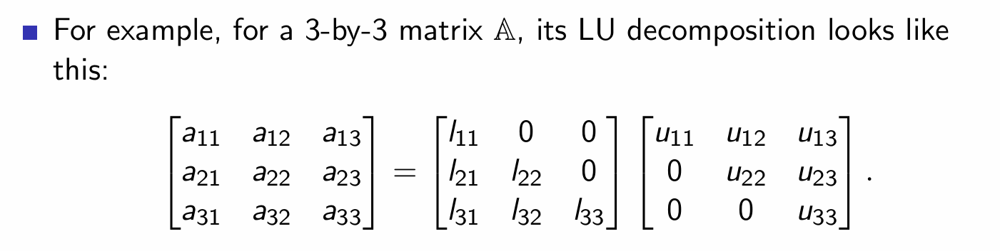

**分解失败的原因**：

  - 若矩阵 $\mathbb{A}$ 未进行适当的行排序或置换，LU 分解可能无法实现。
  - 例如：$a_{11} = l_{11}u_{11}$，若 $a_{11} = 0$，则至少有一个 $l_{11}$ 或 $u_{11}$ 为零，导致 $\mathbb{L}$ 或 $\mathbb{U}$ 奇异；但当 $\mathbb{A}$ 非奇异时，这是不可能的。
  - 这是一个**过程性问题**，可通过对 $\mathbb{A}$ 的行进行**重排（reordering）或主元选择（pivoting）**解决，使置换后矩阵的首元素非零。

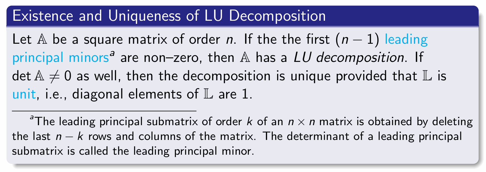

**存在性与唯一性定理（Existence and Uniqueness of LU Decomposition）**
- **存在性条件**：
  设 $\mathbb{A}$ 是 $n$ 阶方阵，若其前 $(n-1)$ 个**顺序主子式（leading principal minors）** 均非零，则 $\mathbb{A}$ 存在 LU 分解。

- **唯一性条件**：
  若 $\det(\mathbb{A}) \neq 0$，且 $\mathbb{L}$ 为**单位下三角矩阵**（即主对角线元素 $\ell_{ii} = 1$），则 LU 分解是唯一的。

- **顺序主子式定义**：
  $n \times n$ 矩阵的 $k$ 阶顺序主子矩阵，是删除最后 $n-k$ 行和列后得到的子矩阵；该子矩阵的行列式称为**顺序主子式**。

### 1.3.3 Doolittle Algorithm

#### 算法背景与设定
- 目标：对 $n \times n$ 矩阵 $\mathbb{A}$ 进行 LU 分解 $\mathbb{A} = \mathbb{L}\mathbb{U}$，其中：
  $$
  \mathbb{L} = \begin{bmatrix}
  \ell_{1,1} & 0 & 0 & \dots & 0 \\
  \ell_{2,1} & \ell_{2,2} & 0 & \dots & 0 \\
  \ell_{3,1} & \ell_{3,2} & \ddots & \dots & 0 \\
  \vdots & \vdots & \ddots & \ddots & 0 \\
  \ell_{n,1} & \ell_{n,2} & \dots & \ell_{n,n-1} & \ell_{n,n}
  \end{bmatrix}, \quad
  \mathbb{U} = \begin{bmatrix}
  u_{1,1} & u_{1,2} & u_{1,3} & \dots & u_{1,n} \\
  0 & u_{2,2} & u_{2,3} & \dots & u_{2,n} \\
  0 & 0 & \ddots & \ddots & \vdots \\
  \vdots & \vdots & \ddots & \ddots & u_{n-1,n} \\
  0 & 0 & \dots & 0 & u_{n,n}
  \end{bmatrix}
  $$
- 唯一性处理：
  - 仅由 $\mathbb{A} = \mathbb{L}\mathbb{U}$ 无法唯一确定 $\mathbb{L}$ 和 $\mathbb{U}$。
  - 常用约束：令 $\mathbb{L}$ 为**单位下三角矩阵**（即 $\ell_{i,i} = 1$，对所有 $1 \le i \le n$），从而唯一确定分解。

#### 特殊情形：Cholesky 分解
- 当满足 $\mathbb{U} = \mathbb{L}^T$（即 $\ell_{i,i} = u_{i,i}$）时，该分解称为 **Cholesky 分解**。
- 适用条件：矩阵 $\mathbb{A}$ 必须是**实对称正定矩阵**。
- 应用领域：在**概率与统计**中有广泛应用。

#### Doolittle 算法伪代码
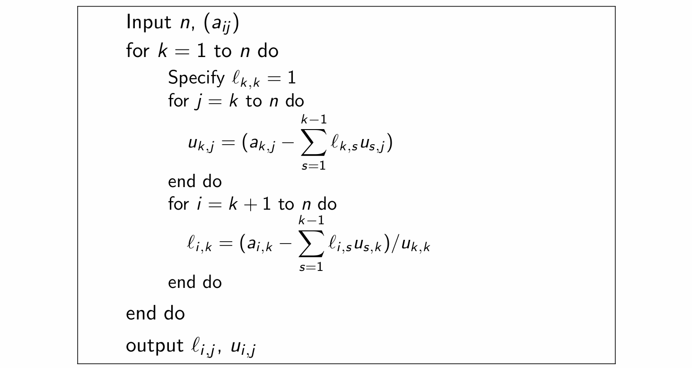

#### 计算复杂度分析
问题：Doolittle 算法的计算复杂度是多少？
- 复杂度求和式：
  $$
  \sum_{k=1}^n \left[(n - k + 1)2(k - 1) + (n - k)(2k - 1)\right]
  $$
- 展开结果：
  $$
  = \frac{1}{3}n^3 + \frac{1}{2}n^2 - \frac{5n}{6}
  $$

**与高斯消元法的复杂度比较**
- 与高斯消元法相比，Doolittle 算法的**最高阶项系数更小**（二者均为 $O(n^3)$ 复杂度，但 Doolittle 的高阶项占比更低）。

### 1.3.4 Doolittle算法示例：4×4矩阵分解

**矩阵与存在性条件**
给定矩阵：
$$
\mathbb{A} = \begin{pmatrix}
1 & 1 & 1 & 1 \\
2 & 3 & 1 & 5 \\
-1 & 1 & -5 & 3 \\
3 & 1 & 7 & -2
\end{pmatrix}
$$
其顺序主子式为 $1, 1, -2, 2$，均非零，因此存在LU分解。

**分解形式（单位下三角L）**
$$
\mathbb{A} = \mathbb{L}\mathbb{U} = 
\begin{pmatrix}
1 & 0 & 0 & 0 \\
\ell_{21} & 1 & 0 & 0 \\
\ell_{31} & \ell_{32} & 1 & 0 \\
\ell_{41} & \ell_{42} & \ell_{43} & 1
\end{pmatrix}
\begin{pmatrix}
u_{11} & u_{12} & u_{13} & u_{14} \\
0 & u_{22} & u_{23} & u_{24} \\
0 & 0 & u_{33} & u_{34} \\
0 & 0 & 0 & u_{44}
\end{pmatrix}
$$

**分步计算过程**

1.  **初始化**
    - U的第一行与A的第一行相同：$u_{1j} = a_{1j}$
    - L的第一列：$\ell_{i1} = a_{i1} / u_{11} = a_{i1}$
    $$
    \mathbb{L} = \begin{pmatrix}
    1 & 0 & 0 & 0 \\
    2 & 1 & 0 & 0 \\
    -1 & \ell_{32} & 1 & 0 \\
    3 & \ell_{42} & \ell_{43} & 1
    \end{pmatrix}, \quad
    \mathbb{U} = \begin{pmatrix}
    1 & 1 & 1 & 1 \\
    0 & u_{22} & u_{23} & u_{24} \\
    0 & 0 & u_{33} & u_{34} \\
    0 & 0 & 0 & u_{44}
    \end{pmatrix}
    $$

2.  **计算U的第二行与L的第二列**
    - U的第二行：
      $$
      \begin{align*}
      u_{22} &= 3 - (2)(1) = 1 \\
      u_{23} &= 1 - (2)(1) = -1 \\
      u_{24} &= 5 - (2)(1) = 3
      \end{align*}
      $$
    - L的第二列：
      $$
      \begin{align*}
      \ell_{32} &= \frac{1 - (-1)(1)}{u_{22}} = \frac{2}{1} = 2 \\
      \ell_{42} &= \frac{1 - (3)(1)}{u_{22}} = \frac{-2}{1} = -2
      \end{align*}
      $$
    $$
    \mathbb{L} = \begin{pmatrix}
    1 & 0 & 0 & 0 \\
    2 & 1 & 0 & 0 \\
    -1 & 2 & 1 & 0 \\
    3 & -2 & \ell_{43} & 1
    \end{pmatrix}, \quad
    \mathbb{U} = \begin{pmatrix}
    1 & 1 & 1 & 1 \\
    0 & 1 & -1 & 3 \\
    0 & 0 & u_{33} & u_{34} \\
    0 & 0 & 0 & u_{44}
    \end{pmatrix}
    $$

3.  **计算U的第三行与L的第三列**
    - U的第三行：
      $$
      \begin{align*}
      u_{33} &= -5 - (-1)(1) - (2)(-1) = -2 \\
      u_{34} &= 3 - (-1)(1) - (2)(3) = -2
      \end{align*}
      $$
    - L的第三列：
      $$
      \ell_{43} = \frac{7 - (3)(1) - (-2)(-1)}{u_{33}} = \frac{2}{-2} = -1
      $$
    $$
    \mathbb{L} = \begin{pmatrix}
    1 & 0 & 0 & 0 \\
    2 & 1 & 0 & 0 \\
    -1 & 2 & 1 & 0 \\
    3 & -2 & -1 & 1
    \end{pmatrix}, \quad
    \mathbb{U} = \begin{pmatrix}
    1 & 1 & 1 & 1 \\
    0 & 1 & -1 & 3 \\
    0 & 0 & -2 & -2 \\
    0 & 0 & 0 & u_{44}
    \end{pmatrix}
    $$

4.  **计算U的第四行**
    - U的第四行：
      $$
      u_{44} = -2 - (3)(1) - (-2)(3) - (-1)(-2) = -1
      $$

**最终分解结果**
$$
\mathbb{A} = 
\begin{pmatrix}
1 & 0 & 0 & 0 \\
2 & 1 & 0 & 0 \\
-1 & 2 & 1 & 0 \\
3 & -2 & -1 & 1
\end{pmatrix}
\begin{pmatrix}
1 & 1 & 1 & 1 \\
0 & 1 & -1 & 3 \\
0 & 0 & -2 & -2 \\
0 & 0 & 0 & -1
\end{pmatrix}
$$


### 1.3.5 LU分解求解线性方程组 $\mathbb{A}\boldsymbol{x} = \boldsymbol{b}$

**求解步骤**
1.  **分解**：对系数矩阵 $\mathbb{A}$ 进行LU分解，得到 $\mathbb{A} = \mathbb{L}\mathbb{U}$。
2.  **前向代入**：求解下三角方程组 $\mathbb{L}\boldsymbol{y} = \boldsymbol{b}$，得到 $\boldsymbol{y}$。
3.  **后向代入**：求解上三角方程组 $\mathbb{U}\boldsymbol{x} = \boldsymbol{y}$，得到解 $\boldsymbol{x}$。

**数学关系**
$$
\boldsymbol{x} = \mathbb{U}^{-1}\boldsymbol{y} = \mathbb{U}^{-1}\mathbb{L}^{-1}\boldsymbol{b} = (\mathbb{L}\mathbb{U})^{-1}\boldsymbol{b} = \mathbb{A}^{-1}\boldsymbol{b}
$$

**计算复杂度**
- **步骤1（LU分解）**：$O(\frac{1}{3}n^3 + \frac{1}{2}n^2 - \frac{5n}{6})$
- **步骤2和3（前向/后向代入）**：$O(2n^2)$

**优势分析**
- 若仅求解一次 $\mathbb{A}\boldsymbol{x} = \boldsymbol{b}$，与直接高斯消元相比节省有限。
- 若需对**不同的 $\boldsymbol{b}$ 多次求解**，由于只需进行一次LU分解，后续求解仅需两次代入，计算节省巨大。


### 1.3.6 通过LU分解计算行列式

**核心公式**
若 $\mathbb{A} = \mathbb{L}\mathbb{U}$，则行列式满足：
$$
\begin{align*}
\det(\mathbb{A}) &= \det(\mathbb{L}\mathbb{U}) \\
&= \det(\mathbb{L})\det(\mathbb{U}) \\
&= \left( \prod_{i=1}^n \mathbb{L}_{ii} \right) \left( \prod_{i=1}^n \mathbb{U}_{ii} \right)
\end{align*}
$$
- 对于Doolittle分解（$\mathbb{L}$ 为单位下三角矩阵），$\det(\mathbb{L}) = 1$，因此 $\det(\mathbb{A}) = \prod_{i=1}^n \mathbb{U}_{ii}$。

**计算复杂度**
- 浮点运算次数约为 $O(2n)$，远低于直接计算行列式。

## 1.4 Stability analysis

### 1.4.1 动机与待求解问题 (Motivation & Problem to solve)

在数值线性方程组的求解中，我们通常面临如下形式的方程：
$$\mathbb{A}\boldsymbol{x} = \boldsymbol{b}$$

在实际应用中，矩阵 $\mathbb{A}$ 和向量 $\boldsymbol{b}$ 作为输入数据，经常会受到多种误差的影响（例如：**舍入误差**和**测量误差**）。
本节的核心目的是研究：**输入数据 $\boldsymbol{b}$ 中的误差是如何传播到输出结果 $\boldsymbol{x}$ 中的？**

#### 误差传播模型
假设矩阵 $\mathbb{A}$ 是精确的。
* **精确情况**：精确输入为 $\boldsymbol{b}$，精确输出为 $\boldsymbol{x}$。
* **实际情况**：由于噪声或舍入误差，实际测量的输入为 $\boldsymbol{b} + \delta\boldsymbol{b}$。
* **实际求解**：我们需要求解带有误差的方程 $\mathbb{A}\tilde{\boldsymbol{x}} = \boldsymbol{b} + \delta\boldsymbol{b}$。

若令实际输出 $\tilde{\boldsymbol{x}} := \boldsymbol{x} + \delta\boldsymbol{x}$，我们希望知道**输出的相对误差**受**输入的相对误差**影响的程度，即试图建立如下的不等式关系：
$$\frac{\|\delta\boldsymbol{x}\|}{\|\boldsymbol{x}\|} \leq C \frac{\|\delta\boldsymbol{b}\|}{\|\boldsymbol{b}\|}$$
为了量化这种误差大小（即定义符号 $\|\cdot\|$），我们需要引入**范数 (Norm)** 的概念。


### 1.4.2 向量范数 (Vector Norm)

设 $\mathbb{X}$ 为一个向量空间（例如 $\mathbb{X} = \mathbb{R}^n$），向量 $\boldsymbol{x} = (x_1, x_2, \dots, x_n)^T$。
一个映射 $\|\cdot\| : \mathbb{X} \to \mathbb{R}_0^+$ 被称为 $\mathbb{X}$ 上的**范数**，当且仅当它满足以下三个性质：
1.  **非负性 (Non-negativity)**: $\|\boldsymbol{x}\| \geq 0$，且 $\|\boldsymbol{x}\| = 0 \iff \boldsymbol{x} = \boldsymbol{0}$。
2.  **齐次性/线性 (Linearity)**: $\|\lambda\boldsymbol{x}\| = |\lambda| \|\boldsymbol{x}\|, \quad \forall \boldsymbol{x} \in \mathbb{X}, \lambda \in \mathbb{R}$。
3.  **三角不等式 (Triangle inequality)**: $\|\boldsymbol{x} + \boldsymbol{y}\| \leq \|\boldsymbol{x}\| + \|\boldsymbol{y}\|, \quad \forall \boldsymbol{x}, \boldsymbol{y} \in \mathbb{X}$。

### 常见的向量范数：
* **欧几里得范数 (Euclidean norm) 或 $\ell_2$-范数**:
    $$\|\boldsymbol{x}\|_2 := \sqrt{x_1^2 + x_2^2 + \dots + x_n^2}$$
* **$\ell_1$-范数**:
    $$\|\boldsymbol{x}\|_1 := |x_1| + |x_2| + \dots + |x_n|$$
* **$\ell_\infty$-范数 (最大值范数)**:
    $$\|\boldsymbol{x}\|_\infty := \max\{|x_1|, |x_2|, \dots, |x_n|\}$$

---

## 3. 矩阵范数 (Matrix Norm)

**诱导矩阵范数 (Induced Matrix Norm)** 是由给定的向量范数推导而来的，定义为：
$$\|\mathbb{A}\| = \sup_{\boldsymbol{x} \neq \boldsymbol{0}} \frac{\|\mathbb{A}\boldsymbol{x}\|}{\|\boldsymbol{x}\|} \implies \|\mathbb{A}\boldsymbol{x}\| \leq \|\mathbb{A}\| \cdot \|\boldsymbol{x}\|$$

#### 常见的特殊矩阵范数：
对于矩阵 $\mathbb{A} \in \mathbb{R}^{n \times n}$，其元素为 $a_{ij}$：

* **1-范数 ($\|\mathbb{A}\|_1$)** —— **列和范数** (最大绝对值列和):
    $$\|\mathbb{A}\|_1 = \max_j \sum_{i=1}^n |a_{ij}|$$
* **$\infty$-范数 ($\|\mathbb{A}\|_\infty$)** —— **行和范数** (最大绝对值行和):
    $$\|\mathbb{A}\|_\infty = \max_i \sum_{j=1}^n |a_{ij}|$$
* **2-范数 ($\|\mathbb{A}\|_2$) 或 谱范数 (Spectral norm)**:
    $$\|\mathbb{A}\|_2 = \sigma_1$$ 
    *(注：$\sigma_1$ 为矩阵 $\mathbb{A}$ 的最大奇异值，即 $\mathbb{A}^T\mathbb{A}$ 的最大特征值的平方根)*
* **弗罗贝尼乌斯范数 (Frobenius norm, $\|\mathbb{A}\|_F$)**:
    $$\|\mathbb{A}\|_F = \left( \sum_{i=1}^n \sum_{j=1}^n a_{ij}^2 \right)^{\frac{1}{2}}$$
    *(注：等价于将矩阵拉直成一个长向量后求向量的 $\ell_2$-范数)*

### 1.4.3 示例练习 (Example)

**题目：** 已知矩阵 $A = \begin{pmatrix} 2 & -1 \\ 2 & 1 \end{pmatrix}$，求其 1-范数 $\|A\|_1$、2-范数 $\|A\|_2$ 以及 $\infty$-范数 $\|A\|_\infty$。

**解析与计算：**

1.  **计算 $\|A\|_1$ (列和范数)**：
    分别计算各列的绝对值之和，取最大值：
    * 第 1 列：$|2| + |2| = 4$
    * 第 2 列：$|-1| + |1| = 2$
    * **结果**：$\|A\|_1 = \max(4, 2) = 4$

2.  **计算 $\|A\|_\infty$ (行和范数)**：
    分别计算各行的绝对值之和，取最大值：
    * 第 1 行：$|2| + |-1| = 3$
    * 第 2 行：$|2| + |1| = 3$
    * **结果**：$\|A\|_\infty = \max(3, 3) = 3$

3.  **计算 $\|A\|_2$ (谱范数)**：
    需要求 $A^TA$ 的最大特征值。
    $$A^T A = \begin{pmatrix} 2 & 2 \\ -1 & 1 \end{pmatrix} \begin{pmatrix} 2 & -1 \\ 2 & 1 \end{pmatrix} = \begin{pmatrix} 8 & 0 \\ 0 & 2 \end{pmatrix}$$
    可以看出矩阵 $A^TA$ 是对角阵，其特征值为 $\lambda_1 = 8$, $\lambda_2 = 2$。
    最大奇异值 $\sigma_1 = \sqrt{\lambda_1} = \sqrt{8} = 2\sqrt{2}$。
    * **结果**：$\|A\|_2 = 2\sqrt{2}$


### 1.4.4 稳定性/敏感性分析与条件数 (Stability/sensitivity analysis and condition number)

在求解线性方程组 $\mathbb{A}\boldsymbol{x} = \boldsymbol{b}$ 时，等式右侧的向量 $\boldsymbol{b}$ 通常会包含误差（例如测量误差或噪声）。这部分主要分析这种**输入误差是如何影响最终解的**。

#### 误差界限的推导
假设矩阵 $\mathbb{A}$ 是精确的，向量 $\boldsymbol{b}$ 存在误差 $\delta\boldsymbol{b}$，导致解 $\boldsymbol{x}$ 产生误差 $\delta\boldsymbol{x}$：
1. **方程两边同时考虑误差**：
   $$\mathbb{A}(\boldsymbol{x} + \delta\boldsymbol{x}) = \boldsymbol{b} + \delta\boldsymbol{b} \implies \mathbb{A}\boldsymbol{x} + \mathbb{A}\delta\boldsymbol{x} = \boldsymbol{b} + \delta\boldsymbol{b}$$
   由于精确解满足 $\mathbb{A}\boldsymbol{x} = \boldsymbol{b}$，两边相减可得：
   $$\mathbb{A}\delta\boldsymbol{x} = \delta\boldsymbol{b} \implies \delta\boldsymbol{x} = \mathbb{A}^{-1}\delta\boldsymbol{b}$$
2. **利用矩阵范数的性质 ($\|\mathbb{A}\boldsymbol{x}\| \leq \|\mathbb{A}\| \cdot \|\boldsymbol{x}\|$) 提取误差的绝对上界**：
   $$\|\delta\boldsymbol{x}\| \leq \|\mathbb{A}^{-1}\| \cdot \|\delta\boldsymbol{b}\|$$
3. **寻找相对误差的界限**：
   我们知道 $\|\boldsymbol{b}\| = \|\mathbb{A}\boldsymbol{x}\| \leq \|\mathbb{A}\| \cdot \|\boldsymbol{x}\|$，对其进行变形可以得到解的下界：
   $$\|\boldsymbol{x}\| \geq \frac{\|\boldsymbol{b}\|}{\|\mathbb{A}\|}$$
4. **得出相对误差不等式**：
   将绝对误差上界除以解的下界，即可得到解的**相对误差**与输入数据**相对误差**之间的关系：
   $$\frac{\|\delta\boldsymbol{x}\|}{\|\boldsymbol{x}\|} \leq \frac{\|\mathbb{A}^{-1}\| \cdot \|\delta\boldsymbol{b}\|}{\|\boldsymbol{x}\|} \leq \frac{\|\mathbb{A}^{-1}\| \cdot \|\delta\boldsymbol{b}\|}{\|\boldsymbol{b}\|/\|\mathbb{A}\|} = \|\mathbb{A}\| \cdot \|\mathbb{A}^{-1}\| \frac{\|\delta\boldsymbol{b}\|}{\|\boldsymbol{b}\|}$$

#### 条件数 (Condition Number)
在上述相对误差的界限不等式中，**$\|\mathbb{A}\| \cdot \|\mathbb{A}^{-1}\|$** 作为一个放大系数，决定了输入误差 $\delta\boldsymbol{b}$ 在最坏情况下会被放大多少倍。我们将其定义为矩阵的**条件数**，记为 $\kappa(\mathbb{A})$：
$$\kappa(\mathbb{A}) := \|\mathbb{A}\| \cdot \|\mathbb{A}^{-1}\|$$
* **物理意义**：条件数衡量了线性方程组对输入数据扰动的敏感程度。条件数越大，说明系统越不稳定，输入微小的误差可能导致解发生剧烈变化。


### 1.4.6 示例：病态问题的判定 (Example of an ill-conditioned problem)

**题目分析：**
设 $\epsilon > 0$，考虑如下矩阵及其逆矩阵：
$$\mathbb{A} = \begin{bmatrix} 1 & 1+\epsilon \\ 1-\epsilon & 1 \end{bmatrix}, \quad \mathbb{A}^{-1} = \epsilon^{-2} \begin{bmatrix} 1 & -1-\epsilon \\ -1+\epsilon & 1 \end{bmatrix}$$

1. **计算 $\infty$-范数 (行和最大值)**：
   * $\|\mathbb{A}\|_\infty = \max(|1| + |1+\epsilon|, |1-\epsilon| + |1|) = 2 + \epsilon$
   * $\|\mathbb{A}^{-1}\|_\infty = \epsilon^{-2} \max(|1| + |-1-\epsilon|, |-1+\epsilon| + |1|) = \epsilon^{-2}(2 + \epsilon)$
2. **计算条件数 $\kappa(\mathbb{A})$**：
   $$\kappa(\mathbb{A}) = \|\mathbb{A}\|_\infty \cdot \|\mathbb{A}^{-1}\|_\infty = \frac{(2+\epsilon)^2}{\epsilon^2} > \frac{4}{\epsilon^2}$$
3. **误差放大的影响**：
   假设 $\epsilon$ 非常小（例如 $\epsilon = 0.01$），那么条件数将变得极大：
   $$\kappa(\mathbb{A}) \geq 40000$$
   这意味着，如果方程右侧 $\boldsymbol{b}$ 发生了一个微小的相对扰动，解 $\boldsymbol{x}$ 中的相对扰动（误差）可能会被放大 **40000倍**！
4. **与行列式的关系**：
   我们可以计算矩阵的行列式 $\det(\mathbb{A}) = 1\cdot 1 - (1+\epsilon)(1-\epsilon) = \epsilon^2$。
   因为 $\epsilon$ 很小，$\det(\mathbb{A}) \approx 0$。像这种行列式接近于 $0$（矩阵几乎不可逆），且条件数极大的系统，在数值计算中被称为**病态的 (ill-conditioned)**。


---

# 2 Sparse matrix and iterative solvers
## 2.1 Sparse matrix

### 2.1.1 稀疏矩阵的基本概念 (Sparse Matrix)
* **定义**：在科学计算中，**稀疏矩阵**是指大部分元素为零的矩阵。相反，如果大部分元素非零，则称为**稠密矩阵 (Dense Matrix)**。
* **判定标准**：虽然没有严格的零元素比例定义，但一个常用的标准是：**非零元素的数量大致等于矩阵的行数或列数**。
* **稀疏度 (Sparsity)**：定义为零元素的数量除以矩阵的总元素数量（例如 $m \times n$ 矩阵）。
* **应用领域**：稀疏矩阵广泛应用于组合数学、网络理论和数值分析中。在求解偏微分方程 (PDEs) 等科学或工程应用中，经常会出现大型稀疏矩阵。


### 2.1.2 稀疏线性方程组的求解 (Linear Equation System with Sparse Matrix)
对于大型稀疏系统，选择合适的求解方法至关重要：
* **直接法 (Direct methods)**：虽然在没有舍入误差的情况下可以给出精确解，但对于大型问题而言**代价过于高昂 (prohibitively expensive)**。
    * **内存消耗大**：例如一个 $20000 \times 20000$ 的全矩阵（双精度）需要 $3.2\text{GB}$ 内存。
    * **计算复杂度高**：LU 分解的计算复杂度为 $O(n^3)$。
    * **填充问题 (Fill-in)**：即使原矩阵 $\mathbb{A}$ 是稀疏的，其分解后的矩阵 $\mathbb{L}$ 和 $\mathbb{U}$ 通常并不稀疏。
* **迭代法 (Iterative methods)**：对于包含数百万变量的大型线性问题更为有效。
    * **平稳迭代法 (Stationary iterative methods)**
    * **Krylov 子空间法 (Krylov subspace methods)**：例如**共轭梯度法 (Conjugate Gradient, CG)**。

### 2.1.3 稀疏矩阵的存储 (Storing a Sparse Matrix)
在计算机上处理大型稀疏矩阵时，使用标准的二维数组（稠密矩阵结构）会浪费大量内存和处理时间。
* **核心优势**：稀疏数据本质上更容易被**压缩 (compressed)**，只需存储非零元素，从而大幅减少存储空间。
* **代价 (Trade-off)**：访问单个元素变得更加复杂，需要额外的数据结构来无歧义地恢复原始矩阵。
* **存储格式分类**：
    1. **支持高效修改的格式**（常用于构建矩阵）：DOK (字典), LIL (列表的列表), COO (坐标列表)。
    2. **支持高效访问和矩阵运算的格式**：**CSR (压缩稀疏行)** 或 CSC (压缩稀疏列)。

### 2.1.4 压缩稀疏行格式详解 (The CSR Format)
**CSR (Compressed Sparse Row)** 格式使用三个一维数组来表示一个 $m \times n$ 的稀疏矩阵：$(V, COL_{INDEX}, ROW_{INDEX})$。假设矩阵有 $NNZ$ 个非零元素。
* **$V$ (值数组)**：长度为 $NNZ$，按行顺序存储所有的非零值。
* **$COL_{INDEX}$ (列索引数组)**：长度为 $NNZ$，存储 $V$ 中每个元素对应的列号。
* **$ROW_{INDEX}$ (行指针数组)**：长度为 $m + 1$，记录每一行的第一个非零元素在 $V$ 和 $COL_{INDEX}$ 中的起始索引。

#### CSR 提取示例 (基于 0 索引)
假设有一个 $4 \times 4$ 矩阵，包含 4 个非零元素：
$$ \begin{pmatrix} 5 & 0 & 0 & 0 \\ 0 & 8 & 0 & 0 \\ 0 & 0 & 3 & 0 \\ 0 & 6 & 0 & 0 \end{pmatrix} $$
* $V = [5, 8, 3, 6]$
* $COL_{INDEX} = [0, 1, 2, 1]$
* $ROW_{INDEX} = [0, 1, 2, 3, 4]$

**如何提取某一行 (例如第 1 行，即第二行)**：
1. 查找起始和结束索引：$row_{start} = ROW_{INDEX}[1] = 1$，$row_{end} = ROW_{INDEX}[2] = 2$。
2. 切片获取数据：$V[1:2] = [8]$，$COL_{INDEX}[1:2] = [1]$。
3. 结论：第 1 行在第 1 列有一个非零元素，值为 8。


### 2.1.5 填充问题与不完全分解 (The Fill-in Issue)
* **填充现象 (Fill-in)**：在求解 $\mathbb{A}\boldsymbol{x} = \boldsymbol{b}$ 时，如果使用 $\mathbb{A} = \mathbb{L}\mathbb{U}$ 分解，得到的三角矩阵 $\mathbb{L}$ 和 $\mathbb{U}$ 往往比原矩阵 $\mathbb{A}$ 稠密得多。这会导致直接求解器的内存需求成为瓶颈。
* **应对策略 1：重新排序 (Reorderings)**
    * 使用减少填充的重排算法（如**最小度算法 Minimum degree algorithm**）对矩阵的未知数进行重新排序。
* **应对策略 2：不完全分解 (Incomplete factorization)**
    * 寻找三角矩阵 $\mathbb{L}$ 和 $\mathbb{U}$ 使得 $\mathbb{A} \approx \mathbb{L}\mathbb{U}$（而不是精确等于）。
    * 由于这不能给出精确解，我们通常将矩阵 $\mathbb{M} = \mathbb{L}\mathbb{U}$ 作为**预条件子 (Preconditioner)**，结合迭代算法（如 **CG** 或 **GMRES**）来加速收敛。

---

## 2.2 Splitting-based Iterative Methods

### 2.2.1 迭代格式的推导与分裂矩阵 (Splitting Matrix)
给定一个矩阵方程 $\mathbb{A}\boldsymbol{x} = \boldsymbol{b}$，其中 $\mathbb{A}$ 为方阵。我们可以引入一个可逆矩阵 $\mathbb{S}$，称之为**分裂矩阵 (Splitting matrix)**。

对方程进行恒等变形：
$$ \mathbb{S}\boldsymbol{x} = (\mathbb{S} - \mathbb{A})\boldsymbol{x} + \boldsymbol{b} $$

两边同时左乘 $\mathbb{S}^{-1}$，得到：
$$ \boldsymbol{x} = \mathbb{S}^{-1}(\mathbb{S} - \mathbb{A})\boldsymbol{x} + \mathbb{S}^{-1}\boldsymbol{b} = (\mathbb{I} - \mathbb{S}^{-1}\mathbb{A})\boldsymbol{x} + \mathbb{S}^{-1}\boldsymbol{b} $$

由此可以构建**迭代格式 (Iterative scheme)**：
$$ \boldsymbol{x}_{i+1} = (\mathbb{I} - \mathbb{S}^{-1}\mathbb{A})\boldsymbol{x}_i + \mathbb{S}^{-1}\boldsymbol{b} $$

序列 $\{\boldsymbol{x}_n\}$ 的通项公式可以表示为：
$$ \boldsymbol{x}_k = (\mathbb{I} - \mathbb{S}^{-1}\mathbb{A})^k \boldsymbol{x}_0 + \sum_{i=0}^{k-1} (\mathbb{I} - \mathbb{S}^{-1}\mathbb{A})^i \mathbb{S}^{-1}\boldsymbol{b} $$

### 2.2.2 误差分析 (Error Analysis)
将迭代格式与原方程相减：
$$ \boldsymbol{x}_{i+1} - \boldsymbol{x} = (\mathbb{I} - \mathbb{S}^{-1}\mathbb{A})(\boldsymbol{x}_i - \boldsymbol{x}) $$

如果我们将第 $j$ 次迭代的误差记作 $\boldsymbol{e}_j := \boldsymbol{x}_j - \boldsymbol{x}$，通过反复应用上述递推公式，可以得到第 $i+1$ 步误差与初始误差的关系：
$$ \boldsymbol{e}_{i+1} = (\mathbb{I} - \mathbb{S}^{-1}\mathbb{A})^{i+1}\boldsymbol{e}_0 $$

### 2.2.3 目标与收敛性定理 (Goals & Convergence Theorem)

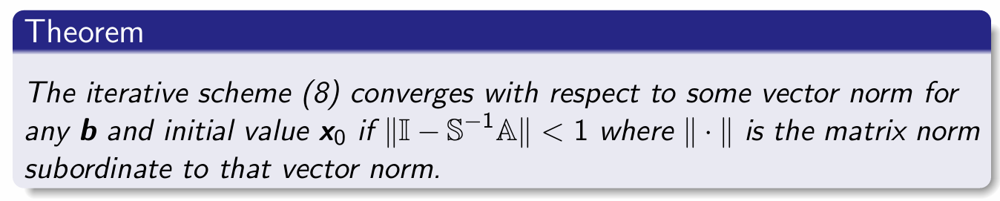
**核心目标：** 选择合适的分裂矩阵 $\mathbb{S}$ 需要满足以下两个条件：
1. $\{\boldsymbol{x}_i\}$ 易于计算。
2. $\{\boldsymbol{x}_i\}$ 能够快速收敛到真实解。

**收敛性充分条件：** 
对于任意向量 $\boldsymbol{b}$ 和初始值 $\boldsymbol{x}_0$，只要存在某种从属矩阵范数满足 $\|\mathbb{I} - \mathbb{S}^{-1}\mathbb{A}\| < 1$，该迭代格式就是收敛的。

*证明思路：* 根据前面的误差递推公式，取范数可得：
$$ \|\boldsymbol{x}_{i+1} - \boldsymbol{x}\| \le \|\mathbb{I} - \mathbb{S}^{-1}\mathbb{A}\|^{i+1} \|\boldsymbol{x}_0 - \boldsymbol{x}\| $$
当 $\|\mathbb{I} - \mathbb{S}^{-1}\mathbb{A}\| < 1$ 时，随着 $i \to \infty$，误差必定趋近于 $0$。

### 2.2.4 谱半径与范数等价性 (Spectral Radius & Equivalence of Norms)

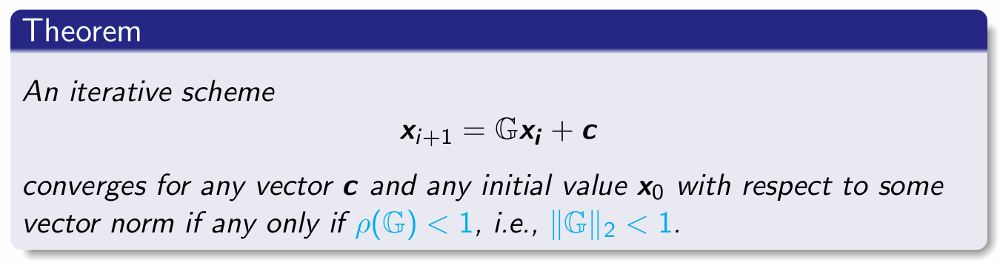
**精确的收敛准则：**
对于更一般的迭代格式 $\boldsymbol{x}_{i+1} = \mathbb{G}\boldsymbol{x}_i + \boldsymbol{c}$，它对任意 $\boldsymbol{c}$ 和初始值 $\boldsymbol{x}_0$ 收敛的**充要条件**是：迭代矩阵的**谱半径 (Spectral radius)** 小于 1，即：
$$ \rho(\mathbb{G}) < 1 \quad (\text{即 } \|\mathbb{G}\|_2 < 1) $$

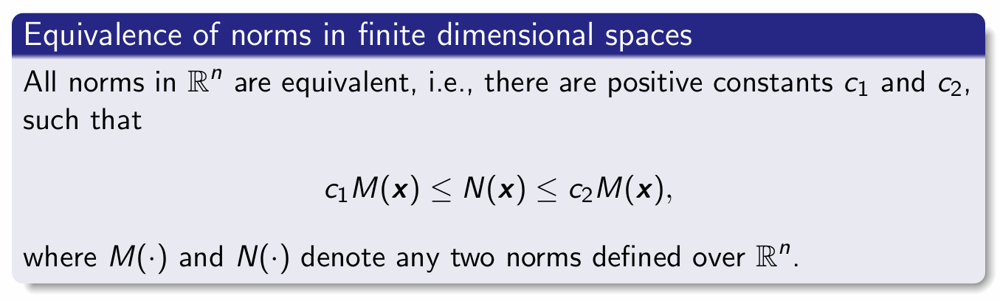

**有限维空间范数的等价性：**
在有限维空间 $\mathbb{R}^n$ 中，所有的范数都是等价的。即对于空间上定义的任意两个范数 $M(\cdot)$ 和 $N(\cdot)$，必定存在正数 $c_1$ 和 $c_2$，使得：
$$ c_1 M(\boldsymbol{x}) \le N(\boldsymbol{x}) \le c_2 M(\boldsymbol{x}) $$

**结论：**
得益于有限维空间中范数的等价性，我们可以选取**任意**一种方便计算的范数来研究迭代格式的收敛性，这在理论上足以保证该格式的整体收敛。


## 2.3 雅可比迭代法 (Jacobi Iterative Method) 

### 2.3.1 算法简介与矩阵分解
在数值线性代数中，**雅可比迭代法**是一种用于求解线性方程组（尤其是对角占优系统）的算法。
给定一个 $n$ 阶线性方程组 $\mathbb{A}\boldsymbol{x} = \boldsymbol{b}$，我们可以将系数矩阵 $\mathbb{A}$ 分解为**对角部分 (diagonal component)** $\mathbb{D}$ 和**剩余部分 (remainder)** $\mathbb{R}$：
$$ \mathbb{A} = \mathbb{D} + \mathbb{R} $$
*   $\mathbb{D}$ 是一个对角矩阵，仅包含矩阵 $\mathbb{A}$ 的主对角线元素。
*   $\mathbb{R}$ 是剩余矩阵，主对角线元素全为 $0$，其余位置为 $\mathbb{A}$ 的非对角线元素。

### 2.3.2 迭代格式 (Iterative Scheme)
基于上述矩阵分解，雅可比迭代法的格式可以写为：

**矩阵形式：**
$$ \boldsymbol{x}^{(k+1)} = \mathbb{D}^{-1}(\boldsymbol{b} - \mathbb{R}\boldsymbol{x}^{(k)}) = \mathbb{D}^{-1}\boldsymbol{b} - \mathbb{D}^{-1}\mathbb{R}\boldsymbol{x}^{(k)} $$
其中，$\boldsymbol{x}^{(k)}$ 是第 $k$ 次迭代的近似解，$\boldsymbol{x}^{(k+1)}$ 是第 $k+1$ 次迭代的解。

**分量（元素）形式：**
对于解向量中的每一个元素 $x_i$，其迭代公式为：
$$ x_i^{(k+1)} = \frac{1}{a_{ii}} \left( b_i - \sum_{j \neq i} a_{ij}x_j^{(k)} \right), \quad i = 1, 2, \dots, n $$
*   **计算特点：** 计算第 $k+1$ 步的 $x_i^{(k+1)}$ 时，需要用到第 $k$ 步中除了它自身之外的所有其他元素的值。
*   **并行优势：** 由于计算当前步的任何分量都不依赖于当前步计算出的其他分量（只依赖于上一轮的结果），因此该迭代方案**非常容易进行并行化计算 (easy to be parallelized)**。

### 2.3.3 收敛性条件 (Convergence Conditions)
雅可比迭代法是否收敛取决于系数矩阵 $\mathbb{A}$ 的性质：

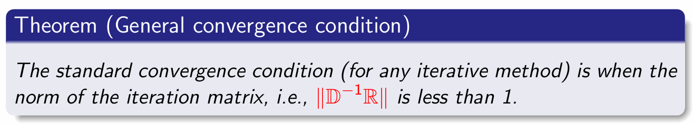

**一般收敛定理 (General convergence condition)：**
    对于任何迭代法，标准的收敛条件是**迭代矩阵的范数严格小于 1**。在雅可比方法中，即要求 $\|\mathbb{D}^{-1}\mathbb{R}\| < 1$。


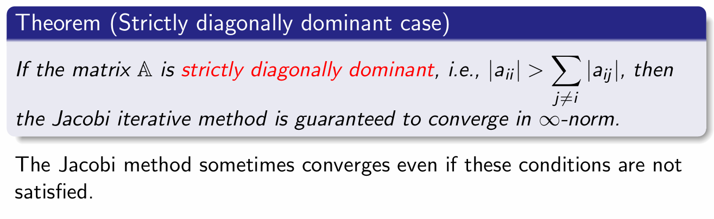
**严格对角占优定理 (Strictly diagonally dominant case)：**
    如果矩阵 $\mathbb{A}$ 是**严格对角占优的 (strictly diagonally dominant)**，即对于所有的行 $i$ 都满足：
    $$ |a_{ii}| > \sum_{j \neq i} |a_{ij}| $$
    （主对角线元素的绝对值大于同行其他所有元素绝对值之和），那么雅可比迭代法**保证在无穷范数 ($\infty$-norm) 下收敛**。

*补充说明：* 即使上述充分条件未被满足，雅可比迭代法在某些特定情况下依然有可能会收敛。

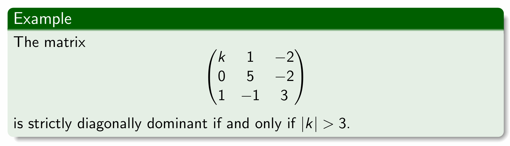

## 2.4 高斯-赛德尔迭代法 (Gauss-Seidel Iterative Method)

### 2.4.1 算法简介与矩阵分解
高斯-赛德尔方法是一种用于求解 $n$ 元方阵线性方程组 $\mathbb{A}\boldsymbol{x} = \boldsymbol{b}$ 的迭代技术。
与雅可比方法不同，这里将系数矩阵 $\mathbb{A}$ 分解为**下三角部分 (lower triangular component, 包含主对角线)** $\mathbb{L}_*$ 和**严格上三角部分 (strictly upper triangular component)** $\mathbb{U}$：
$$ \mathbb{A} = \mathbb{L}_* + \mathbb{U} $$
通过这种分解，原线性方程组可以被重写为：
$$ \mathbb{L}_*\boldsymbol{x} = \boldsymbol{b} - \mathbb{U}\boldsymbol{x} $$

### 2.4.2 迭代格式 (Iterative Scheme)
基于上述重写的方程，高斯-赛德尔方法的迭代格式如下：

**矩阵形式：**
$$ \boldsymbol{x}^{(k+1)} = \mathbb{L}_*^{-1}(\boldsymbol{b} - \mathbb{U}\boldsymbol{x}^{(k)}) $$
利用 $\mathbb{L}_*$ 的下三角特性，可以通过**前向替换 (forward substitution)** 顺序计算出 $\boldsymbol{x}^{(k+1)}$ 的各个元素。

**分量（元素）形式：**
对于解向量中的每一个元素 $x_i$，其迭代公式为：
$$ x_i^{(k+1)} = \frac{1}{a_{ii}} \left( b_i - \sum_{j<i} a_{ij}x_j^{(k+1)} - \sum_{j>i} a_{ij}x_j^{(k)} \right), \quad i = 1, 2, \dots, n $$
*   **计算特点：** 在计算当前步的 $x_i^{(k+1)}$ 时，对于排在 $i$ 之前的元素（$j < i$），**直接使用本轮已经计算出的最新值** $x_j^{(k+1)}$；对于排在 $i$ 之后的元素（$j > i$），则使用上一轮的旧值 $x_j^{(k)}$。

## 2.5 迭代法小结
### 2.5.1 算法特点与备注 (Remarks)
*   **存储优势：** 由于每次计算出的新元素可以直接覆盖旧元素参与后续计算，因此在编程实现时**只需要一个存储向量 (only one storage vector)**。这对于求解超大规模问题非常有优势。
*   **并行性差：** 与雅可比方法不同，高斯-赛德尔方法中每个元素的计算严重依赖于前一个元素的计算结果。因此，它**无法进行并行计算 (cannot be done in parallel)**。
*   **顺序依赖：** 每次迭代中的计算值会受到原方程组排列顺序的影响。
*   **收敛速率：** 如果两者都收敛，高斯-赛德尔法通常比雅可比法快得多。

### 2.5.2 收敛性条件 (Convergence Conditions)

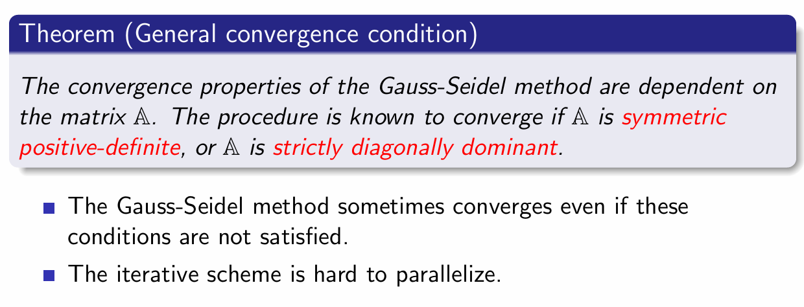
高斯-赛德尔方法的收敛性取决于系数矩阵 $\mathbb{A}$ 的性质。已知在以下两种情况之一满足时，该算法必定收敛：
1.  矩阵 $\mathbb{A}$ 是**对称正定矩阵 (symmetric positive-definite)**。
2.  矩阵 $\mathbb{A}$ 是**严格对角占优矩阵 (strictly diagonally dominant)**。

*补充说明：* 与雅可比方法类似，即使不满足上述充分条件，高斯-赛德尔方法在某些情况下也可能收敛。同时再次强调，该迭代格式很难被并行化。

---

# 3 Singular Value Decomposition and Low-rank approximation

## 3.1 SVD 基础概念

### 3.1.1 矩阵的低秩分解 (Rank and Matrix Factorizations)
*   **基础引理：** 一个秩为 $r$ 的矩阵 $\mathbb{A} \in \mathbb{R}^{m \times n}$ 必然允许分解为 $\mathbb{A} = \mathbb{B}\mathbb{C}^T$ 的形式，其中 $\mathbb{B} \in \mathbb{R}^{m \times r}$，$\mathbb{C} \in \mathbb{R}^{n \times r}$。
*   **低秩定义 (Low rank)：** 当矩阵的秩 $r$ 远远小于其行数和列数时（即 $\text{rank}(\mathbb{A}) \ll m, n$），我们称矩阵 $\mathbb{A}$ 具有低秩特性。
*   **近似与降维：** 在多数实际应用中，矩阵 $\mathbb{A}$ 往往是满秩的（$\text{rank}(\mathbb{A}) = \min\{m, n\}$），但核心目标是寻找一个**低秩矩阵 (low-rank matrix)** 来近似替代原始矩阵。

### 3.1.2 为什么低秩表示很重要？(Why Low-Rank Representation Matters?)
低秩表示在降低计算复杂度和存储成本方面具有极大优势。
*   **存储成本降低：** 存储原始矩阵 $\mathbb{A}$ 需要占据 $mn$ 个元素空间，而存储低秩分解后的矩阵对 $\mathbb{B}$ 和 $\mathbb{C}$ 仅需 $mr + nr$ 个空间。
*   **计算复杂度极具缩减（以矩阵-向量乘法为例）：** 
    *   对于矩阵 $\mathbb{A} \in \mathbb{R}^{n \times n}$（例如 $n = 100000$）且秩很小（例如 $k = 5$）的情况，直接计算乘法 $\mathbb{A}\boldsymbol{x}$ 的复杂度为不可接受的 $n^2$。
    *   如果利用低秩分解 $\mathbb{A} = \mathbb{B}\mathbb{C}^T$，原式可化为计算 $\mathbb{B}(\mathbb{C}^T\boldsymbol{x})$。
    *   通过改变计算顺序，整体复杂度从 $n^2$ 骤降至 $2nr$，由于 $2nr \ll n^2$，这使得原本无法计算的庞大问题变得可行。

### 3.1.3 奇异值分解定理 (Singular Value Decomposition, SVD)

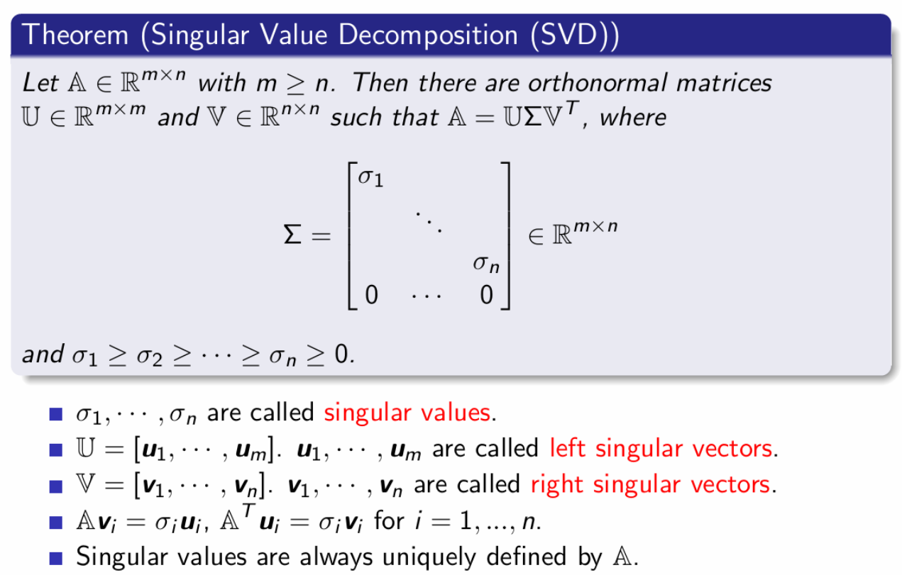
对于任意给定的矩阵 $\mathbb{A} \in \mathbb{R}^{m \times n}$（假设 $m \ge n$），存在正交矩阵 (orthonormal matrices) $\mathbb{U} \in \mathbb{R}^{m \times m}$ 和 $\mathbb{V} \in \mathbb{R}^{n \times n}$，使得：
$$ \mathbb{A} = \mathbb{U}\Sigma\mathbb{V}^T $$
其中 $\Sigma \in \mathbb{R}^{m \times n}$ 是一个由奇异值构成的主对角线状分块矩阵。

**相关定义与性质：**
*   $\sigma_1, \dots, \sigma_n$ 称为**奇异值 (singular values)**，它们是非负实数且按降序排列：$\sigma_1 \ge \sigma_2 \ge \dots \ge \sigma_n \ge 0$。
*   奇异值是由原矩阵 $\mathbb{A}$ 唯一确定的。
*   $\mathbb{U} = [\boldsymbol{u}_1, \dots, \boldsymbol{u}_m]$ 中的列向量被称为**左奇异向量 (left singular vectors)**。
*   $\mathbb{V} = [\boldsymbol{v}_1, \dots, \boldsymbol{v}_n]$ 中的列向量被称为**右奇异向量 (right singular vectors)**。
*   它们满足核心对应关系：对所有 $i = 1, \dots, n$，有 $\mathbb{A}\boldsymbol{v}_i = \sigma_i\boldsymbol{u}_i$ 且 $\mathbb{A}^T\boldsymbol{u}_i = \sigma_i\boldsymbol{v}_i$。

### 3.1.4 SVD 证明概要 (Sketch of Proof)
SVD 定理的证明核心是使用**对维数 $n$ 的数学归纳法 (Induction over $n$)**：
1.  **初始状态：** 当 $n = 1$ 时，证明是显然的 (trivial)。
2.  **寻找首个奇异对：** 当 $n > 1$ 时，通过最优化问题 $\boldsymbol{v}_1 = \arg\max_{\boldsymbol{v} \in \mathbb{R}^n} \{\|\mathbb{A}\boldsymbol{v}\|_2 : \|\boldsymbol{v}\|_2 = 1\}$ 找到最大奇异值对应的右奇异向量。由此定义 $\sigma_1 := \|\mathbb{A}\boldsymbol{v}_1\|_2$ 和左奇异向量 $\boldsymbol{u}_1 := \mathbb{A}\boldsymbol{v}_1/\sigma_1$。
3.  **基补全与正交变换：** 将 $\boldsymbol{u}_1$ 和 $\boldsymbol{v}_1$ 补全为正交矩阵 $\mathbb{U}_1$ 和 $\mathbb{V}_1$，对其做矩阵乘法得到分块形式 $\begin{bmatrix} \sigma_1 & \boldsymbol{w}^T \\ \mathbf{0} & \mathbb{A}_1 \end{bmatrix}$。
4.  **范数不变性：** 利用矩阵的 2-范数在正交变换下保持不变的性质，结合不等式 $\sigma_1 \ge \sqrt{\sigma_1^2 + \|\boldsymbol{w}\|_2^2}$，推导出右上角的偏置向量必定为零（即 $\boldsymbol{w} = \mathbf{0}$）。
5.  **归纳传递：** 最后，将归纳假设继续应用于右下角的较小矩阵 $\mathbb{A}_1$，完成对整个矩阵的推导证明。


## 3.2 SVD 的计算与基本性质

奇异值分解是线性代数中一种重要的矩阵分解方法，对于任意 $m \times n$ 矩阵 $\mathbb{A}$，都可以进行 SVD 分解。

### 3.2.1 SVD 的计算推导过程

计算矩阵 $\mathbb{A} \in \mathbb{R}^{m \times n}$ 的奇异值分解 $\mathbb{A} = \mathbb{U}\Sigma\mathbb{V}^T$ 可通过以下步骤进行：

#### 第一步：构造对称半正定矩阵
计算矩阵 $\mathbb{A}^T\mathbb{A}$。这是一个 $n \times n$ 的**对称（symmetric）**且**半正定（positive semidefinite）**矩阵，因为对于任意向量 $\boldsymbol{x}$，都有 $\boldsymbol{x}^T(\mathbb{A}^T\mathbb{A})\boldsymbol{x} = (\mathbb{A}\boldsymbol{x})^T(\mathbb{A}\boldsymbol{x}) \ge 0$。

#### 第二步：求特征值与特征向量（构造 $\mathbb{V}$）
* 求出 $\mathbb{A}^T\mathbb{A}$ 的特征值，并按非递增顺序排列：$\sigma_1^2 \ge \sigma_2^2 \ge \dots \ge \sigma_n^2$。
* 假设前 $r$ 个特征值为正数，即 $\sigma_1^2, \dots, \sigma_r^2 > 0$，而其余的 $\sigma_{r+1}^2, \dots, \sigma_n^2 = 0$。
* 设 $\{\boldsymbol{v}_1, \boldsymbol{v}_2, \dots, \boldsymbol{v}_n\}$ 为对应于这些特征值的**标准正交（orthonormal）**特征向量集，满足 $\mathbb{A}^T\mathbb{A}\boldsymbol{v}_i = \sigma_i^2\boldsymbol{v}_i$。
* 利用这些特征向量构造 $n \times n$ 矩阵 $\mathbb{V}$，其转置 $\mathbb{V}^T$ 的行向量为 $\boldsymbol{v}_1^T, \boldsymbol{v}_2^T, \dots, \boldsymbol{v}_n^T$。

*推论*：$\|\mathbb{A}\boldsymbol{v}_i\|_2^2 = \boldsymbol{v}_i^T\mathbb{A}^T\mathbb{A}\boldsymbol{v}_i = \boldsymbol{v}_i^T\sigma_i^2\boldsymbol{v}_i = \sigma_i^2$。因此，当 $i \ge r+1$ 时，$\mathbb{A}\boldsymbol{v}_i = \mathbf{0}$。

#### 第三步：构造左奇异向量（构造 $\mathbb{U}$）
* 观察到 $r = \text{rank}(\mathbb{A}^T\mathbb{A}) \le \min\{\text{rank}(\mathbb{A}^T), \text{rank}(\mathbb{A})\} \le \min\{m, n\}$。
* 对于 $1 \le i \le r$，定义向量：$\boldsymbol{u}_i = \sigma_i^{-1}\mathbb{A}\boldsymbol{v}_i$。
* 可以证明，这些 $\boldsymbol{u}_i$ 构成一个标准正交系统：
  $$\boldsymbol{u}_i^T \boldsymbol{u}_j = \sigma_i^{-1}(\mathbb{A}\boldsymbol{v}_i)^T \sigma_j^{-1}(\mathbb{A}\boldsymbol{v}_j) = (\sigma_i\sigma_j)^{-1}(\boldsymbol{v}_i^T\mathbb{A}^T\mathbb{A}\boldsymbol{v}_j) = \delta_{ij}$$
* 为了构成 $\mathbb{R}^m$ 空间的完整基，选择额外的正交向量 $\boldsymbol{u}_i$ ($r+1 \le i \le m$)，使得 $\{\boldsymbol{u}_1, \boldsymbol{u}_2, \dots, \boldsymbol{u}_m\}$ 成为 $\mathbb{R}^m$ 的标准正交基。
* 令 $\mathbb{U}$ 为 $m \times m$ 矩阵，其列向量为 $\boldsymbol{u}_1, \boldsymbol{u}_2, \dots, \boldsymbol{u}_m$。

#### 第四步：构造对角矩阵 $\Sigma$
* 令 $\Sigma$ 为 $m \times n$ 矩阵，其主对角线上的元素为 $\sigma_1, \sigma_2, \dots, \sigma_r$，其余位置全为 $0$。

#### 结论
由此可得 $\mathbb{A} = \mathbb{U}\Sigma\mathbb{V}^T$。
其中，数值 $\sigma_1, \sigma_2, \dots, \sigma_n$ 被称为矩阵 $\mathbb{A}$ 的**奇异值 (singular values)**，它们也是 $\mathbb{A}^T\mathbb{A}$ 特征值的非负平方根。

### 3.2.2  SVD 的基本性质 (Basic Properties)

1. **秩的对应关系**：
   矩阵的秩 $r = \text{rank}(\mathbb{A})$ 等于 $\mathbb{A} \in \mathbb{R}^{m \times n}$ 的**非零奇异值的个数**。

2. **矩阵分解形式**：
   $\mathbb{A} = \mathbb{U}\Sigma\mathbb{V}^T$，其中 $\Sigma \in \mathbb{R}^{m \times n}$ 形式如下：
   $$
   \Sigma = \begin{bmatrix}
   \sigma_1 & & & \\
   & \ddots & & \\
   & & \sigma_n & \\
   0 & \dots & 0 & 
   \end{bmatrix}
   $$
   且满足 $\sigma_1 \ge \sigma_2 \ge \dots \ge \sigma_r > 0 = \sigma_{r+1} = \dots = \sigma_n$。

3. **求和形式 (秩-1 展开 / 截断 SVD)**：
   奇异值分解可以等价地写成秩为 1 的矩阵的加权求和形式：
   $$\mathbb{A} = \sum_{i=1}^{r} \sigma_i \boldsymbol{u}_i \boldsymbol{v}_i^T$$
   其中 $r \le \min\{m, n\}$。这种形式在数据压缩、降维和图像处理中非常有用，可以通过保留前 $k$ 个最大的奇异值来近似原矩阵。


### 3.2.3 矩阵的核 (Kernel) 与值域 (Range)

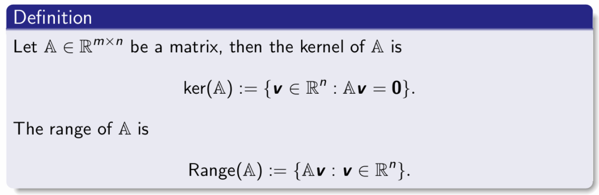

对于给定的矩阵 $\mathbb{A} \in \mathbb{R}^{m \times n}$：
* **核 (Kernel / Null space)**：定义为 $\text{ker}(\mathbb{A}) := \{\boldsymbol{v} \in \mathbb{R}^n : \mathbb{A}\boldsymbol{v} = \mathbf{0}\}$。它是 $\mathbb{R}^n$ 空间中的一个子空间。
* **值域 (Range / Column space)**：定义为 $\text{Range}(\mathbb{A}) := \{\mathbb{A}\boldsymbol{v} : \boldsymbol{v} \in \mathbb{R}^n\}$。它是 $\mathbb{R}^m$ 空间中的一个子空间。
* **与 SVD 的联系 (课件问题解答)**：已知 SVD 展开式为 $\mathbb{A} = \sum_{i=1}^r \sigma_i \boldsymbol{u}_i \boldsymbol{v}_i^T$ （$r$ 为非零奇异值的个数），则：
    * $\text{Range}(\mathbb{A})$ 由对应的**左奇异向量** $\{\boldsymbol{u}_1, \boldsymbol{u}_2, \dots, \boldsymbol{u}_r\}$ 张成 (span)。
    * $\text{ker}(\mathbb{A})$ 由对应于零奇异值的**右奇异向量** $\{\boldsymbol{v}_{r+1}, \boldsymbol{v}_{r+2}, \dots, \boldsymbol{v}_n\}$ 张成。


### 3.2.4 经济型 SVD (Economy size SVD)
在大部分实际应用中，正交矩阵 $\mathbb{U}$ 中多余的列向量 $\boldsymbol{u}_{n+1}, \dots, \boldsymbol{u}_m$（对应于零奇异值）并不具有实际关注价值。省略这些向量可以得到“经济型 SVD”。
* **定理**：设矩阵 $\mathbb{A} \in \mathbb{R}^{m \times n}$ 且 $m \ge n$。必定存在一个具有标准正交列的矩阵 $\mathbb{U} \in \mathbb{R}^{m \times n}$ 和一个标准正交矩阵 $\mathbb{V} \in \mathbb{R}^{n \times n}$，使得：
    $$\mathbb{A} = \mathbb{U}\Sigma\mathbb{V}^T$$
* 与完整 SVD 不同的是，此时的 $\Sigma \in \mathbb{R}^{n \times n}$ 是一个**方阵**，其对角线元素为 $\sigma_1 \ge \sigma_2 \ge \dots \ge \sigma_n \ge 0$。

### 3.2.5 SVD 的计算与复杂度 (针对中小型稠密矩阵)
* **代码实现**：在 MATLAB 中，可以通过指令 `[U, S, V] = svd(A, 'econ')` 直接计算经济型 SVD。
* **空间/内存复杂度**：$O(mn)$。
* **时间复杂度**：计算 $m \times n$ 矩阵的 SVD 时间复杂度为 $O(mn \min(n, m))$。
* **计算瓶颈**：由于计算复杂度相对于数据规模呈**超线性 (super-linear)** 增长，因此当面临超大规模数据集时，直接计算 SVD 会变得非常昂贵甚至不可行。

### 3.2.6 矩阵范数：谱范数与 Frobenius 范数
利用 SVD 分解 $\mathbb{A} = \mathbb{U}\Sigma\mathbb{V}^T$，可以非常直观地定义和计算两种重要的矩阵范数：
* **谱范数 (Spectral norm)**：记作 $\|\mathbb{A}\|_2$，它等于矩阵的**最大奇异值**。
    $$\|\mathbb{A}\|_2 = \sigma_1$$
    *等价定义*：$\|\mathbb{A}\|_2 = \max\{\|\mathbb{A}\boldsymbol{v}\|_2 : \|\boldsymbol{v}\|_2 = 1\}$，表示矩阵对向量拉伸的最大比例。
* **Frobenius 范数 (F-范数)**：记作 $\|\mathbb{A}\|_F$，它等于**所有奇异值平方和的平方根**。
    $$\|\mathbb{A}\|_F = \sqrt{\sigma_1^2 + \sigma_2^2 + \dots + \sigma_n^2}$$

#### 矩阵范数的基本性质：
1.  $\|\cdot\|_2$ 和 $\|\cdot\|_F$ 均满足矩阵范数的基本数学定义。
2.  **正交/酉不变性 (Unitarily invariant)**：对于任意正交矩阵 $\mathbb{Q}$ 和 $\mathbb{Z}$，都有 $\|\mathbb{Q}\mathbb{A}\mathbb{Z}\|_2 = \|\mathbb{A}\|_2$ 且 $\|\mathbb{Q}\mathbb{A}\mathbb{Z}\|_F = \|\mathbb{A}\|_F$。（即矩阵乘上正交矩阵，相当于进行旋转或翻转，不会改变其“大小”/范数）。
3.  **两者的界限关系**：对于秩为 $r$ 的矩阵，存在不等式：
    $$\|\mathbb{A}\|_2 \le \|\mathbb{A}\|_F \le \|\mathbb{A}\|_2\sqrt{r}$$

## 3.3 低秩近似 Low-rank approximation

### 3.3.1 复数矩阵的奇异值分解 (SVD for Complex Matrix)

奇异值分解不仅适用于实数矩阵，同样可以推广到复数域。其证明过程与实数矩阵完全一致。

* **定理**：对于任意复数矩阵 $A \in \mathbb{C}^{m \times n}$ (假设 $m \ge n$)，存在**复酉矩阵 (complex unitary matrices)** $U \in \mathbb{C}^{m \times m}$ 和 $V \in \mathbb{C}^{n \times n}$，使得：
  $$A = U\Sigma V^*$$
* **核心要素说明**：
  * **$V^*$**：表示矩阵 $V$ 的**共轭转置 (conjugate transpose)**。
  * **$\Sigma$**：虽然 $A, U, V$ 是复数矩阵，但 $\Sigma \in \mathbb{R}^{m \times n}$ 仍然是一个包含**实数**的对角矩阵。其对角线元素即为奇异值，且满足非负且递减的性质：$\sigma_1 \ge \sigma_2 \ge \dots \ge \sigma_n \ge 0$。

### 3.3.2 最佳低秩近似 (Best Low-Rank Approximation)

在数据科学和信号处理中，我们常常希望用一个包含信息量较少（秩较低）的矩阵来近似原始的复杂数据矩阵，从而实现数据压缩或降噪。

#### 问题定义
给定数据矩阵 $A \in \mathbb{R}^{m \times n}$ 和一个目标秩 $k \in \mathbb{N}$ (通常 $k \ll m$ 且 $k \ll n$)，我们希望找到一个秩不超过 $k$ 的矩阵 $B$，使得它与原矩阵 $A$ 的误差最小。这可以表达为一个带约束的优化问题：
$$
\min_{\substack{B \in \mathbb{R}^{m \times n} \\ \text{rank}(B) \le k}} \|A - B\|
$$

#### 截断奇异值分解 (Truncated SVD)
为了求解上述问题，我们提取 SVD 分解的前 $k$ 个最大奇异值及其对应的奇异向量：
* 令 $U_k := [u_1, \dots, u_k]$ (前 $k$ 个左奇异向量)
* 令 $\Sigma_k := \text{diag}(\sigma_1, \dots, \sigma_k)$ (前 $k$ 个最大的奇异值)
* 令 $V_k := [v_1, \dots, v_k]$ (前 $k$ 个右奇异向量)

由此构造出一个秩最多为 $k$ 的矩阵 $A_k$：
$$A_k := U_k \Sigma_k V_k^T$$

#### 近似误差的计算
由于我们丢弃了从 $\sigma_{k+1}$ 到 $\sigma_n$ 的较小奇异值，对于任意酉不变范数，近似误差表现为对角矩阵残差的范数：
$$\|A - A_k\| = \|\text{diag}(0, \dots, 0, \sigma_{k+1}, \dots, \sigma_n)\|$$

具体到两种常用范数：
* **谱范数误差 (Spectral norm)**: 误差等于被截断的第一个奇异值（即第 $k+1$ 大的奇异值）。
  $$\|A - A_k\|_2 = \sigma_{k+1}$$
* **Frobenius 范数误差 (Frobenius norm)**: 误差等于所有被丢弃的奇异值的平方和的平方根。
  $$\|A - A_k\|_F = \sqrt{\sigma_{k+1}^2 + \dots + \sigma_n^2}$$
* **结论**：如果矩阵的奇异值衰减得非常快（即大部分信息集中在前几个奇异值上），那么 $A_k$ 将非常接近 $A$。

#### 矩阵近似引理 (Matrix Approximation Lemma / Eckart-Young-Mirsky 定理)
该定理给出了低秩近似问题的一个强有力的结论：**我们构造的 $A_k$ 就是在所有秩不超过 $k$ 的矩阵中，对 $A$ 的最佳近似。**

* **定理内容**：对于任意酉不变范数 $\|\cdot\|$，都成立：
  $$\|A - A_k\| = \min\{\|A - B\| : B \in \mathbb{R}^{m \times n} \text{ 且 } \text{rank}(B) \le k\}$$
* **课件证明思路 (针对谱范数 $\|\cdot\|_2$)**：
  证明的核心在于利用维数定理。对于任意秩不超过 $k$ 的矩阵 $B$，其零空间（kernel）的维度至少为 $n-k$。因此，它必然与 $V$ 的后 $n-k$ 个向量张成的空间有交集。在这个交集中取一个单位向量 $w$，可以推导出 $\|A-B\|_2 \ge \|(A-B)w\|_2 \ge \sigma_{k+1}$。因为 $\|A-A_k\|_2$ 刚好等于 $\sigma_{k+1}$，所以 $A_k$ 达到了这个理论下界，即为最优解。