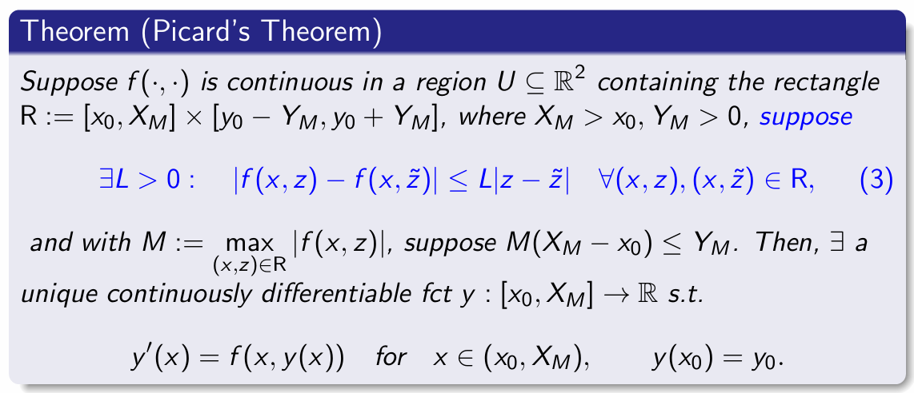

# Numerical Methods for Ordinary Differential Equations

# 1 常微分方程基础 (Basics of ODEs)
## 1.1 基本定义
常微分方程 (ODE) 是包含未知函数 $y = y(x)$ 及其导数的方程。

* **n阶显式 ODE (Explicit ODE of order n):** $$y^{(n)}(x) = f(x, y(x), y'(x), \dots, y^{(n-1)}(x))$$
* **n阶隐式 ODE (Implicit ODE of order n):** $$F(x, y(x), y'(x), \dots, y^{(n)}(x)) = 0$$

本课程主要关注 **一阶显式 ODEs (Explicit first-order ODEs)**：
$$y'(x) = f(x, y(x))$$

#### 动机：神经 ODE (Neural ODE)
Neural ODE 使用神经网络来参数化隐藏状态的导数：
$$\partial_t u(t) = f(u(t), \theta^{\text{ODE}}(t)), \quad t \in (0, T], \quad u(0) = u_0$$
在这里，$f$ 是一个神经网络。给定训练数据，我们的目标是找到一个良好的近似函数来完成特定任务（即求解该 ODE 以获得 $u(T)$）。这就引出了核心问题：**该问题是否有唯一解？如果有，如何计算？**

## 1.2 初值问题 (Initial-value Problems, IVPs)

一个普通的微分方程（如 $y'(x) = 3y(x)$）通常有无限多个解（$y(x) = c e^{3x}$）。为了得到**唯一解**，我们需要指定函数在某个点的值，这称为**初值条件 (Initial condition, i.c.)** $y(x_0) = y_0$。

形如下式的方程称为 **初值问题 (IVPs)**：
$$y'(x) = f(x, y(x)), \quad y(x_0) = y_0$$

### 唯一性警告
**并非所有的 IVP 都有唯一解。**
* **反例:** $y'(x) = [y(x)]^{\frac{2}{3}}, y(0) = 0$。该方程有多个解，例如 $y \equiv 0$ 和 $y(x) = \frac{1}{27}x^3$。
* **结论:** 函数 $f(\cdot, \cdot)$ 的连续性不足以保证解的唯一性。
    * *注: 根据 Peano 存在性定理，连续性只能保证至少存在一个解。*

## 1.3 解的存在性与唯一性：皮卡定理 (Picard's Theorem)

为了保证 IVP 解的唯一性，我们需要比“连续”更强的条件，即 Lipschitz 条件。

### 1.3.1 标量情况下的 Picard 定理
假设 $f(\cdot, \cdot)$ 在包含矩形区域 $R := [x_0, X_M] \times [y_0 - Y_M, y_0 + Y_M]$ 的区域 $U \subseteq \mathbb{R}^2$ 内连续。
如果满足以下条件：
1.  **Lipschitz 条件:** 存在 $L > 0$，使得 $\forall (x, z), (x, \tilde{z}) \in R$ 有：
    $$|f(x, z) - f(x, \tilde{z})| \le L|z - \tilde{z}|$$
2.  **边界限制:** 设 $M := \max_{(x,z)\in R} |f(x, z)|$，满足 $M(X_M - x_0) \le Y_M$。

**定理结论:** 存在一个**唯一**的连续可微函数 $y: [x_0, X_M] \to \mathbb{R}$，满足 $y'(x) = f(x, y(x))$ 且 $y(x_0) = y_0$。
*(观察：在积分区间内，函数 $y$ 的图像始终位于区域 $R$ 内)*

### 1.3.2 ODE 系统下的 Picard 定理
对于包含 $m$ 个 ODE 的系统：
$$\mathbf{y}'(x) = \mathbf{f}(x, \mathbf{y}(x)), \quad \mathbf{y}(x_0) = \mathbf{y}_0$$
引入欧几里得范数 $\|\mathbf{u}\| := \sqrt{\sum_{i=1}^m |u_i|^2}$。

定理可推广为：在区域 $R = \{(x, \mathbf{z}) \in \mathbb{R} \times \mathbb{R}^m : x \in [x_0, X_M], \|\mathbf{z} - \mathbf{y}_0\| \le Y_M\}$ 内，若 $\mathbf{f}$ 连续，且满足向量形式的 Lipschitz 条件：
$$\exists L > 0 : \|\mathbf{f}(x, \mathbf{z}) - \mathbf{f}(x, \tilde{\mathbf{z}})\| \le L\|\mathbf{z} - \tilde{\mathbf{z}}\|$$
以及 $M(X_M - x_0) \le Y_M$（其中 $M$ 为范数最大值），则该系统存在唯一连续可微解 $\mathbf{y}(x)$。

## 1.4 保证 Lipschitz 性质的充分条件

如何判断一个函数是否满足 Lipschitz 条件？

**充分条件（偏导数有界）：**
如果 $f$ 在区域 $R$ 上连续，在其内部 $\text{int}(R)$ 可微，且存在 $C > 0$ 使得其对 $z$ 的偏导数有界：
$$|f_z(x, z)| := \left| \frac{\partial f}{\partial z}(x, z) \right| \le C \quad \forall (x, z) \in \text{int}(R)$$
则 Lipschitz 条件**自动满足**，且 Lipschitz 常数 $L := C$。（证明基于中值定理 Mean-Value Theorem）

对于方程系统，条件变为雅可比矩阵的范数有界：$\left\| \frac{\partial \mathbf{f}}{\partial \mathbf{z}}(x, \mathbf{z}) \right\| \le C$。

### ⚠️ 警告：逆命题不一定成立！
**偏导数有界是充分条件，而非必要条件。** 存在满足 Lipschitz 条件但在某处不可微（即偏导数不存在）的函数。
* **反例:** 考虑 $f(x, z) := |z|$。
    * 它满足 $L=1$ 的 Lipschitz 条件：$||z| - |\tilde{z}|| \le |z - \tilde{z}|$。
    * 但是 $f$ 在 $z=0$ 处不可微，因此不能使用偏导数有界的条件来判定。

## 1.5 稳定性
### 1.5.1 稳定性的定义
考虑一个 ODE 系统的初值问题 (IVP): $\mathbf{y}'(x) = \mathbf{f}(x, \mathbf{y}(x)), \mathbf{y}(x_0) = \mathbf{y}_0$。
假设 $\mathbf{y} = \mathbf{v}(x)$ 是该问题的解。针对初值产生微小扰动（变为 $\mathbf{z}$）后的新解 $\mathbf{w}(x)$，我们有以下三种稳定性的定义：

1.  **区间上的稳定 (Stable on $[x_0, X_M]$):**
    如果对于任意 $\varepsilon > 0$，都存在 $\delta > 0$，使得对于所有满足 $\|\mathbf{y}_0 - \mathbf{z}\| < \delta$ 的 $\mathbf{z} \in \mathbb{R}^m$，扰动后的 IVP 问题 $\mathbf{w}'(x) = \mathbf{f}(x, \mathbf{w}(x)), \mathbf{w}(x_0) = \mathbf{z}$ 的解 $\mathbf{w}$ 在 $[x_0, X_M]$ 上有定义，并且满足：
    $$\|\mathbf{v}(x) - \mathbf{w}(x)\| < \varepsilon \quad \forall x \in [x_0, X_M]$$
    *简言之：初值的微小变化只会导致解在有限区间内的微小变化。*

2.  **李雅普诺夫稳定 (Stable in the sense of Lyapunov):**
    如果解 $\mathbf{y} = \mathbf{v}(x)$ 在无穷区间 $[x_0, \infty)$ 上是稳定的（即对于任意的 $X_M$ 都稳定，且 $\delta$ 的选取与 $X_M$ 无关）。

3.  **渐近稳定 (Asymptotically stable):**
    如果在满足李雅普诺夫稳定的前提下，还满足当 $x \to \infty$ 时，扰动解与原解的偏差趋于零：
    $$\lim_{x \to \infty} \|\mathbf{v}(x) - \mathbf{w}(x)\| = 0$$

### 1.5.2 稳定性示例 (Stability Example)

考虑一个标量 IVP：$y'(x) = \lambda y(x), y(0) = 1$。
其唯一解为 $v(x) := e^{\lambda x}$。
假设初值受到扰动变为 $z$，则扰动问题 $w'(x) = \lambda w(x), w(0) = z$ 的唯一解为 $w(x) := ze^{\lambda x}$。

两者的偏差为：$|v(x) - w(x)| = |1 - z|e^{\lambda x}$。根据参数 $\lambda$ 的不同取值，稳定性如下：

* **当 $\lambda \le 0$ 时:** $|v(x) - w(x)| \le |1 - z|$ 对所有 $x \in [0, \infty)$ 成立。
    $\implies$ 解 $y = v(x)$ 在 $[0, \infty)$ 上是**稳定**的。
    *(注：如果 $\lambda < 0$，解甚至是渐近稳定的)*
* **当 $\lambda > 0$ 时:** 在区间 $[0, X_M]$ 上，最大偏差为 $\max_{x\in[0,X_M]} |v(x) - w(x)| = |1 - z|e^{\lambda X_M}$。随着 $X_M$ 增大，偏差会呈指数级放大，无法找到一个独立于 $X_M$ 的 $\delta$。
    $\implies$ 解 $y = v(x)$ 在 $[0, \infty)$ 上是**不稳定**的。

### 1.5.3 关于稳定性的主要结果与 Gronwall 引理

#### Picard 定理假设下的稳定性
**定理:** 在 Picard 定理成立的假设条件下（即 $\mathbf{f}$ 连续且满足 Lipschitz 条件），初值问题 $\mathbf{y}'(x) = \mathbf{f}(x, \mathbf{y}(x)), \mathbf{y}(x_0) = \mathbf{y}_0$ 的唯一解 $\mathbf{y} = \mathbf{v}(x)$ 在有限区间 $[x_0, X_M]$ 上是**稳定**的。

**证明思路 (基于积分形式和 Lipschitz 条件):**
将原解 $\mathbf{v}(x)$ 和扰动解 $\mathbf{w}(x)$ 写成积分形式，并做差：
$$\|\mathbf{v}(x) - \mathbf{w}(x)\| \le \|\mathbf{v}(x_0) - \mathbf{z}\| + \int_{x_0}^x \|\mathbf{f}(t, \mathbf{v}(t)) - \mathbf{f}(t, \mathbf{w}(t))\| dt$$
利用 Lipschitz 条件（常数为 $L$），可以得到核心不等式：
$$\|\mathbf{v}(x) - \mathbf{w}(x)\| \le \|\mathbf{v}(x_0) - \mathbf{z}\| + L \int_{x_0}^x \|\mathbf{v}(t) - \mathbf{w}(t)\| dt$$

#### Gronwall 引理 (Gronwall Lemma)
为了从上述积分不等式中解出 $\|\mathbf{v}(x) - \mathbf{w}(x)\|$ 的显式界限，需要用到 Gronwall 引理。

**引理内容:**
如果存在常数 $a$ 和 $L > 0$ 使得函数 $A(x)$ 满足：
$$A(x) \le a + L \int_{x_0}^x A(t) dt \quad \forall x \in I$$
那么，必然有：
$$A(x) \le a e^{L(x - x_0)} \quad \forall x \in I$$

**在稳定性证明中的应用:**
令 $A(x) = \|\mathbf{v}(x) - \mathbf{w}(x)\|$ 且 $a = \|\mathbf{v}(x_0) - \mathbf{z}\|$。由 Gronwall 引理可得：
$$\|\mathbf{v}(x) - \mathbf{w}(x)\| \le \|\mathbf{v}(x_0) - \mathbf{z}\| e^{L(x - x_0)}$$
这证明了只要初始扰动 $\|\mathbf{v}(x_0) - \mathbf{z}\|$ 足够小（即小于某个 $\delta$），在有限区间 $[x_0, X_M]$ 内的偏差就可以被任意 $\varepsilon$ 控制，从而证明了区间上的稳定性。

---

# 2 One-Step Methods

## 2.1 问题定义与基本假设 (The Problem and Standing Assumption)

我们将考虑以下初值问题 (IVP)：
$$y'(x) = f(x, y(x)), \quad y(x_0) = y_0$$

**基本假设：** 在后续的讨论中，我们始终假设函数 $f$ 在矩形区域 $R$ 上满足皮卡定理 (Picard's Theorem) 的条件，并且该 IVP 在区间 $[x_0, X_M]$ 上存在**唯一的解**，其中 $-\infty < x_0 < X_M < \infty$。

## 2.2 Euler’s method and its relatives: the θ-method

### 2.2.1 最简单的单步法：欧拉方法 (Euler's Method)

我们的目标是求出 IVP 精确解 $y: [x_0, X_M] \to \mathbb{R}$ 的近似值。

#### 区间离散化
对于 $N \in \mathbb{N}$，我们将区间 $[x_0, X_M]$ 划分为 $N + 1$ 个**网格点 (mesh-points)**：
$$x_0, \quad x_1 = x_0 + h, \quad x_2 = x_0 + 2h, \quad \dots \quad, \quad x_N = x_0 + Nh = X_M$$
* **步长 (step size):** $h := \frac{X_M - x_0}{N} > 0$
* **目标:** 对于每个 $n \in \{0, \dots, N\}$，寻找精确值 $y(x_n)$ 的近似值 $y_n$。（注：当 $n=0$ 时，近似值 $y_0$ 已经由初值条件给出）。

#### 欧拉方法的推导
**核心思想：** 利用微积分基本定理，将微分方程转化为积分形式：
$$y(x_{n+1}) = y(x_n) + \int_{x_n}^{x_{n+1}} y'(x) dx = y(x_n) + \int_{x_n}^{x_{n+1}} f(x, y(x)) dx$$

**矩形法则近似：** 我们使用矩形法则（左端点）来近似计算上述积分：$\int_a^b g(x) dx \approx (b - a)g(a)$。
应用此法则，可得：
$$y(x_{n+1}) \approx y(x_n) + hf(x_n, y(x_n))$$

**（显式）欧拉方法公式：**
$$y_{n+1} = y_n + hf(x_n, y_n), \quad n \in \{0, \dots, N - 1\}$$

### 2.2.2 欧拉方法的推广：$\theta$-方法 (The $\theta$-method)

我们可以通过使用更通用的积分近似法则来推广欧拉方法。

**核心思想：** 积分形式保持不变，但我们不使用简单的左端点矩形法则，而是引入参数 $\theta \in [0, 1]$ 的加权积分法则：
$$\int_a^b g(x) dx \approx (b - a)[(1 - \theta)g(a) + \theta g(b)]$$

将此近似法则应用到我们之前的积分式中，得到：
$$y(x_{n+1}) \approx y(x_n) + h[(1 - \theta)f(x_n, y(x_n)) + \theta f(x_{n+1}, y(x_{n+1}))]$$

**$\theta$-方法公式：**
对于 $\theta \in [0, 1]$：
$$y_{n+1} = y_n + h[(1 - \theta)f(x_n, y_n) + \theta f(x_{n+1}, y_{n+1})], \quad n \in \{0, \dots, N - 1\}$$

**单步法特性：**
注意到在计算下一个近似值 $y_{n+1}$ 时，我们**只需要用到前一个状态的值 $y_n$**，而不需要更早的历史数据（如 $y_{n-1}$）。因此，这类方法被称为**单步法 (One-step method)**。

## 2.3 Error analysis of the θ-method

### 2.3.1 误差的定义 (Definitions of Error)

在使用数值方法求解常微分方程时，我们主要关注两种误差：

* **全局误差 (Global Error):** 精确解与数值解在各个网格点上的实际偏差。
    定义为：$$e_n := y(x_n) - y_n \quad \text{for} \quad n \in \{0, \dots, N\}$$
    *本节的核心目标是研究当网格步长 $h \to 0$ 时，全局误差 $e_n$ 的衰减情况。*

* **相容性误差 / 截断误差 (Consistency Error / Truncation Error):** 将精确解代入差分格式后产生的残差（衡量局部一步的理论误差）。
    对于显式欧拉方法，定义为：
    $$T_n = \frac{y(x_{n+1}) - y(x_n)}{h} - f(x_n, y(x_n)), \quad n \in \{0, 1, \dots, N - 1\}$$

### 2.3.2 显式欧拉方法的误差分析 (Error Analysis for Explicit Euler)

我们将分步推导显式欧拉方法的全局误差界限。

#### 步骤 1: 估计相容性误差
利用 $f(x_n, y(x_n)) = y'(x_n)$ 以及泰勒定理 (Taylor's Theorem)，存在 $\xi_n \in (x_n, x_{n+1})$ 使得：
$$|T_n| = \left| \frac{y(x_{n+1}) - y(x_n) - hy'(x_n)}{h} \right| = \frac{\frac{1}{2} h^2 |y''(\xi_n)|}{h} \le \frac{h}{2}M_2$$
其中 $M_2 := \max_{x \in [x_0, X_M]} |y''(x)|$。前提是假设 $f$ 足够平滑，使得 $y''(x)$ 存在且有界。

#### 步骤 2: 建立 $e_{n+1}$ 与 $e_n$ 的递推关系
将显式欧拉的定义式 $0 = \frac{y_{n+1} - y_n}{h} - f(x_n, y_n)$ 从相容性误差 $T_n$ 的定义式中减去，得到：
$$e_{n+1} = e_n + h[f(x_n, y(x_n)) - f(x_n, y_n)] + hT_n$$
利用 Lipschitz 条件 $|f(x_n, y(x_n)) - f(x_n, y_n)| \le L|y(x_n) - y_n| = L|e_n|$，取绝对值并放缩：
$$|e_{n+1}| \le (1 + hL)|e_n| + h|T_n|$$
令 $T := \max_n |T_n|$，则有 $|e_{n+1}| \le (1 + hL)|e_n| + hT$。

#### 步骤 3 & 4: 递推求界与最终结论
不断向下递推上述不等式至 $e_0$：
$$|e_n| \le (1 + hL)^n|e_0| + \frac{T}{L}[(1 + hL)^n - 1]$$
利用不等式 $1 + x \le e^x$ 对所有实数成立，以及 $nh = x_n - x_0$，可化简为：
$$|e_n| \le e^{L(x_n - x_0)}|e_0| + \frac{T}{L}[e^{L(x_n - x_0)} - 1]$$
由于理论上初始误差 $e_0 = y(x_0) - y_0 = 0$（忽略浮点数舍入误差），代入 $T \le \frac{h}{2}M_2$，我们最终得到**全局误差的界**：
$$|e_n| \le h \frac{M_2}{2L} [e^{L(X_M - x_0)} - 1] \quad \forall n \in \{0, \dots, N\}$$

**结论:** 对于显式欧拉方法，当 $h \searrow 0$ 时，最大全局误差为：
$$\max_{n \in \{0, \dots, N\}} |e_n| = \mathcal{O}(h)$$
即**显式欧拉方法是一阶收敛的**。

### 2.3.3 $\theta$-方法的误差分析与改进欧拉方法

#### $\theta$-方法的收敛阶
对于一般的 $\theta \in [0, 1]$：
* 当 **$\theta \neq \frac{1}{2}$** 时：$\max |e_n| = \mathcal{O}(h)$ （一阶收敛）
* 当 **$\theta = \frac{1}{2}$** 时：$\max |e_n| = \mathcal{O}(h^2)$ （二阶收敛）

$\implies$ 从逼近真实解的收敛速度来看，$\theta = \frac{1}{2}$（梯形法则, Trapezium rule）是“最佳”的。

#### 改进欧拉方法 (Improved Euler Method)
**问题：** 既然 $\theta = \frac{1}{2}$ 更精确，为什么不总是用它？
**原因：** 梯形法则在计算上**不方便 (less convenient)**，因为它是一个**隐式方法 (implicit method)**。在每一步都需要求解关于未知数 $y_{n+1}$ 的方程。

**解决方案（折中方案）：**
先用显式欧拉方法计算出一个粗略的预测值，然后再将这个预测值代入梯形法则中进行校正。这就是**改进的欧拉方法**（也称预测-校正法）：
$$y_{n+1} = y_n + \frac{h}{2} \left[ f(x_n, y_n) + f(x_{n+1}, \underbrace{y_n + hf(x_n, y_n)}_{\text{Explicit Euler prediction}}) \right]$$
该方法既保留了显式方法的计算便利性，又提高了计算精度。

## 2.4 General one-step methods

### 2.4.1 单步法的通用框架 (Formal Definition)

为了更系统地分析各种数值方法，我们引入单步法的正式数学定义。

**定义:** 一个**单步法**可以看作是一个函数 $\Psi$。它接收当前节点的坐标 $\xi$、当前节点的近似解 $\eta$、步长 $h$，以及微分方程右侧的函数 $f(\cdot, \cdot)$，并计算出下一个节点 $x = \xi + h$ 处精确解 $y(\xi + h)$ 的近似值。

对应于局部初值问题 (IVP)：
$$y'(x) = f(x, y(x)), \quad y(\xi) = \eta$$
单步法计算出的近似值为：
$$\Psi(\xi, \eta; h, f) \in \mathbb{R}$$
*(注：假设该 IVP 有唯一解。有时步长 $h$ 需要足够小以保证 $\Psi$ 有良好的定义。)*

#### 例子：用 $\Psi$ 表示欧拉方法
* **显式欧拉 (Explicit Euler):** 下一步的值可以直接算出来。
    $$\Psi(\xi, \eta; h, f) = \eta + hf(\xi, \eta)$$
* **隐式欧拉 (Implicit Euler):** 下一步的值被隐式定义在方程中，需要求解。
    $$\Psi(\xi, \eta; h, f) = \eta + hf(\xi + h, \Psi(\xi, \eta; h, f))$$
    *(如果 $f$ 在第二个参数上满足全局 Lipschitz 条件 $|f(x, z) - f(x, \tilde{z})| \le L|z - \tilde{z}|$，则该隐式方程通常有唯一解。)*

### 2.4.2 显式单步法 (Explicit One-step Methods)

对于**显式**单步法，我们通常可以将其提取出一个更标准的一般形式，引入**增量函数 (increment function)** $\Phi$。

#### 一般形式
一个一般的显式单步法可以写为：
$$y_{n+1} = y_n + h\Phi(x_n, y_n; h, f), \quad n \in \{0, \dots, N - 1\}, \quad y_0 = y(x_0)$$

这里，$\Phi = \Phi(\xi, \eta; h, f)$ 是关于参数 $\xi, \eta, h$ 的连续函数。它代表了在当前步长 $h$ 下，解的估计斜率或平均变化率。

#### $\Psi$ 与 $\Phi$ 的关系
根据上述定义，计算下一步的函数 $\Psi$ 与增量函数 $\Phi$ 的关系非常明确：
$$\Psi(\xi, \eta; h, f) = \eta + h\Phi(\xi, \eta; h, f)$$

* **例子 (显式欧拉):**
    对于显式欧拉方法，增量函数仅仅是当前点的导数值：
    $$\Phi(\xi, \eta; h, f) = f(\xi, \eta)$$

#### 符号简写约定 (Notation Remark)
在大多数显式方法的讨论中，$\Phi$ 和 $\Psi$ 都可以被显式地计算出来。
为了书写简便，从现在起，**我们将省略符号中对函数 $f$ 的依赖指示**。
即，将 $\Phi(\xi, \eta; h, f)$ 简写为 $\Phi(\xi, \eta; h)$。
例如，显式欧拉的增量函数直接记为：$\Phi(\xi, \eta; h) = f(\xi, \eta)$。

## 2.5 General explicit one-step methods

### 2.5.1 误差的正式定义 (Global & Consistency Error)

回顾一般显式单步法的形式：
$$y_{n+1} = y_n + h\Phi(x_n, y_n; h), \quad n \in \{0, \dots, N - 1\}, \quad y_0 = y(x_0)$$
其中 $\Phi(\cdot, \cdot; \cdot)$ 是连续的增量函数。

基于此形式，我们重新定义两种误差：

* **全局误差 (Global error):**
    $$e_n := y(x_n) - y_n, \quad n \in \{0, \dots, N\}$$

* **相容性误差 / 截断误差 (Consistency error):** 衡量精确解代入数值格式后产生的残差。
    $$T_n = \frac{y(x_{n+1}) - y(x_n)}{h} - \Phi(x_n, y(x_n); h), \quad n \in \{0, \dots, N - 1\}$$
    *(注：对于隐式单步法 $y_{n+1} = y_n + h\Phi(x_n, y_n, y_{n+1}; h)$，其相容性误差定义中 $\Phi$ 的第三个参数应代入精确解 $y(x_{n+1})$。)*

### 2.5.2 误差界定理 (Theorem: Error Bound)

对于一般的显式单步法，如果增量函数 $\Phi$ 满足一定的条件，我们可以给出全局误差的上限。

**定理内容：**
假设 $\Phi$ 是连续函数，并且关于其第二个参数满足 **Lipschitz 条件**（存在常数 $L_\Phi, h_0 > 0$）：
$$|\Phi(x, z; h) - \Phi(x, \tilde{z}; h)| \le L_\Phi|z - \tilde{z}| \quad \forall (x, z), (x, \tilde{z}) \in R, \text{ for } h \in [0, h_0]$$
假设数值解始终落在允许的区域内（即 $|y_n - y_0| \le Y_M$），则全局误差满足以下界限：
$$|e_n| \le e^{L_\Phi(x_n - x_0)}|e_0| + \frac{e^{L_\Phi(x_n - x_0)} - 1}{L_\Phi} T, \quad n \in \{0, \dots, N\}$$
其中 $T := \max_{n \in \{0, \dots, N-1\}} |T_n|$。

### 2.5.3 应用实例：显式欧拉求解特定 IVP

**问题：** 考虑初值问题 (IVP)
$$y'(x) = \arctan(y(x)) \quad \text{for } x \in (0, 1), \quad y(0) = 1$$
使用显式欧拉方法来近似求解。

#### 步骤 1: 确定 $\Phi$ 并计算 Lipschitz 常数 $L_\Phi$
* 这里 $f(x, z) := \arctan(z)$。
* 对于显式欧拉方法，增量函数就是 $f$，即 $\Phi(x, z; h) := f(x, z) = \arctan(z)$。
* 计算对 $z$ 的偏导数来寻找 Lipschitz 常数：
    $$|\partial_z f(x, z)| = \left| \frac{1}{1 + z^2} \right| \le 1 \quad \forall (x, z) \in \mathbb{R}^2$$
    因此，$\Phi$ 满足**全局 Lipschitz 条件**，且常数 $L_\Phi := 1$。
    *(注：由于满足全局条件，定理中关于解域有界 $|y_n - y_0| \le Y_M$ 的假设就不再必要了。)*

#### 步骤 2: 应用一般误差界公式
假设初始误差 $e_0 = 0$（精确给定了初值），代入 $L_\Phi = 1$ 和区间起点 $x_0 = 0$：
$$|e_n| \le \frac{e^{1 \cdot (x_n - 0)} - 1}{1} T = (e^{x_n} - 1)T$$
已知显式欧拉的相容性误差界为 $T \le \frac{M_2}{2}h$，所以：
$$|e_n| \le (e^{x_n} - 1) \frac{M_2}{2} h$$

#### 步骤 3: 估计 $M_2$ (即二阶导数的最大值)
我们需要找到 $M_2 := \max_{x \in [0, 1]} |y''(x)|$ 的上限。
利用链式法则求导：
$$|y''(x)| = \left| \frac{d}{dx}(\arctan(y(x))) \right| = \left| \frac{y'(x)}{1 + [y(x)]^2} \right| = \left| \frac{\arctan(y(x))}{1 + [y(x)]^2} \right|$$
因为 $|\arctan(\cdot)| < \frac{\pi}{2}$，且分母 $1 + [y(x)]^2 \ge 1$，所以：
$$|y''(x)| \le \frac{\pi}{2}$$
因此，我们可以取 $M_2 \le \frac{\pi}{2}$。

#### 步骤 4: 得出最终结论与步长选择
将 $M_2$ 代入误差公式，并注意到在整个区间 $x \in (0, 1]$ 内 $x_n \le 1$：
$$|e_n| \le (e^{x_n} - 1) \frac{\pi/2}{2} h \le \frac{\pi(e - 1)}{4} h \quad \forall n \in \{0, \dots, N\}$$

**实际应用 (控制误差)：**
如果给定一个容差 (Tolerance) $TOL > 0$，为了保证全局误差 $|e_n| \le TOL$，我们需要满足：
$$\frac{\pi(e - 1)}{4} h \le TOL \implies h \le \frac{4}{\pi(e - 1)} TOL$$
这为我们在实际编程中选择合适的步长 $h$ 提供了理论依据。

### 2.5.4 相容性的定义 (Consistency)

根据上一节的全局误差界限公式 $|e_n| \le \frac{e^{L_\Phi(x_n - x_0)} - 1}{L_\Phi} T$，我们可以看出，**相容性误差 (Consistency error) $T$ 决定了全局误差能否收敛到 0**。

**定义 (相容的方法):**
如果一个显式单步法的相容性误差满足：对于任意 $\varepsilon > 0$，都存在 $h_\varepsilon > 0$，使得对于所有步长 $h \in (0, h_\varepsilon)$，都有 $|T_n| < \varepsilon$。那么称该方法与微分方程是**相容的 (consistent)**。
*(简而言之，当步长 $h \to 0$ 时，截断误差 $T_n \to 0$)*

**核心等价条件:**
回顾相容性误差的定义 $T_n = \frac{y(x_{n+1}) - y(x_n)}{h} - \Phi(x_n, y(x_n); h)$。
当取极限 $h \to 0$ 时：
$$\lim_{h \to 0} T_n = y'(x) - \Phi(x, y(x); 0) = f(x, y(x)) - \Phi(x, y(x); 0)$$
要使极限为 0，必须满足以下结论：
**单步法是相容的，当且仅当：**
$$\Phi(x, y; 0) \equiv f(x, y)$$
*(即：当步长趋于零时，增量函数必须等于微分方程的右端函数。)*

### 2.5.5 收敛性定理 (Convergence Theorem)

结合相容性和 Lipschitz 条件，我们可以得到一般显式单步法的收敛性保证。

**定理 (一般显式单步法的收敛性):**
假设初值问题 (IVP) 的真实解和数值近似解在步长 $h \le h_0$ 时都位于区域 $R$ 内。同时假设增量函数 $\Phi(\cdot, \cdot; \cdot)$ 满足以下三个条件：
1.  **一致连续:** 在区域 $R \times [0, h_0]$ 上是一致连续的 (uniformly continuous)。
2.  **相容性:** 满足相容性条件 $\Phi(x, y; 0) \equiv f(x, y)$。
3.  **Lipschitz 条件:** 对第二个参数满足 Lipschitz 条件：
    $$|\Phi(x, z; h) - \Phi(x, \tilde{z}; h)| \le L_\Phi |z - \tilde{z}| \quad \forall (x, z, h), (x, \tilde{z}, h) \in R \times [0, h_0]$$

**结论:** 在上述条件下，随着步长不断减小 ($h \to 0$) 且步数不断增加 ($n \to \infty$)，只要节点 $x_n = x_0 + nh$ 趋近于区间内的某个固定点 $x \in [x_0, X_M]$，数值解就会收敛于 IVP 的真实解：
$$|y(x) - y_n| \to 0 \quad \text{as} \quad h \to 0, n \to \infty, x_n \to x$$

### 2.5.6 精度阶数 (Order of Accuracy)

我们之前得出显式欧拉方法的相容性误差为 $|T_n| = \mathcal{O}(h)$。然而，存在表现更好的单步法（如 Runge-Kutta 方法），它们的误差可以达到 $\mathcal{O}(h^2), \mathcal{O}(h^3)$ 等。我们需要一个指标来衡量收敛的速度。

**定义 (精度阶数 / 相容性阶数):**
如果存在一个**最大的自然数** $p \in \mathbb{N}$，使得对于该 IVP 的任何足够平滑的解曲线，其相容性误差满足：
$$|T_n| = \mathcal{O}(h^p)$$
则称该数值方法具有 **$p$ 阶精度 (order of accuracy $p$)**，或称为 **$p$ 阶相容 (order of consistency $p$)**。

**严格数学表达:**
这意味着存在常数 $h_0 > 0$ 和 $K > 0$，使得对于所有的步长 $h \in (0, h_0]$，以及解曲线上的任意两点，都满足：
$$|T_n| \le K h^p$$
*(注：$p$ 越大，随着步长 $h$ 减小，误差缩小得越快，方法的精度越高。显式欧拉方法是 1 阶精度的。)*
